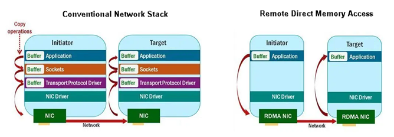
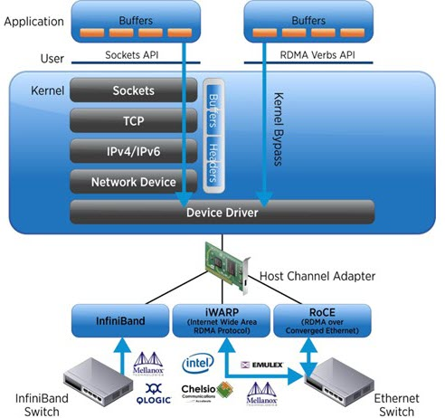

# RDMA Fundamentals

## Traditional Networking and Its Limitations

To understand why Remote Direct Memory Access (RDMA) is necessary, we must first look at the bottlenecks in standard networking.

In a traditional TCP/IP networking stack, the operating system kernel manages the flow of data. When a packet arrives at a host, the Network Interface Card (NIC) delivers it to a kernel buffer. This process triggers an interrupt, forcing the CPU to wake up, switch contexts, process the network headers, and copy the payload into the application's user-space memory. This multi-step process (involving context switches and memory copies) consumes significant memory bandwidth and CPU time.

> For a detailed walkthrough of the traditional Linux packet reception flow, see [Linux Networking: Packet Reception Flow](https://github.com/ManiAm/dpdk-labnet/blob/master/Linux_Networking.md#packet-reception-flow).

### Traditional NIC Offloading (Stateless)

To ease this burden, traditional Ethernet NICs offer stateless [hardware offloading](https://github.com/ManiAm/dpdk-labnet/blob/master/Linux_Networking.md#nic-hardware-offloading) (e.g., Checksum Offloading or Large Send Offload). In this model, the NIC acts as a high-speed assistant. It performs specific, repetitive mathematical chores, such as rapidly calculating a checksum or splitting a massive 64KB data block into 1500-byte packets before putting them on the wire.

However, the OS’s software TCP/IP stack remains entirely in charge of the connection's state. The host CPU must still track sequence numbers, process incoming acknowledgments, manage flow control, and execute retransmissions. Traditional offloading merely speeds up the CPU's packet processing; it does not eliminate it.

### Software Kernel Bypass: DPDK

To bypass the latency of the OS kernel, software frameworks like the Data Plane Development Kit (DPDK) were introduced. DPDK moves the network driver and protocol processing directly into the application's user space.

Instead of relying on hardware interrupts, DPDK uses `Poll Mode Drivers` (PMDs). The CPU dedicates entire cores to sit in an infinite loop, constantly polling the NIC for new packets. When a packet arrives, it is placed directly into a user-space memory buffer, and the CPU processes the TCP/IP headers right there. While DPDK drastically reduces latency by eliminating OS context switches, the host CPU still does all the heavy lifting. It must actively process every packet and burn continuous compute cycles just polling the NIC even when no network traffic is flowing.

> For a detailed introduction to DPDK and kernel bypass networking, see [DPDK Guide](https://github.com/ManiAm/dpdk-labnet/blob/master/DPDK.md).

## Remote Direct Memory Access (RDMA)

RDMA is a networking technology that solves the bottlenecks of traditional networking by allowing one computer to directly access the memory of another computer across a network.

Instead of relying heavily on the OS and CPU to process each data transfer, RDMA enables the NIC to move data directly between application memory regions on different machines. This need emerged in the late 1990s as high-performance computing (HPC) clusters, distributed storage, and large-scale databases demanded faster node-to-node communication. Today, RDMA is the backbone of high-speed storage systems and large-scale AI and machine learning clusters.

### Core Mechanisms Behind RDMA Performance

RDMA achieves its massive performance gains through three intertwined mechanisms:

**True Hardware Offload** (Processing Efficiency): Unlike traditional stateless NIC offloading or software-based DPDK, an RDMA-capable adapter (such as an InfiniBand HCA or a RoCE-capable NIC) performs full stateful transport offload. The hardware completely replaces the kernel's role in data movement. The silicon autonomously tracks the connection state, generates hardware-level acknowledgments, monitors sequence numbers, enforces flow control, and executes retransmissions natively. The host CPU is entirely removed from the data path.

**Zero-Copy Data Transfers** (Data Path Efficiency): When an application registers a memory region with the NIC, the registration process pins the pages in RAM and provides the NIC with the virtual-to-physical address translations it needs. Armed with these mappings, each side's NIC uses Direct Memory Access (DMA) to read from or write to its local host's application memory without any CPU involvement. Data crosses between machines over the RDMA fabric, but on each end the transfer between the NIC and application memory is a local DMA operation. This bypasses intermediate kernel buffers entirely, preserving memory bandwidth and accelerating data-intensive workloads.

**Kernel Bypass** (Control Path Efficiency): RDMA allows applications to communicate with the NIC through specialized user-space libraries (often called `verbs` interfaces). These libraries allow applications to post work requests directly to queues managed by the NIC. The OS is only responsible for the initial setup and resource management; the actual data movement occurs independently in hardware, eliminating CPU context-switching and minimizing latency jitter.

### RDMA Transport Categories and Technologies

RDMA transports fall into three main categories, depending on the underlying network fabric used to transmit the data.

| Technology | Year Introduced | Transport Network  | Organization / Origin               | Notes                                                               |
| ---------- | --------------- | ------------------ | ----------------------------------- | ------------------------------------------------------------------- |
| InfiniBand | 2000            | InfiniBand fabric  | InfiniBand Trade Association (IBTA) | First widely adopted RDMA interconnect for HPC and AI clusters      |
| iWARP      | 2007            | TCP/IP (Ethernet)  | IETF / RDMA Consortium              | RDMA over TCP; works on Ethernet without requiring lossless fabric  |
| RoCE v1    | 2010            | Ethernet (L2)      | IBTA / Mellanox                     | RDMA over Converged Ethernet; requires lossless Ethernet (PFC)      |
| RoCE v2    | 2014            | UDP/IP (L3)        | Mellanox / IBTA                     | Routed RDMA over Ethernet using UDP encapsulation                   |
| Omni-Path  | 2015            | Omni-Path fabric   | Intel                               | HPC interconnect competing with InfiniBand (divested to Cornelis Networks) |

#### Native RDMA Fabrics

Native fabrics are purpose-built network architectures designed from the ground up to support RDMA semantics. They define their own link layer, transport protocols, addressing schemes, and switching behavior to guarantee low latency and lossless transmission.

- **InfiniBand** (Introduced 2000): The most widely deployed native RDMA fabric and the dominant interconnect in HPC and AI clusters. It features built-in congestion control, reliable connections, and massive hardware offload capabilities.

- **Omni-Path** (Introduced 2015): Developed by Intel to compete with InfiniBand. It offered low-latency communication and hardware-accelerated messaging but saw limited adoption. Intel divested the Omni-Path business to Cornelis Networks in 2020.

#### Ethernet RDMA (RoCE)

Ethernet RDMA technologies encapsulate RDMA operations within Ethernet frames, allowing operators to leverage existing Ethernet infrastructure without deploying a separate interconnect like InfiniBand.

- **RoCE v1** (Introduced 2010): Operates directly over Layer-2 Ethernet frames (no IP routing). It requires a lossless Ethernet configuration, typically relying on Priority Flow Control (PFC) to prevent packet loss. RoCE v1 is largely deprecated in favor of RoCE v2, which adds IP routability.

- **RoCE v2** (Introduced 2014): Introduced IP and UDP encapsulation, allowing RDMA traffic to be routed across Layer-3 networks. RoCE v2 is widely used in modern cloud environments and AI clusters where scalable, high-bandwidth communication is required.

#### TCP-Based RDMA (iWARP)

TCP-based RDMA implements RDMA functionality on top of the traditional TCP/IP networking stack.

- **iWARP** (Introduced 2007): Encapsulates RDMA operations within a TCP stack. Because TCP inherently guarantees reliable, ordered delivery, iWARP can operate on standard, lossy Ethernet networks without specialized lossless configurations (like PFC). However, relying on TCP introduces additional processing overhead, noticeably increasing latency compared to InfiniBand or RoCE.

> iWARP is primarily implemented by Intel and Chelsio adapters; Mellanox NICs do not support it.
