# InfiniBand: Architecture and Protocol Deep Dive

InfiniBand is a purpose-built, high-performance interconnect designed to deliver ultra-low latency, high bandwidth, and lossless communication. Originally developed by the **InfiniBand Trade Association** (IBTA) - a consortium founded by Compaq, Dell, Hewlett-Packard, IBM, Intel, Microsoft, and Sun Microsystems - for High Performance Computing (HPC), it has become the dominant fabric for AI training clusters, supercomputers, and large-scale distributed systems. Mellanox Technologies (acquired by NVIDIA in 2020) subsequently became the dominant supplier of InfiniBand hardware, driving much of the technology's commercial adoption.

## Core Architecture: Kernel Bypass and Hardware Offload

In traditional TCP/IP networking, the operating system and CPU dictate data transfers. Sending data is a heavy process that requires:

- System calls (introducing context-switch overhead).
- Memory copies (moving data from user space to kernel buffers).
- Software processing (navigating the OS networking stack).
- Hardware handoff (finally delivering the data to the NIC).

This repeated memory movement and CPU intervention introduces latency and creates a severe bottleneck, crippling scalability at high speeds. InfiniBand fundamentally rethinks this model by introducing the **Host Channel Adapter** (HCA), a network adapter that offloads all transport logic directly into hardware. This enables an OS-independent communication model:

- **Direct Hardware Interaction**: InfiniBand enables applications to interact directly with the HCA through a user-space interface known as the *Verbs API*. Instead of relying on the kernel, the application posts work requests (e.g., send, receive, read, write) into hardware-managed queues using a lightweight Peripheral Component Interconnect Express (PCIe) "doorbell" write.

- **Hardware Ownership**: Once a request is posted, the HCA takes full control. It handles all transport responsibilities including packetization, reliability (acknowledgments, retransmissions), ordering, and flow control. It uses Direct Memory Access (DMA) to pull data straight from the application's memory and transmits it over the network.

- **Zero-Copy Reception**: On the receiving end, the remote HCA uses DMA to write the incoming data directly into the remote application's pre-registered memory buffers. This happens entirely in hardware, completely bypassing the remote CPU and kernel.


## Communication Fundamentals


### Memory Registration

Traditional networking relies on the operating system’s kernel to copy data from an application's virtual memory into network buffers. InfiniBand bypasses the OS entirely to achieve zero-copy, high-throughput transfers. However, for a Host Channel Adapter (HCA) to safely read and write directly to application memory via Direct Memory Access (DMA), that memory must be prepared in advance.

This preparation is called **Memory Registration**, and it accomplishes two vital tasks:

- **Pinning**: It locks the memory pages into physical RAM, preventing the OS from swapping them to disk.

- **Address Translation**: It provides the HCA with a virtual-to-physical address translation table, allowing the hardware to perform DMA operations directly.

Because memory registration requires kernel intervention (such as page table manipulation and TLB updates), it is a high-latency operation. Consequently, applications typically register memory once during initialization and reuse those buffers for their entire lifecycle, keeping the actual data-transfer path strictly in user space.


### Memory Protection

To secure direct hardware access, the architecture uses two hierarchical security constructs. Because memory is exposed directly to the network hardware, strict boundaries are required:

- **Protection Domain (PD)**: The foundational security boundary. A PD acts as a localized container. All subsequent RDMA resources—including registered memory and communication queues—must be assigned to a specific PD. Resources within the same PD can interact freely, but the hardware enforces strict isolation between different PDs to prevent unauthorized access across applications.

- **Memory Region (MR)**: A specific, contiguous block of application memory that has been registered and pinned within a PD. When an MR is created, the system generates two distinct authorization tokens:

    - **L_Key** (Local Key): Used by the local HCA to authorize DMA operations initiated by the local application. This key is strictly local and never shared.

    - **R_Key** (Remote Key): Exchanged out-of-band with a trusted remote peer. The remote HCA must present this key to perform one-sided operations (like RDMA Read or Write) directly against this memory region. Without the correct `R_Key`, remote access is hardware-blocked, regardless of network connectivity.


### Work Requests

Before data can be sent, the application must define what needs to happen. It does this by creating software-level instructions called Work Requests.

- **Work Request (WR)**: A software-level instruction built by the application in local memory. It defines the job details: operation type, memory address, data size, and the authorizing `L_Key`.

- **Work Queue Element (WQE)**: The hardware-facing version of the WR. When an application submits a WR, the system's Verbs API converts it into a WQE for the hardware to process.


### Scatter-Gather Lists

In many real-world scenarios, the data an application needs to send is not stored in a single contiguous buffer. For example, a network protocol message might consist of a header in one buffer and a payload in another, or a database row might be assembled from fields scattered across different memory allocations. To maintain zero-copy efficiency, applications avoid manually copying these fragments into one buffer. Instead, each Work Request contains a **scatter-gather list**. Each entry in this list points to a single slice of memory by specifying a starting address, a byte length, and the required `L_Key` that authorizes access to that buffer.

- **On Send**: The HCA walks the list, gathering data from various physical locations and transmitting it as a single logical message.

- **On Receive**: The hardware scatters the incoming data across multiple pre-allocated buffers.

This mechanism allows the hardware to assemble or disassemble messages from non-contiguous memory entirely on its own, saving valuable CPU cycles. The diagram below illustrates the chain from Work Request, to Scatter-Gather Elements, to physical Memory Regions within a Protection Domain.

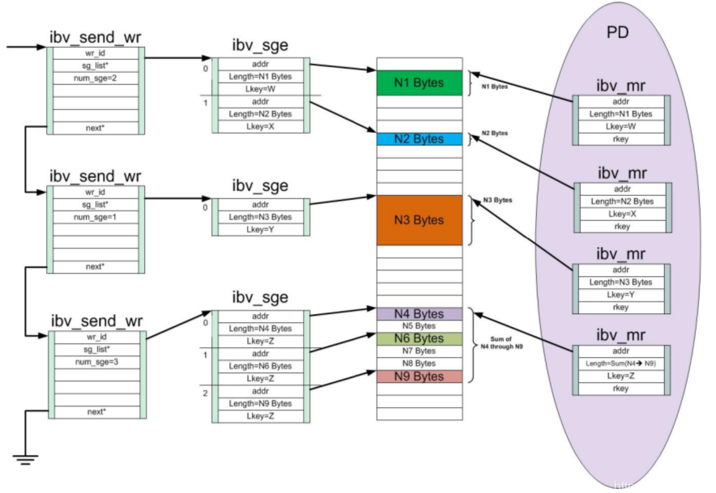

**Work Requests (left)**: The application builds three `ibv_send_wr` structures, chained together via their `next` pointer fields. Each WR contains a `wr_id`, a pointer to its scatter-gather list (`sg_list`), and the number of entries in that list (`num_sge`). These are the software instructions that will be converted into WQEs when posted via the Verbs API.

**Scatter-Gather Entries (center-left)**: Each WR points to one or more `ibv_sge` entries. The first WR has `num_sge=2`, gathering N1 Bytes (Key W) and N2 Bytes (Key X) from two separate Memory Regions into a single operation. The second WR has `num_sge=1`, referencing a single buffer (N3 Bytes, Key Y). The third WR has `num_sge=3`, gathering N4, N6, and N9 from three non-adjacent locations within the same large Memory Region (Key Z), skipping N5, N7, and N8.

**Data Buffers (center-right)**: The colored blocks represent the actual payload data sitting in the host's physical RAM. The arrows show how each scatter-gather entry maps to a specific buffer.

**Protection Domain and Memory Regions (right)**: The large purple oval is the Protection Domain (PD), the security boundary that groups all RDMA resources together. Inside it are four registered Memory Regions (`ibv_mr`), each with its own `L_Key` (W, X, Y, Z) and `R_Key`. Some regions cover a single buffer (N1 with Key W, N2 with Key X, N3 with Key Y), while the fourth covers a large contiguous range spanning N4 through N9 (Key Z). The HCA will refuse to access any buffer unless the WQE presents the correct matching `L_Key`.


### The Queue-Based Communication Model

Once memory is registered, protected, and instructions (WQEs) can be formatted, the application needs a mechanism to pass these instructions to the hardware. InfiniBand replaces standard socket APIs with a hardware-integrated, queue-based model. Crucially, queues do not hold payload data. They only hold the lightweight WQEs that point the HCA to the registered Memory Regions.

- **Queue Pair (QP)**: The core communication endpoint, conceptually similar to a network socket. Every QP consists of two tightly coupled queues physically residing in pinned host memory but managed by the HCA:

    - **Send Queue (SQ)**: The application posts outgoing WQEs here, instructing the HCA to perform actions like a standard Send, RDMA Write, or RDMA Read.

    - **Receive Queue (RQ)**: For two-sided operations, the receiving application must pre-post WQEs here before data arrives. These descriptors point to pre-allocated buffers, providing a landing zone for incoming payloads.

- **Completion Queue (CQ)**: A separate queue used to report the outcome of operations. After the HCA finishes processing a WQE from either the SQ or RQ, it writes a Completion Queue Entry (CQE) here containing the status (success/failure) and metadata. A CQ can be dedicated to a single QP or shared across multiple QPs.


### The Data Transfer Lifecycle

With the endpoints, memory, and queues established, a standard data transfer executes in a strict lifecycle:

- **Work Creation**: The application constructs a Work Request (WR) in local memory, defining the payload via a scatter-gather list, setting the operation type, and applying the `L_Key`.

- **Work Submission**: The application calls a Verbs API post function. This converts the WR into a WQE, places it in the SQ or RQ, and rings a hardware "doorbell" (a lightweight PCIe write to an HCA register) to notify the hardware that a new instruction is ready.

- **Hardware Execution**: The HCA takes over. It fetches the WQE, validates the `L_Key`, follows the scatter-gather pointers directly to the application's memory buffers, and executes the transfer across the network via DMA.

- **Work Completion**: Upon finishing, the HCA pushes a CQE into the associated Completion Queue to report the outcome.

- **Application Polling**: For ultra-low latency, the application polls the CQ in user space to check for new CQEs, avoiding CPU-intensive kernel interrupts. If latency is less critical, it can use a Completion Channel for interrupt-driven notifications.

The diagram below illustrates the complete end-to-end communication path between two hosts, showing how the application interacts with its local HCA via these queues to move data across the InfiniBand fabric.

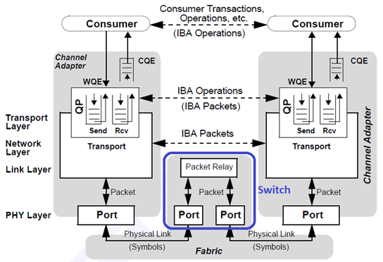


### Communication Semantics: Operation Types

While Queue Pairs (QPs) provide the control mechanism through which the HCA receives instructions, the protocol defines distinct methods or operations for moving data between the memory buffers of remote hosts. These operations dictate how much involvement is required from the remote hardware and CPU.

| Operation                        | Initiator uses          | Target uses                         |
| -------------------------------- | ----------------------- | ----------------------------------- |
| **Two-sided** (Send/Recv)        | SQ (post Send)          | RQ (pre-post Receive)               |
| **One-sided** (RDMA Write/Read)  | SQ (post Write or Read) | Neither — target SQ and RQ are idle |
| **Atomics** (CAS, Fetch-and-Add) | SQ (post atomic)        | Neither — target SQ and RQ are idle |


**Two-Sided Operations** (Send/Receive)

Two-sided operations in InfiniBand, consisting of Send and Receive commands, closely mirror the traditional messaging models found in standard TCP/IP networking. In this paradigm, a data transfer cannot occur in isolation; both the sender and the receiver must actively coordinate to complete the transaction. The process strictly dictates that the receiving application must prepare in advance by allocating a memory buffer and posting a "Receive" work request into its local RQ. Once the receiver is ready, the initiator can post a "Send" work request. The hardware then executes the transfer, marrying the incoming send operation to the receiver's pre-posted buffer.

> If the sender transmits data before the receiver has posted a matching Receive WQE, the receiver's HCA responds with a Receiver Not Ready (RNR) NAK in RC mode, causing the sender to back off and retry. In unreliable transports (UC/UD), the incoming message is silently dropped. We will go over transport services (RC, UC, UD) later.

When the target HCA successfully places the incoming payload into the pre-allocated memory buffer, it generates a CQE. This entry acts as an alert to the receiver's CPU, notifying it that a new message has arrived and is ready to be consumed. Because this process forces the remote CPU to wake up and handle the notification, two-sided operations are not typically used for massive, bulk data transfers. Instead, they are suited for control-plane traffic, small synchronization events, or explicit state updates where the receiving application must be immediately aware of and actively react to new information.

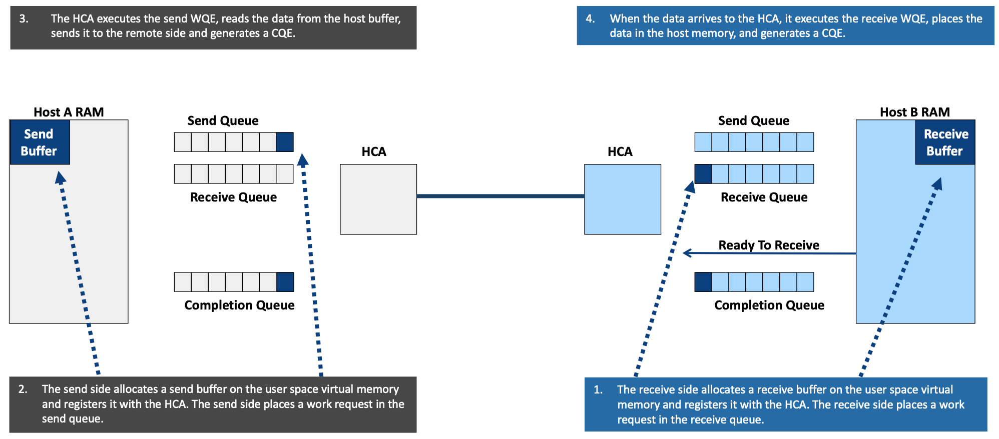

As illustrated in the diagram, a two-sided operation requires active orchestration from both the sending and receiving hosts.

1. **Receiver Preparation**: The process begins on the receiving side (Host B). The receiver allocates a buffer in its user-space memory, registers it with its local HCA, and places a Receive WQE into its Receive Queue. It then signals the sender that it is ready to receive data.

2. **Sender Execution**: The sender (Host A) allocates and registers its own memory buffer, then places a Send WQE into its Send Queue.

3. **Hardware Transfer**: Host A's HCA processes the Send WQE, uses DMA to read the data from Host A's RAM, and transmits it across the fabric. Upon completion, Host A's HCA generates a CQE to notify the sender's CPU that the message was dispatched.

4. **Receiver Notification**: When the data arrives at Host B, its HCA consumes the pending Receive WQE, places the incoming data exactly where that WQE specified in Host B's RAM, and generates a local CQE. This final CQE is what interrupts or notifies Host B's CPU that new data has arrived and is ready for processing.


**One-Sided Operations** (RDMA Read/Write)

One-sided operations, frequently referred to as "True RDMA," represent a fundamental departure from traditional messaging by allowing one node to directly access the memory of a remote node without any involvement from the remote CPU. In this model, the target system is entirely passive. The initiating node dictates the entire transaction by explicitly specifying the exact remote memory address it wishes to access, along with the required authorization token (the `R_Key`) to prove it has authorization. Depending on the need, the initiator uses this access to either "push" data directly into the remote memory (an RDMA Write) or "pull" data directly from it (an RDMA Read).

The defining characteristic of a one-sided operation is the complete bypass of the target's processing hardware. When the request arrives across the fabric, the remote HCA validates the memory address and the `R_Key`, and then executes the memory transaction directly via DMA. Because it is a one-sided command, the remote HCA does not consume a Receive WQE, nor does it generate a local CQE. As a result, the target CPU is never interrupted, notified, or burdened. It remains completely oblivious to the fact that its memory was just read from or written to.

> The exception is **RDMA Write with Immediate Data**, a hybrid operation that carries a 32-bit immediate value alongside the RDMA payload. Because the receiver must be notified of the immediate value, this operation does consume a Receive WQE on the target and generates a CQE containing the immediate data. This makes it useful for signaling the completion of a data transfer without a separate control message.

This zero-interrupt architecture makes one-sided operations the ideal mechanism for massive data transfers, such as migrating AI model weights or streaming NVMe-oF storage blocks, where traditional CPU interrupts would introduce severe performance bottlenecks.

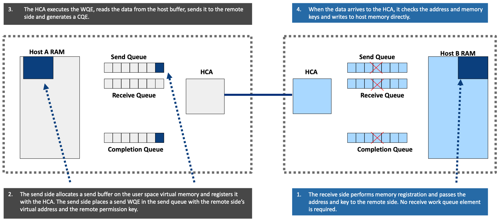

The diagram highlights the fundamental advantage of one-sided operations: complete bypass of the target's receive and completion queues (indicated by the red 'X' marks on Host B's queues).

1. **Memory Registration**: Before the operation begins, the target (Host B) registers a region of its memory and passes the virtual address and its authorization token (`R_Key`) to the initiator (Host A) out-of-band. Crucially, Host B does not need to post a Receive WQE.

2. **Initiator Execution**: The initiator (Host A) places an RDMA WQE into its Send Queue. This WQE explicitly contains the target's virtual address and the `R_Key` required to access the remote memory.

3. **Hardware Transfer**: Host A's HCA executes the WQE, reads the data from Host A's RAM, and transmits it to the remote side. It then generates a CQE in Host A's Completion Queue so the sender knows the operation finished.

4. **Target Bypass**: When the packets arrive at Host B, the receiving HCA hardware validates the memory address and the `R_Key`. Once authorized, Host B's HCA writes the payload directly into Host B's RAM using DMA. Because no Receive WQE was consumed, no CQE is generated on Host B. The target CPU remains completely unaware of the transaction, resulting in true zero-copy, zero-interrupt data movement.


**Atomic Operations**

Atomic operations function as a specialized, highly synchronized extension of one-sided communication. Their primary purpose is to execute remote memory synchronization primitives directly in hardware, completely bypassing the remote CPU. To achieve this, the hardware performs a "read-modify-write" sequence as a single, indivisible action over the network. This strict indivisibility guarantees data correctness even when multiple nodes in a cluster attempt to access and alter the same memory location concurrently. The two most common atomic primitives are:

- **Fetch-and-Add**: adds a specified value to a remote 64-bit integer and returns the original value

- **Compare-and-Swap** (CAS): reads a remote 64-bit value and replaces it with a new one only if it matches an expected baseline.

In both scenarios, the original value is invariably returned to the caller, allowing the application to determine whether its operation succeeded. Because atomics intrinsically require a response and strict packet ordering to function, they are exclusively supported over RC transports.

The execution flow closely mirrors standard one-sided operations but enforces strict atomic guarantees at the memory level. The target system (Host B) first registers an 8-byte aligned memory region and shares its virtual address and `R_Key` with the initiator (Host A) through an out-of-band channel. To trigger the operation, Host A posts an Atomic Work Queue Element (WQE) to its Send Queue, detailing the remote address, the `R_Key`, and the specific operation parameters (such as the value to add or the compare/swap variables).

Host A's HCA transmits this request across the fabric. Upon arrival, Host B's HCA serializes access to the target address and executes the read-modify-write as a single indivisible operation in silicon, guaranteeing that no other network or local CPU access can interleave during the transaction. The target HCA then transmits the original memory value back to Host A's local buffer and generates a CQE on Host A's side.

Throughout this entire complex sequence, Host B's CPU remains completely oblivious and uninvolved, making this an exceptionally efficient mechanism for managing distributed locks, shared counters, and coordination flags in HPC and distributed databases.


### Connection Setup: Out-of-Band Exchange

To send data over an InfiniBand network, your local system's QP must be configured with the exact addressing details of the remote system's QP. However, you cannot use InfiniBand to ask the remote system for these details, because doing so requires a working InfiniBand connection. You need the addresses to establish the connection, but you need a connection to get the addresses.

To bypass this paradox, systems use an Out-of-Band (OOB) exchange. This simply means using a different, already-functioning communication channel to swap the necessary setup information. In almost all cases, this alternate channel is a standard TCP/IP socket running over the traditional Ethernet management network. Once the systems use TCP to swap their InfiniBand coordinates, they can build the high-speed InfiniBand connection and drop the TCP connection.

**What Information Must Be Exchanged?**

Before tracing the step-by-step timeline of connection setup, it is crucial to understand the exact data parameters the two nodes must swap over their out-of-band TCP connection.

Regardless of the intended communication type, every InfiniBand connection requires exchanging four baseline values to establish a functional link. These include the **Queue Pair Number** (`qp_num`), which uniquely identifies the specific Queue Pair on the peer machine; the **LID**, which provides the link-layer address used by local switches to route packets; the **GID**, used for routing across different subnets; and the **Packet Sequence Number** (`PSN`), which establishes the starting sequence number to ensure precise packet ordering and enable loss detection.

If the applications intend to perform standard two-sided operations (Send/Receive), this baseline data is entirely sufficient. Because two-sided communication requires an active receiver that has already prepared a specific place in its own memory (via a Receive WQE) for the incoming data, the sender does not need to know the final memory destination.

However, if the applications intend to execute one-sided operations (RDMA Read/Write) or Atomics, the communication requirements expand. In these scenarios, the sender completely bypasses the remote CPU and interacts directly with the remote memory. Because the receiving system is entirely passive, the sender must be explicitly told exactly where to place the data and must present the correct authorization token to do so. Therefore, two advanced values must be included in the out-of-band exchange: the **Remote Virtual Address**, defining the exact memory coordinate the sender will target, and the **`R_Key`**, the authorization token generated during memory registration that grants the remote HCA access to that specific memory region.

**The QP State Machine**

A Queue Pair cannot simply be created and used immediately. It must be advanced through a series of hardware states, each of which configures a specific aspect of the connection. This progression is enforced by the HCA. The application must explicitly transition the QP through each state using the Verbs API (`ibv_modify_qp`).

| State | Name             | What Gets Configured                                                 | Can Send? | Can Receive? |
| ----- | ---------------- | -------------------------------------------------------------------- | --------- | ------------ |
| RESET | Initial state    | Nothing — QP just created                                            | No | No |
| INIT  | Initialized      | Port number, access permissions (local write, remote write, remote read, remote atomic) | No | Can post Receive WQEs (but they won't be processed yet) |
| RTR   | Ready to Receive | Remote QP number, remote LID, remote GID (if GRH is used), starting PSN, Maximum Transmission Unit (MTU) | No | Yes |
| RTS   | Ready to Send    | Timeout, retry count, starting send PSN, max outstanding RDMA reads | Yes | Yes |

The key insight is that the transition from `INIT` to `RTR` requires the **remote** side's QP number, LID, GID, and PSN which is exactly the data obtained through the out-of-band exchange. This is why the OOB exchange must happen between `INIT` and `RTR`.

Note that in `INIT` state, the application can already post Receive WQEs to the Receive Queue. This is useful because for two-sided operations, the receiver should pre-post its receive buffers before the QP reaches `RTR`, ensuring that incoming data has a place to land the moment the QP becomes ready.

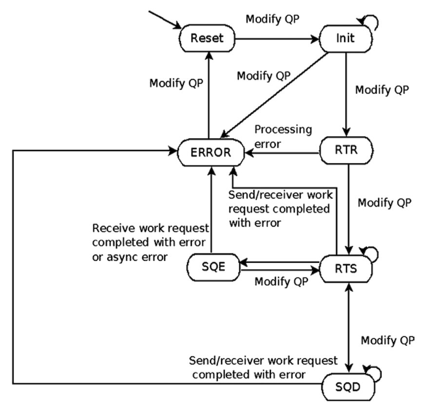


**How This Works in Production Environments**

Manually writing code to open TCP sockets and swap these exact variables is the best way to understand the architecture. However, in real-world production environments, developers rarely do this manually:

- **RDMA CM** (`librdmacm`): This is an abstraction library that handles the entire setup for you. It automatically resolves addresses, creates the QPs, manages the state transitions, and performs the exchange behind the scenes using a familiar socket-like API (e.g., `rdma_connect` / `rdma_accept`).

- **High-Level Frameworks**: If you are using parallel computing or AI frameworks like MPI, UCX, or NVIDIA's NCCL, they have their own internal bootstrap mechanisms. They completely hide the out-of-band exchange from the end user, allowing you to focus purely on sending and receiving data.


### Transport Services

When a QP is created in InfiniBand, it must be bound to a specific transport service. This service defines how data is delivered, what guarantees are provided, and which communication semantics (one-sided, two-sided, or Atomic) are allowed. These transport types are implemented directly in the HCA, allowing applications to choose the appropriate balance between reliability, scalability, and performance.

| Feature           | Reliable Connection (RC)  | Unreliable Connection (UC)         | Unreliable Datagram (UD)           |
| ----------------- | ------------------------- | ---------------------------------- | ---------------------------------- |
| Connection Type   | 1:1 (Dedicated)           | 1:1 (Dedicated)                    | 1:Many (Shared)                    |
| Reliability       | Hardware ACKs and retries | None (packet loss results in drop) | None                               |
| Max Message Size  | Up to 2 GB                | Up to 2 GB                         | Single MTU                         |
| Send / Receive    | Supported                 | Supported                          | Supported                          |
| RDMA Write        | Supported                 | Supported                          | Not supported                      |
| RDMA Read         | Supported                 | Not supported                      | Not supported                      |
| Atomic Operations | Supported                 | Not supported                      | Not supported                      |

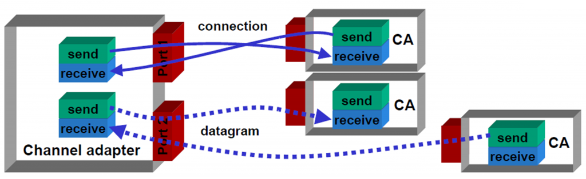

**Reliable Connection (RC)** - The Gold Standard

RC is the most widely used and feature-rich transport type in InfiniBand. It establishes a dedicated, point-to-point (1:1) connection between two QPs (one on each host). Once established, this connection behaves like a private, hardware-managed communication channel that guarantees *reliable*, *in-order* delivery of data.

Reliability is enforced entirely in hardware. Each packet is assigned a PSN by the sender. The receiving HCA tracks these sequence numbers and detects any gaps, which indicate packet loss or corruption.

RC uses **hardware acknowledgments** (ACKs) and a **Go-Back-N** retransmission mechanism. The receiver sends ACKs for successfully received packets. If an ACK is missing or an error is detected, the sender rewinds to the last acknowledged packet and retransmits all subsequent packets. Because of its strong guarantees, RC is the only transport that fully supports all operation types, including RDMA Reads and Atomics.

**Unreliable Connection (UC)**

UC serves as a strategic middle ground within the InfiniBand transport suite. Like RC, it establishes a dedicated point-to-point (1:1) link between two endpoints; however, it intentionally strips away the processing overhead of hardware acknowledgments and retransmissions. If a packet is lost or corrupted in the fabric, the HCA simply drops it without attempting any form of recovery.

This "fire-and-forget" architecture strictly dictates which operations the transport can support. For instance, RDMA Writes are fully supported because they are inherently one-way transactions; the sender simply pushes data to the network and moves on, neither needing nor expecting a response. Conversely, RDMA Reads are fundamentally unsupported. An RDMA Read intrinsically requires a two-way exchange: a request packet sent out to the target, and a payload of data packets returned. Because UC lacks acknowledgment, timeout, and retry mechanisms, a dropped packet in either direction would leave the initiating HCA hanging indefinitely, waiting for a response that will never arrive.

By sacrificing guaranteed delivery to eliminate latency overhead, UC becomes highly efficient for workloads where pure speed outweighs perfect data integrity such as raw video streaming, high-frequency telemetry, or applications designed to manage their own reliability logic at the software level.

**Unreliable Datagram (UD)**

UD provides a connection-less communication model, similar in spirit to UDP in traditional networking. A single UD QP can communicate with multiple peers, enabling one-to-many or many-to-one communication patterns without requiring dedicated connections for each endpoint.

Unlike RC, UD does not guarantee delivery, ordering, or reliability, and it only supports two-sided Send operations (no RDMA). Its maximum message size is limited to a single MTU. This makes UD extremely lightweight and efficient, as it avoids the overhead associated with maintaining connection state. UD is typically used for control-plane traffic, such as subnet management, discovery protocols, and multicast communication.


## Segmentation and Reassembly (SAR)

With the transport services and communication semantics established, the next question is: what happens when an application message is larger than the network can carry in a single packet?

InfiniBand applications often operate on massive data buffers (such as megabytes of memory). However, the underlying network can only transmit data in smaller, fixed units defined by the Maximum Transmission Unit (MTU) which in InfiniBand is strictly set to 256, 512, 1024, 2048, or 4096 bytes. To bridge this mismatch, the HCA implements Segmentation and Reassembly (SAR) entirely in hardware.

- **The Sending Side**: The HCA takes a large application message and automatically divides it into multiple smaller packets that fit perfectly within the MTU. These packets are transmitted across the fabric at full line rate.

- **The Receiving Side**: The destination HCA performs the exact inverse operation. It reassembles the incoming packets and places the data directly into the correct memory buffer, making it appear to the application as if it had arrived as a single contiguous message.

Because this process is fully hardware-offloaded, it requires no CPU involvement, preserving high throughput and low latency.

A critical consequence of SAR is the strict requirement for in-order packet delivery, particularly in Reliable Connection (RC) mode. For RDMA operations, the very first packet of a segmented message carries essential metadata in its RDMA Extended Transport Header (RETH), including the destination memory address, the `R_Key`, and the total DMA length. All subsequent packets contain only raw payload fragments and rely on the first packet's metadata to determine where they belong. For Send operations, the destination address comes from the receiver's pre-posted WQE rather than the packet, but the HCA still depends on processing packets sequentially to correctly reassemble the message. In either case, the receiver cannot process out-of-order packets.


## Go-Back-N Retransmission

Because SAR creates a strict dependency on in-order delivery, the network must have a highly structured response to **packet loss** or **misordering**. If a packet arrives at the destination HCA with a higher-than-expected Packet Sequence Number (PSN), the receiver immediately knows a previous packet was lost or delayed. The receiving HCA takes the following steps:

- It instantly discards the out-of-order packet.
- It generates a **Negative Acknowledgment** (NAK) indicating a sequence error.
- It sends this NAK back to the transmitter, explicitly stating the PSN it was expecting to receive.

Upon receiving this NAK, the transmitting HCA triggers a Go-Back-N retransmission. It completely rewinds its transmission state to the exact PSN of the missing packet and retransmits it, along with every single subsequent packet that followed it.

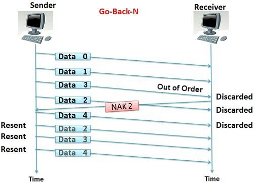

While resending packets that were already successfully transmitted might seem inefficient, it is a deliberate architectural choice. It completely eliminates the need for the receiving HCA to buffer out-of-order data. Storing, sorting, and reassembling out-of-order packets would require massive amounts of expensive on-device memory and drastically increase hardware complexity. By forcing the sender to simply "try again" from the point of failure, InfiniBand prioritizes hardware simplicity, highly deterministic latency, and maximum resource efficiency.

> Some advanced, modern implementations introduce optimizations that allow for limited out-of-order placement, but these are vendor-specific enhancements rather than standard InfiniBand specification behavior.


## Virtual Lanes

SAR and Go-Back-N address how data is segmented and recovered at the transport layer. The next set of mechanisms operate at the link layer, governing how traffic is organized, prioritized, and flow-controlled as it moves hop-by-hop through the fabric.

Virtual Lanes (VLs) are logical channels multiplexed over a single physical InfiniBand link. They are designed to provide traffic isolation, prevent head-of-line blocking, and enable quality of service (QoS) within the fabric. Instead of all traffic competing for the same buffers and transmission resources, each VL operates as an independent channel with its own buffering resources. This ensures that congestion in one lane does not stall traffic in others.

InfiniBand supports up to 15 data VLs (VL0 through VL14) plus a dedicated management VL (VL15), for a total of 16 virtual lanes per link. This allows different types of traffic such as latency-sensitive control messages and high-throughput data transfers to coexist without interference. The Subnet Manager or system configuration can map traffic classes to specific VLs to enforce prioritization and isolation policies.

Each Virtual Lane operates as an independent flow control domain, meaning that buffering and back-pressure are handled separately per lane. This design is critical for maintaining predictable performance in mixed workloads.

Among these lanes, certain VLs have special roles. VL0 is the default data lane used for standard traffic when no explicit QoS policy is applied. Additional lanes (VL1 through VL14) are available for traffic classification and prioritization.

A particularly important lane is VL15, which is reserved exclusively for management traffic. It is used by the Subnet Manager to send control messages (such as topology discovery and configuration) through a dedicated queue pair (QP0) that exists on every InfiniBand port. VL15 is given the highest priority and is isolated from normal data traffic, ensuring that control-plane communication remains functional even under heavy load.

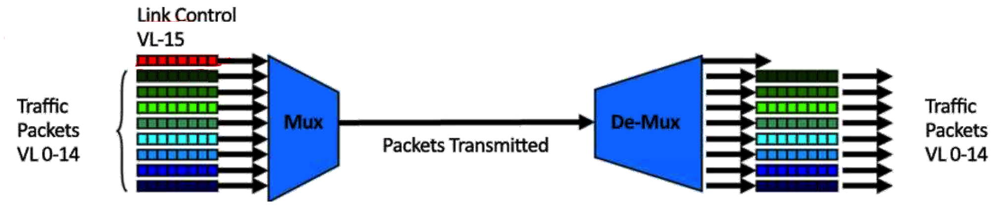


## Flow Control

InfiniBand implements **Credit-Based Flow Control** (CBFC) at the link layer to guarantee a lossless network fabric. Unlike traditional Ethernet, where packets may be dropped when buffers overflow, InfiniBand ensures that a sender transmits data only when the receiver has sufficient buffer space available. This eliminates packet loss due to congestion and avoids the need for higher-layer retransmissions.

CBFC operates through a credit exchange mechanism between directly connected devices (such as HCA-to-switch or switch-to-switch links). The receiver advertises a number of credits, where each credit represents available buffer capacity for incoming data. The sender tracks these credits and is only allowed to transmit packets when sufficient credits are available. Each transmitted packet consumes credits proportional to its size. As the receiver processes packets and frees buffer space, it sends credit updates back to the sender, allowing transmission to continue.

> Each VL maintains its own credit pool and flow control state, ensuring that congestion in one traffic class does not impact others. This preserves isolation and prevents head-of-line blocking across different traffic types.

When the sender exhausts its available credits, transmission is paused in hardware until new credits are received. No packets are dropped, and no retransmissions are required at this stage. This behavior is implemented entirely in the HCA and switch silicon, enabling fast, deterministic control without CPU involvement.

The result is a strictly lossless link-layer transport, which is a foundational property of InfiniBand. By preventing packet drops, CBFC reduces latency variability, avoids congestion collapse, and allows higher-level transport mechanisms to operate efficiently.

```text
┌────────────────────────────────────────────────────────────────────────────────┐
│               INFINIBAND CREDIT-BASED FLOW CONTROL (CBFC)                      │
├────────────────────────────────────────────────────────────────────────────────┤
│                                                                                │
│   Source HCA                                    IB Switch / Receiver HCA       │
│       │                                                    │                   │
│       │ <--- Initial Credit Advertisement (Buffer Credits) |                   │
│       │                                                    │                   │
│       │ [Sender initializes per-VL credit counter]         │                   │
│       │                                                    │                   │
│       │ ---- Send IB Packet 1 (Consumes credits) ------->  │                   │
│       │ ---- Send IB Packet 2 (Consumes credits) ------->  │ Buffer fills      │
│       │                                                    │                   │
│       │ ...                                                │                   │
│       │                                                    │                   │
│       │ [PAUSE - No credits available for this VL]         │ Process packets   │
│       │                                                    │ & free buffers    │
│       │                                                    │                   │
│       │ <--- Credit Update (Freed buffer space) ---------- │                   │
│       │                                                    │                   │
│       │ [Sender increments available credits]              │                   │
│       │                                                    │                   │
│       │ ---- Resume transmission (credits available) --->  │                   │
│       │                                                    │                   │
│       │                                                    │                   │
└────────────────────────────────────────────────────────────────────────────────┘
```

### The Limits of CBFC

Credit-Based Flow Control is a proactive, hop-by-hop mechanism that operates at the Link Layer of the InfiniBand architecture. CBFC guarantees that packets will never be dropped due to network congestion or buffer overflow. However, it does not guarantee zero packet loss. Since physical hardware is imperfect, packets can still be destroyed or corrupted in transit. CBFC is powerless against the following scenarios:

- **Bit Errors and Data Corruption**: Optical transceivers degrade, copper DAC cables suffer from electromagnetic interference (EMI), and cosmic rays occasionally flip bits in switch memory. If a packet's payload or routing header is altered in flight, it becomes corrupted. When an InfiniBand switch detects a VCRC mismatch at the link layer, or the receiving HCA detects an ICRC mismatch at the transport layer, the protocol requires the corrupted packet to be silently dropped. Routing a corrupted packet could overwrite the wrong area of the server's memory.

- **Physical Hardware Failures**: If a packet is successfully transmitted by a sender, but the cable is unplugged, severed, or the receiving switch port physically dies while the packet is mid-wire, the packet is gone forever.

- **Topology Changes and Flapping Links**: If a link goes down, the InfiniBand Subnet Manager (SM) must recalculate the routing tables. During this brief transition, packets already in flight may be routed to dead-end ports and discarded.

> CBFC ensures the switch is ready to catch the ball, but it cannot prevent the ball from exploding in mid-air. This is why a transport-layer reliability mechanism like Go-Back-N (GBN) is required as an end-to-end safety net.


## Congestion Control

While CBFC ensures that packets are not dropped due to buffer overflow, it does not prevent congestion within the fabric. Congestion occurs when multiple flows compete for the same output port or path in the network, creating hot-spots and increasing latency. In such scenarios, even though packets are not lost, they may experience significant queuing delays, leading to performance degradation.

To address this, InfiniBand implements hardware-based congestion control using **Explicit Congestion Notification** (ECN) mechanisms, specifically **Forward ECN** (FECN) and **Backward ECN** (BECN). When a switch detects congestion (typically by monitoring queue depth or buffer occupancy) it marks packets with a congestion indication (FECN) as they pass through the congested point. When the receiving endpoint processes a packet marked with FECN, it generates a BECN message back to the sender.

The BECN serves as a signal to the transmitting HCA that congestion exists along the path. In response, the sender reduces its injection rate, slowing down the rate at which it transmits packets into the network. This feedback loop is implemented entirely in hardware, allowing rapid and fine-grained adjustment of traffic rates without CPU involvement.

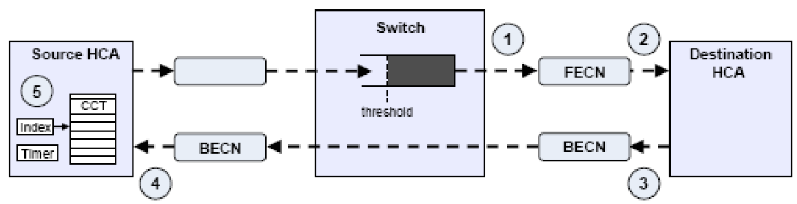

This mechanism enables InfiniBand to not only maintain a lossless fabric, but also to actively manage congestion, ensuring fair bandwidth distribution and stable performance across the network. By combining CBFC (which prevents packet loss) with ECN-based congestion control (which regulates traffic rates), InfiniBand achieves both reliability and efficiency under high load conditions.


## Subnet Manager (SM): The Brain of the InfiniBand Fabric

InfiniBand utilizes a strictly centralized control model to manage the network fabric. This is a fundamental departure from traditional IP/Ethernet networks, which rely on distributed routing protocols (like OSPF or BGP) running independently on every router and switch.

In an InfiniBand environment, the central authority is the **Subnet Manager (SM)**. It functions as the absolute control plane for the entire subnet. The SM is responsible for bringing the fabric to life; without a running SM, InfiniBand devices might establish a physical link, but they will be completely unable to pass any application data. All routing intelligence resides in the SM, allowing the physical switches to act purely as simple, ultra-fast forwarding devices.

### Deployment: A Software Entity

It is important to understand that the SM is a software entity, not a specific, dedicated piece of hardware. Every InfiniBand subnet must have at least one active SM, which can be deployed in two primary ways:

- **On a Switch (Managed Switch)**: Most enterprise-grade InfiniBand switches feature an onboard microprocessor that runs the SM internally.

- **On a Host (Server)**: The SM can run as a software daemon (such as OpenSM) on one of the connected Linux servers. This is a common approach in smaller or budget-conscious setups that utilize "unmanaged" (externally managed) switches.

### The Management Channel (How the SM Communicates)

To execute its control functions without interfering with — or being delayed by — application data traffic, the SM communicates with network devices using a dedicated, out-of-band logical channel.

It sends and receives Management Datagrams (MADs), specifically Subnet Management Packets (SMPs), through a reserved queue pair known as QP0. This queue pair exists on every single InfiniBand port in the fabric.

Crucially, these management packets are transmitted exclusively over VL15 — the dedicated management lane described earlier, which has the highest priority and is isolated from normal data traffic. This ensures that the SM can always reach and configure devices, even if the data plane is severely congested.

### Core Responsibilities: The "Sweep" Process

When an InfiniBand fabric powers on, the switches and HCAs have absolutely no knowledge of the network topology. The SM discovers and configures the network through a continuous operational cycle known as a sweep.

During a sweep, the SM systematically executes the following responsibilities:

- **Topology Discovery**: The SM probes every port in the network (via VL15) to identify all connected devices, mapping out exactly how HCAs, switches, and physical links are interconnected.

- **LID Assignment**: Once the topology is mapped, the SM assigns a LID to every HCA port and one LID to each switch (associated with its management port 0) in the subnet. A LID is a unique 16-bit address that serves as the fundamental routing destination within the local fabric. Individual switch data ports do not receive their own LIDs.

- **Path Calculation**: Using the discovered topology, the SM computes the shortest, most efficient, and loop-free forwarding paths between all endpoints. This calculation is designed to ensure ultra-low latency and prevent bottlenecks.

- **Programming Forwarding Tables**: The SM takes its calculated routes and "teaches" the physical switches where to send packets. It does this by loading Linear Forwarding Tables (LFTs) directly into the memory of each switch. These tables simply map destination LIDs to specific physical output ports.

- **Continuous Monitoring**: The fabric is rarely static. The SM continuously sweeps the network to watch for state changes — such as a cable being unplugged, a link failing, or a new server being provisioned. If a change is detected, the SM automatically recalculates paths and reconfigures the network to heal the fabric.

### High Availability and Redundancy

Because the Subnet Manager represents a centralized single point of failure, InfiniBand provides robust, built-in high availability mechanisms.

A single subnet can (and typically should) have multiple SM instances running simultaneously across different host nodes or switches. Through an automated coordination and election process, one instance is promoted to the Master SM, taking active control of managing the fabric. All other instances remain in Standby mode.

If the Master SM crashes, is taken offline for maintenance, or becomes unreachable, the fabric does not collapse. A standby instance will automatically detect the failure and take over as the new Master SM without disrupting the ongoing flow of application data traffic. This ensures both centralized intelligence and operational resilience in large-scale, high-performance environments.

### LID Mask Control (LMC): Flow-Based Load Balancing

LMC is an InfiniBand feature that enables path diversity and load distribution by assigning multiple LIDs to a single physical port. Instead of a port having a single address within the subnet, the Subnet Manager can allocate a range of LIDs (determined by the LMC value) that all resolve to the same port. This effectively gives the port multiple logical identities in the fabric, allowing the Subnet Manager to compute multiple forwarding paths to that destination and program them into the switches' forwarding tables.

When communication is established (particularly in RC mode) a QP is bound to a specific addressing tuple (including source and destination LIDs). As a result, each QP is associated with one selected path through the fabric. By using different LIDs for different QPs, traffic can be distributed across multiple paths, improving overall link utilization and avoiding hot-spots. This is often described as flow-based load balancing, where each flow (QP) is pinned to a single path.

A critical property of LMC is that it operates at the connection (flow) level, not at the packet level. InfiniBand requires strict in-order delivery for reliable transports, and packet reordering would trigger error handling and retransmissions. Because different paths can have different latencies, sending packets from the same QP across multiple paths would result in out-of-order arrival. To avoid this, all packets within a given QP follow the same path consistently, while different QPs may take different paths.

In summary, LMC provides a hardware-friendly mechanism for multi-path utilization without violating InfiniBand's ordering guarantees. It allows the fabric to scale efficiently by spreading independent flows across available links, while maintaining deterministic and reliable delivery for each individual connection.


## InfiniBand Switches (NVIDIA Quantum)

InfiniBand switches are purpose-built for lossless, ultra-low-latency forwarding. Unlike Ethernet switches, they do not run distributed routing protocols. Instead, they act as simple, high-speed forwarding engines that execute precomputed [Linear Forwarding Tables (LFTs)](#core-responsibilities-the-sweep-process) programmed by the Subnet Manager, enforce [credit-based flow control](#flow-control) to guarantee zero packet loss, and support [adaptive routing](#lid-mask-control-lmc-flow-based-load-balancing) and congestion signaling ([FECN/BECN](#congestion-control)) to optimize traffic distribution across the fabric.

NVIDIA's Quantum switch family is the dominant InfiniBand switching platform. The product line evolves alongside InfiniBand speed generations:

| Switch Generation | InfiniBand Speed | Per-Port Bandwidth |
| ----------------- | ---------------- | ------------------ |
| Quantum-1         | HDR              | 200 Gb/s           |
| Quantum-2         | NDR              | 400 Gb/s           |
| Quantum-3         | XDR              | 800 Gb/s           |

These switches form the backbone of large-scale HPC and AI clusters, enabling thousands of nodes to communicate with deterministic latency.


## InfiniBand Speeds and Link Structure

Ethernet speeds are expressed in terms of throughput (GbE), where `E` explicitly denotes Ethernet (e.g., 100 GbE, 400 GbE). InfiniBand, in contrast, uses generation-based naming, where each generation corresponds to a signaling rate per lane and an aggregate link bandwidth.

| Generation | Name               | Per-Lane Speed  | 4× Link Bandwidth | Line Coding | Block Coding  |
| ---------- | ------------------ | --------------- | ----------------- | ----------- | ------------- |
| SDR        | Single Data Rate   | 2.5 Gbps        | 10 Gbps           | NRZ         | 8b/10b        |
| DDR        | Double Data Rate   | 5 Gbps          | 20 Gbps           | NRZ         | 8b/10b        |
| QDR        | Quad Data Rate     | 10 Gbps         | 40 Gbps           | NRZ         | 8b/10b        |
| FDR        | Fourteen Data Rate | 14 Gbps         | 56 Gbps           | NRZ         | 64b/66b       |
| EDR        | Enhanced Data Rate | 25 Gbps         | 100 Gbps          | NRZ         | 64b/66b       |
| HDR        | High Data Rate     | 50 Gbps         | 200 Gbps          | PAM4        | 64b/66b + FEC |
| NDR        | Next Data Rate     | 100 Gbps        | 400 Gbps          | PAM4        | 64b/66b + FEC |
| XDR        | Extreme Data Rate  | 200 Gbps        | 800 Gbps          | PAM4        | 64b/66b + FEC |

> The per-lane speeds in this table are nominal signaling rates. Effective data throughput is lower after accounting for encoding overhead (20% for 8b/10b, ~3% for 64b/66b). See the [Encoding and Efficiency](#encoding-and-efficiency) section below for details.

### Link Width

The `4×` notation in InfiniBand refers to link width, meaning how many physical lanes are combined to form a single logical connection. A lane is an independent high-speed serial data path (essentially one transmit/receive pair capable of carrying data at a specific signaling rate). Instead of increasing performance by making a single lane infinitely faster (which is physically challenging due to signal integrity and power constraints), InfiniBand scales bandwidth by striping data across multiple lanes in parallel.

In a 4× link, four such lanes operate together as one logical link. The hardware distributes data across these lanes and reassembles it on the receiving side, making the multi-lane connection appear as a single high-bandwidth pipe to the application. As a result, the total bandwidth is simply the per-lane speed multiplied by the number of lanes. For example, in HDR InfiniBand, each lane runs at 50 Gbps, so a 4× link delivers an aggregate of 200 Gbps.

    Total bandwidth = per-lane speed × number of lanes.

It is important to note that 4× is not mandatory. InfiniBand also supports other link widths such as 1×, 8×, and 12× in certain implementations. However, 4× has become the industry standard because it provides a practical balance between performance, cost, power consumption, and physical design complexity. Wider links (like 8× or 12×) increase bandwidth but require more pins, more complex PCB routing, and stricter signal integrity constraints, while narrower links reduce cost but limit throughput.

### Encoding and Efficiency

InfiniBand improves bandwidth efficiency by evolving both block encoding schemes and physical signaling methods. These two aspects serve different but complementary roles: "block coding" improves transmission efficiency and reliability at the bit level, while "line coding" (or modulation) defines how those bits are physically represented on the wire.

- Line coding → how bits are mapped to electrical/optical waveforms
- Block coding → adds structure, control bits, and error detection

Early InfiniBand generations (SDR through QDR) used NRZ signaling (1 bit per symbol) combined with 8b/10b block encoding. While robust and simple, 8b/10b introduces a 20% overhead, meaning only 80% of the transmitted bits carry useful data. As link speeds increased, this overhead became a limiting factor.

To address this, InfiniBand transitioned to 64b/66b encoding starting with FDR. This significantly reduced overhead to approximately 3%, improving efficiency to about 97% while still maintaining synchronization and error detection capabilities. This change allowed higher throughput without requiring proportional increases in clock frequency.

With HDR and newer generations, InfiniBand introduced PAM4 signaling, which encodes 2 bits per symbol instead of 1. This effectively doubles the data rate at the same signaling frequency, making it possible to scale bandwidth further without pushing the physical medium beyond its limits. However, PAM4 is more sensitive to noise and signal distortion, so it is always paired with FEC and efficient block encoding (such as 64b/66b) to maintain reliability.

Overall, the evolution from 8b/10b → 64b/66b → PAM4 + FEC reflects a layered optimization strategy: reduce encoding overhead, increase bits per symbol, and compensate for increased error rates. This approach enables InfiniBand to scale to high data rates while keeping power consumption, signal integrity, and hardware complexity within practical limits.


## InfiniBand Protocol Stack

Now that we have covered InfiniBand's communication model, transport mechanisms, and fabric management individually, we can see how they fit together as a unified, layered protocol stack. Unlike TCP/IP, which is processed primarily in software, every layer of InfiniBand's stack is purpose-built for hardware execution in silicon. Each layer has a well-defined role, and understanding the stack as a whole clarifies how the concepts from the previous sections relate to one another.

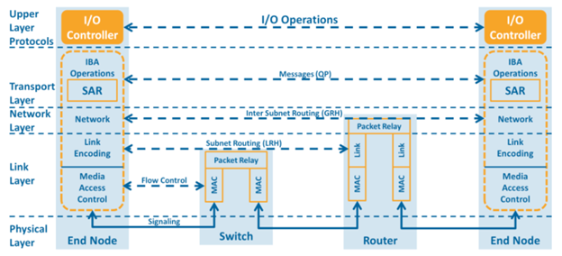

### Physical Layer

The Physical Layer is responsible for the transmission of bits over the medium, whether copper via Direct Attach Copper (DAC) cables or optical via Active Optical Cables (AOC) and transceivers. It defines the electrical or optical signaling characteristics, including voltage levels, timing, encoding schemes (NRZ or PAM4), and lane structure. This layer ensures that raw symbols are reliably transmitted between directly connected devices. As InfiniBand speeds increase, this layer evolves to support higher signaling rates while maintaining signal integrity, often requiring advanced techniques such as equalization and Forward Error Correction (FEC).

### Link Layer

The Link Layer provides reliable, hop-by-hop delivery within a single InfiniBand subnet. It is where credit-based flow control (CBFC), Virtual Lanes (VLs), and congestion signaling (FECN/BECN) operate. InfiniBand switches function entirely at this layer, forwarding packets based on Local Identifiers (LIDs) loaded into their forwarding tables by the Subnet Manager. Link-level integrity is verified at every hop using the Variant CRC (VCRC). Because CBFC eliminates congestion-based packet loss at this layer, higher-layer retransmission mechanisms (such as Go-Back-N) are rarely triggered.

### Network Layer

The Network Layer enables routing traffic between different InfiniBand subnets using Global Identifiers (GIDs) — 128-bit addresses carried in the Global Route Header (GRH). In many deployments, communication occurs within a single subnet and this layer is effectively bypassed. It becomes essential in larger or multi-fabric environments where hierarchical routing is required.

### Transport Layer

The Transport Layer exists only on the endpoints (HCAs) and is not processed by switches. It implements the transport services (RC, UC, UD), tracks Packet Sequence Numbers (PSNs) for ordering and loss detection, manages acknowledgments and Go-Back-N retransmissions, and performs Segmentation and Reassembly (SAR). Because this layer is fully implemented in hardware, it enables RDMA Read/Write operations and atomic primitives without CPU involvement. End-to-end integrity is verified here using the Invariant CRC (ICRC).


## InfiniBand Packet Format

With the protocol stack defined, we can now examine what the data actually looks like on the wire. InfiniBand packets are carefully structured to enable fast, deterministic parsing in hardware, allowing switches and HCAs to process traffic at line rate with minimal latency. Each packet is composed of a series of headers, where each layer in the stack adds only the information required for its specific function (routing, transport, or integrity) without unnecessary overhead.

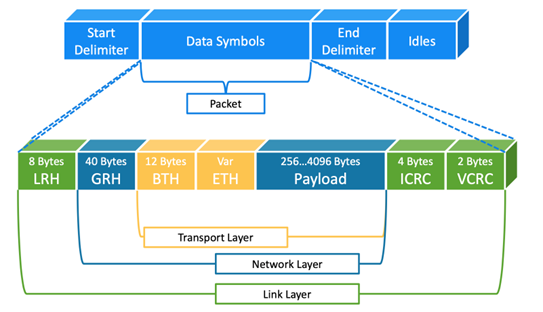

### Local Route Header (LRH)

At the front of the packet is the LRH, which is used by InfiniBand switches for forwarding within a subnet. It contains the Destination LID (`DLID`) and Source LID (`SLID`), which uniquely identify endpoints within the fabric.

| Field                  | Size (Bits) | Description                                                                                            |
| ---------------------- | ----------- | ------------------------------------------------------------------------------------------------------ |
| Virtual Lane (VL)      | 4           | Identifies the Virtual Lane (0–15) used for the packet.                                                |
| Link Version (LVer)    | 4           | Specifies the version of the link-level packet format.                                                 |
| Service Level (SL)     | 4           | Indicates the requested class of service. It is mapped to a VL at each switch hop.                     |
| Reserved               | 2           | Reserved for future use.                                                                               |
| Link Next Header (LNH) | 2           | Indicates the type of header following the LRH (e.g., BTH, GRH, or IPv6).                              |
| Destination LID (DLID) | 16          | Local Identifier of the destination port. Used by switches to perform forwarding table (LFT) lookups.  |
| Reserved               | 5           | Reserved for future use.                                                                               |
| Packet Length          | 11          | Total packet length expressed in 4-byte words.                                                         |
| Source LID (SLID)      | 16          | Local Identifier of the source port.                                                                   |

Switches operate exclusively on this header, making forwarding decisions without inspecting deeper layers.

### Global Route Header (GRH)

When communication spans multiple subnets, the packet includes a GRH. This header is conceptually similar to an IPv6 header and carries 128-bit GIDs for source and destination. The GRH enables routing across subnet boundaries, but it is optional and only present when required. In many single-subnet deployments, packets do not include a GRH, which reduces overhead and simplifies processing.

| Field           | Size (Bits) | Description                                                                                              |
| --------------- | ----------- | -------------------------------------------------------------------------------------------------------- |
| IP Version      | 4           | Identifies the version of the header (0x6 for IPv6-like format).                                         |
| Traffic Class   | 8           | Used for QoS and prioritization across subnets.                                                          |
| Flow Label      | 20          | Identifies a sequence of packets belonging to the same flow, enabling routers to maintain flow affinity. |
| Payload Length  | 16          | Specifies the length of the payload in bytes.                                                            |
| Next Header     | 8           | Identifies the next header type (commonly 0x1B for Base Transport Header (BTH)).                         |
| Hop Limit       | 8           | Similar to IP Time-To-Live (TTL); decremented at each hop to prevent infinite loops.                     |
| Source GID      | 128         | Globally unique identifier of the sender.                                                                |
| Destination GID | 128         | Globally unique identifier of the receiver.                                                              |

### Base Transport Header (BTH)

The BTH is the core of InfiniBand's transport functionality and is processed only by the endpoints (HCAs). It defines the operation being performed such as Send, RDMA Read, or RDMA Write and identifies the destination QP. It also carries the PSN, which is essential for enforcing ordering and reliability in transports like RC. Together, these fields allow the HCA to execute RDMA operations and manage retransmissions entirely in hardware.

| Field                        | Size (Bits) | Description                                                                                              |
| ---------------------------- | ----------- | -------------------------------------------------------------------------------------------------------- |
| OpCode                       | 8           | Specifies the operation (e.g., Write, Read, Send, ACK). Defines the semantic meaning of the packet.      |
| Solicited Event (SE)         | 1           | If set, triggers an interrupt at the receiver (used to wake up waiting processes/threads).               |
| Migration Request (M)        | 1           | Used for Automatic Path Migration (APM) to support failover between paths.                               |
| Pad Count                    | 2           | Indicates 0–3 bytes of padding to align the payload to a 4-byte boundary.                                |
| Transport Version (TVer)     | 4           | Specifies the version of the transport header format.                                                    |
| Partition Key (P_Key)        | 16          | Provides logical isolation (similar to VLAN tagging). Communication requires matching P_Keys.            |
| Reserved                     | 8           | Reserved for future use.                                                                                 |
| Destination QP               | 24          | Destination Queue Pair number; identifies the target endpoint (hardware "socket").                       |
| Ack Request (A)              | 1           | If set, requests an acknowledgment (ACK) from the receiver.                                              |
| Reserved                     | 7           | Reserved for future use.                                                                                 |
| Packet Sequence Number (PSN) | 24          | Used for ordering and reliability; detects lost or out-of-order packets.                                 |

### Payload

Following the headers is the payload, which contains the actual application data being transferred. The payload is placed directly into application memory by the receiving HCA using DMA, without intermediate buffering in the kernel.

### Data Integrity

To ensure data integrity, InfiniBand uses a two-level CRC mechanism.

The **Variant CRC** (VCRC) is applied at the link layer and is verified at every hop, ensuring that errors on a specific link are detected immediately. The **Invariant CRC** (ICRC) provides end-to-end integrity, covering fields that must remain unchanged across the fabric.

This dual-check approach ensures both hop-by-hop reliability and end-to-end correctness, aligning with InfiniBand's design goal of a lossless, high-performance transport.
