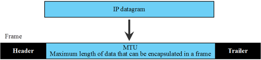

# RDMA over Converged Ethernet (RoCE)

Historically, data centers ran two networks: **InfiniBand** (for high-speed, direct-memory storage/compute) and **Ethernet** (for standard internet/user traffic). Managing two distinct infrastructures is operationally complex and expensive. The concept of "Network Convergence" emerged to unify these traffic types onto a single wire, driving the development of RDMA over Converged Ethernet (RoCE).

## RoCEv1: The Layer 2 Solution (2010)

Introduced by the InfiniBand Trade Association (IBTA) in April 2010, RoCEv1 (often termed "IBoE" or InfiniBand over Ethernet) was the first attempt to run the InfiniBand transport protocol over Ethernet links.

RoCEv1 was designed for simplicity. It keeps the InfiniBand transport and Verbs API unchanged, but runs them on Ethernet physical and link layers so organizations can use standard Ethernet switches, DACs, and transceivers while retaining low-latency, zero-copy RDMA.

### RoCEv1 Packet Structure

Relative to the [native InfiniBand packet format](02_README_INFINIBAND.md#infiniband-packet-format), RoCEv1 does not remove the InfiniBand transport — it substitutes only the headers that belonged to InfiniBand's own link (and, for hop integrity, link CRC):

| Role on the wire              | Native InfiniBand                         | RoCEv1                                                                  |
| ----------------------------- | ----------------------------------------- | ----------------------------------------------------------------------- |
| L2 forwarding                 | Local Route Header (LRH) — LIDs           | Ethernet MAC header (Ethertype `0x8915`)                                |
| Endpoint identity / L3 fields | Global Route Header (GRH) — optional      | **GRH always present** (IBTA requires a valid GRH on every RoCE packet) |
| Transport                     | Base Transport Header (BTH) + extensions  | Unchanged BTH (+ any opcode-specific extended headers)                  |
| Payload                       | Application data                          | Unchanged                                                               |
| End-to-end integrity          | Invariant CRC (ICRC)                      | Unchanged ICRC                                                          |
| Hop / frame integrity         | Variant CRC (VCRC)                        | Ethernet Frame Check Sequence (FCS); VCRC is not used                   |

The resulting on-the-wire layout is:

`Ethernet | GRH | BTH [+ extensions] | Payload | ICRC | FCS`

### Data Integrity: VCRC and ICRC

In native InfiniBand, the VCRC protects link-level routing headers that may change hop by hop, while the ICRC protects end-to-end invariant fields and payload. On RoCEv1, the Ethernet FCS takes over the hop-by-hop role — each switch along the path verifies and recomputes the FCS for its link segment — so the VCRC is redundant and omitted. The ICRC remains the end-to-end safeguard, computed once by the sender and verified by the receiving HCA before DMA'ing data into application memory.

### The Scalability Limitation

RoCEv1 had a fatal flaw for large-scale deployment: it was not IP-routable. Although every RoCEv1 packet carries a GRH with GIDs, forwarding still depends on Ethernet MAC addresses and Ethertype `0x8915`. There is no IP header, so packets cannot traverse Layer 3 routers. Traffic stays inside a single Layer 2 broadcast domain (a VLAN or rack). As data centers moved to Leaf-Spine fabrics that route at Layer 3, RoCEv1 became impractical for hyperscale use and was largely relegated to smaller, localized deployments.

## RoCEv2: The Routable Revolution (2014)

To address RoCEv1's scalability limit, the IBTA released RoCEv2 in late 2014 — widely known as "Routable RoCE." The InfiniBand transport (BTH and below) is unchanged; the decisive change is at the network layer: **the GRH is replaced by a standard IP header, with a UDP header providing demultiplexing and ECMP entropy**.

To Ethernet switches and IP routers, the packet looks like ordinary UDP/IP traffic. Routers forward on the destination IP address across multi-tier topologies, allowing RDMA to scale from a single rack to multi-pod fabrics with tens of thousands of nodes.

### RoCEv2 Packet Structure

Compared with RoCEv1, only the encapsulation above the BTH changes:

`Ethernet | IP | UDP | BTH [+ extensions] | Payload | ICRC | FCS`

**Ethernet Header (14 Bytes)**

Ethertype: `0x0800` (IPv4) or `0x86DD` (IPv6). The frame no longer advertises RoCE at L2; RDMA is identified deeper in the stack (UDP destination port).

**IP Header (20 Bytes for IPv4)**

Takes over the routing role that the GRH held in RoCEv1. The DSCP field classifies traffic for QoS, mapping RoCEv2 packets into the appropriate Traffic Class and Priority Group. The ECN field carries congestion marks that drive the DCQCN congestion control algorithm. Both mechanisms are covered in the [RoCEv2 Network Configuration](#rocev2-network-configuration) section.

**UDP Header (8 Bytes)**

Destination Port: Fixed at **4791** (IANA). This tells the receiving RNIC that the UDP payload begins with an InfiniBand BTH.

Source Port: Variable. Computed per-flow (typically a hash of the Queue Pair number and other connection identifiers). Leaf-Spine fabrics use this as entropy for ECMP so different RoCEv2 flows can take different equal-cost paths. Without it, all RoCE traffic between two hosts would hash to a single path.

> The full implications of this mechanism for AI-scale traffic are explored in the [RoCEv2 Load Balancing](https://github.com/ManiAm/GNS-DC-Load-Balancing/blob/master/03_README_ROCE_LB.md) deep dive.

**InfiniBand Transport (BTH and below)**

After UDP, the packet is again InfiniBand transport: the BTH (OpCode, DestQP, PSN, …), any opcode-specific extended headers, the payload, and the ICRC — identical in meaning to native InfiniBand and RoCEv1. The HCA strips Ethernet/IP/UDP and processes the BTH with the same hardware engines. Frame integrity on the wire remains the Ethernet FCS, as in RoCEv1.

## Preparing Ethernet for RDMA

With the RoCEv2 protocol and packet format defined, we must now address a fundamental deployment challenge. InfiniBand is natively lossless; it uses **Credit-Based Flow Control** (CBFC) at the hardware level to physically prevent packet drops. Ethernet is natively lossy; if a switch's buffer fills up, it simply discards the overflow packets.

Because the RDMA transport protocol relies on a strict **Go-Back-N** (GBN) retransmission mechanism, dropping packets in an RDMA environment destroys throughput and dramatically increases latency. Therefore, to run RDMA on Ethernet, Ethernet must be engineered to behave as a lossless fabric.

At modern link speeds, the Go-Back-N retransmission window is large. At 800 Gb/s with typical round-trip latency, approximately 108 packets are in flight at any moment. A single lost packet therefore triggers retransmission of, on average, N/2 ≈ 54 packets. The bandwidth consumed by those 54 redundant retransmissions is pure waste.

The damage scales rapidly with loss rate. At just 1% packet loss, effective throughput drops to approximately 65% of line rate. At 5% loss, the fabric becomes nearly unusable as retransmission storms consume most of the available bandwidth. This is why zero loss is not a performance optimization — it is a correctness requirement for any RoCE deployment.

## Data Center Bridging (DCB)

Achieving lossless behavior on Ethernet requires **Data Center Bridging** (DCB), a family of IEEE standards that transform a standard Ethernet fabric into a lossless transport suitable for RDMA. The DCB suite provides four building blocks:

- **Enhanced Transmission Selection (ETS)** — IEEE 802.1Qaz: egress scheduling via strict-priority or weighted round-robin policies that guarantee fair bandwidth distribution under congestion.
- **Priority Flow Control (PFC)** — IEEE 802.1Qbb: per-priority PAUSE frames that prevent packet loss by halting a single traffic class while others continue flowing.
- **Data Center Bridging Exchange (DCBX)** — IEEE 802.1Qaz: an LLDP-based handshake that auto-negotiates PFC, ETS, and application mappings between a switch and a NIC, preventing silent misconfigurations.
- **Quantized Congestion Notification (QCN)** — IEEE 802.1Qau: a legacy Layer 2 congestion signal, now obsolete. Modern RoCEv2 fabrics replace it with DCQCN, which uses Layer 3 ECN to signal congestion across routed networks.

> For a detailed treatment of DCB see the **[Data Center Bridging (DCB)](https://github.com/ManiAm/GNS-QOS/blob/master/docs/03_CLASSIFICATION.md#data-center-bridging-dcb--why-it-exists)** documentation series.

## RoCEv2 Network Configuration

With the RoCEv2 protocol defined, this section details how the DCB building blocks are configured to carry RoCEv2 traffic with the correct QoS and lossless guarantees.

### Classification and Trust Mode

In a RoCEv2 deployment, the switch operates in **trust DSCP** mode (reading the 6-bit DSCP field from the IP header) and maps incoming packets into Traffic Classes. The canonical mapping is:

| DSCP Value | Traffic Class | Traffic Type     |
| ---------- | ------------- | ---------------- |
| 48         | TC6           | CNP              |
| 24         | TC3           | RoCEv2 data      |
| 0          | TC0           | TCP / management |

Any unmapped DSCP value falls to TC0 (best-effort). While this mapping is fully configurable, these defaults are the recognized industry standard for RDMA deployments.

### Egress Scheduling

The egress scheduler, governed by ETS (IEEE 802.1Qaz), combines Strict Priority and Deficit Weighted Round Robin (DWRR):

| Traffic Class | Scheduling Algorithm | Bandwidth Allocation      | Primary Purpose                                 |
| ------------- | -------------------- | ------------------------- | ----------------------------------------------- |
| TC6 (CNP)     | Strict Priority      | — (Always serviced first) | Instant congestion feedback (DCQCN)             |
| TC3 (RoCEv2)  | DWRR                 | 50% of remaining          | High-speed RDMA data transfers                  |
| TC0 (TCP)     | DWRR                 | 50% of remaining          | Standard network management and general traffic |

> CNPs are small control frames that carry congestion feedback from receiver to sender as part of the DCQCN algorithm (covered below). Because a delayed CNP means a delayed reaction to congestion, they are assigned to TC6 with Strict Priority to ensure they are always dequeued ahead of data traffic. For details on CNP generation and the DCQCN feedback loop, see the **[Notification Point documentation](https://github.com/ManiAm/GNS-QOS/blob/master/docs/05_DCQCN.md#the-notification-point-generating-the-cnp)**.

### Priority Groups

These Traffic Classes map into three Priority Groups on the ingress side:

- **PG6 (Congestion Notification)**: Mapped from TC6. Configured as lossy, but strictly prioritized so CNPs bypass data queues and reach the sender with minimal delay.
- **PG3 (RDMA/RoCEv2)**: Mapped from TC3. Configured as lossless. PFC is exclusively enabled on this group to guarantee zero packet drops.
- **PG0 (Standard Traffic)**: Mapped from TC0. Configured as lossy.

### PFC vs. Credit-Based Flow Control

PFC is Ethernet's mechanism for emulating the lossless reliability that CBFC provides natively in InfiniBand. While both prevent congestion drops, CBFC's proactive credit-granting approach makes it inherently stable. PFC achieves the same goal reactively — pausing traffic only when buffer occupancy reaches a critical threshold — which requires meticulous network tuning and introduces operational risks such as PFC storms and deadlocks.

| Feature  | PFC (Priority-Based Flow Control)                                  | CBFC (Credit-Based Flow Control)                                                       |
| -------- | ------------------------------------------------------------------ | -------------------------------------------------------------------------------------- |
| Logic    | Reactive: pauses traffic when congestion occurs ("I'm full, stop") | Proactive: allows transmission only when credits are available ("You have credit, go") |
| Trigger  | Sends PAUSE frames when buffer occupancy reaches a threshold       | Sends credit updates as buffer space becomes available                                 |
| Standard | IEEE 802.1Qbb (part of Data Center Bridging, DCB)                  | InfiniBand; emerging in Ultra Ethernet Consortium (UEC) designs                        |
| Main Use | General data center networks (e.g., RoCEv2, FCoE)                  | AI clusters, HPC systems, and large-scale distributed training fabrics                 |

### DCQCN Congestion Control

To avoid triggering PFC's reactive pause mechanism, the RoCEv2 ecosystem relies on **DCQCN** (Data Center Quantized Congestion Notification) as a proactive congestion control algorithm. DCQCN uses ECN bits in the IP header to signal congestion: when a switch's queue depth crosses a WRED threshold, it marks passing packets with Congestion Experienced (CE). The receiver detects these CE marks and generates a **Congestion Notification Packet (CNP)** back to the sender, which then throttles its transmission rate through a multi-phase recovery state machine.

> For the full algorithm see **[DCQCN and ECN](https://github.com/ManiAm/GNS-QOS/blob/master/docs/05_DCQCN.md)**.

## Maximum Transmission Unit (MTU)

From the IP layer's perspective, the Maximum Transmission Unit (MTU) is the largest IP packet (header plus payload) that can cross a given link in one piece. The specific value depends on the Layer-2 technology carrying the IP packet — different link types impose different frame-size limits (for example, classic Ethernet allows 1500 bytes, PPPoE reduces that to 1492, Token Ring supported up to 17,914, and FDDI allowed 4352). If a packet exceeds the next hop's MTU, IP must either **fragment** it into smaller packets or drop it. The usable end-to-end size is limited by the smallest MTU along the path — commonly called the **path MTU**.

### Fragmentation

When a packet is too large for the outgoing link, IP can split it:

- **IPv4** allows intermediate routers to fragment packets (unless the sender sets the Don't Fragment (DF) bit). The destination host reassembles the fragments. In practice, router fragmentation is avoided: it consumes resources at every fragmenting hop, interacts badly with packet loss (a single lost fragment kills the entire datagram), and defeats NIC offload optimizations.

- **IPv6** removes router fragmentation entirely. Only the **sending host** may fragment, using an IPv6 Fragment extension header. If a packet is too large for any link along the path, the router drops it and returns an ICMPv6 "Packet Too Big" message. The sender relies on **Path MTU Discovery (PMTUD)** to learn the correct size.

### Ethernet MTU

On an Ethernet interface, the MTU is configured as the largest IP datagram that fits in one frame. It does **not** include the Ethernet header (14 bytes) or FCS (4 bytes) — only the Layer-3 content.

Two common Ethernet frame types exist, and they differ slightly:

- **Ethernet II (DIX)** — Uses a 2-byte Ethertype field. Maximum payload: **1500 bytes**. This is the dominant framing on virtually all modern LANs and data centers.

- **IEEE 802.3 with LLC/SNAP** — Uses a 2-byte Length field followed by an 8-byte LLC/SNAP header inside the payload area. Because those 8 bytes consume space that would otherwise carry IP data, the effective IP MTU drops to **1492 bytes**. This framing is rarely used in practice today.

When people say "Ethernet MTU = 1500," they mean Ethernet II — which is what RoCEv2 uses. Frames that carry a larger IP datagram are called **jumbo frames**; **9000 bytes** is the standard data-center setting. On Linux this corresponds to the `mtu` value shown by `ip link`.

### MTU Implications for RoCEv2

Because RoCEv2 encapsulates InfiniBand transport inside a standard IP/UDP datagram, two MTU values interact. Confusing them is a common source of underperforming RDMA links.

#### RDMA Path MTU

Underneath the UDP payload, the InfiniBand transport layer operates with its own [discrete path MTU](02_README_INFINIBAND.md#infiniband-mtu). Unlike native InfiniBand — where the path MTU is constrained only by HCA and switch capabilities — in RoCE the Ethernet MTU acts as an additional ceiling. The driver reads the Ethernet MTU, subtracts the RoCE transport overhead (IP, UDP, BTH, and ICRC headers), and selects the largest discrete InfiniBand MTU that fits. This becomes the port's `active_mtu`, which can be inspected with `ibv_devinfo`. During QP setup, both endpoints exchange their `active_mtu` values and the connection uses the smaller of the two.

#### Why IP Fragmentation Is Not an Option

RNICs expect each RoCE packet to fit in a single IP datagram. IP fragmentation would force the receiving NIC to reassemble in software before the HCA can process the BTH, destroying the zero-copy, kernel-bypass data path. Therefore the Ethernet MTU must be large enough to carry the chosen RDMA path MTU plus all RoCEv2 headers without fragmenting.

#### How the Two MTUs Relate

The Ethernet MTU must accommodate the entire IP datagram:

| Field (IPv4, no VLAN, no opcode extensions)  | Size            |
| -------------------------------------------- | --------------- |
| IPv4 header                                  | 20 B            |
| UDP header                                   | 8 B             |
| BTH                                          | 12 B            |
| RDMA payload (path MTU)                      | ≤ 4096 B (4 KB) |
| ICRC                                         | 4 B             |
| **Minimum Ethernet MTU for 4096 B path MTU** | **≥ 4140 B**    |

With a default **1500-byte** Ethernet MTU, only about **1456 bytes** remain after headers — so the driver selects **1024** as the `active_mtu`. With a jumbo MTU of **4200** or above, **4096** fits comfortably. This is why Soft-RoCE on a 1 GbE NIC with a standard MTU reports `Mtu: 1024[B]`, while a properly configured ConnectX RoCEv2 link with jumbo frames reports `4096[B]`.

#### Practical Deployment

Set the Ethernet interface (and every switch hop on the path) to a jumbo MTU of **9000**. That leaves comfortable room for a **4096-byte** RDMA path MTU, VLAN tags if present, and minor encapsulation overhead, while cutting per-packet header waste. Both ends must agree; the usable path is limited by the smallest MTU along the route.

> Step-by-step jumbo-frame setup for this lab is in [Configuring ConnectX-4 for RoCEv2](09_README_ROCEv2_TEST.md#network-configuration-and-jumbo-frames).
