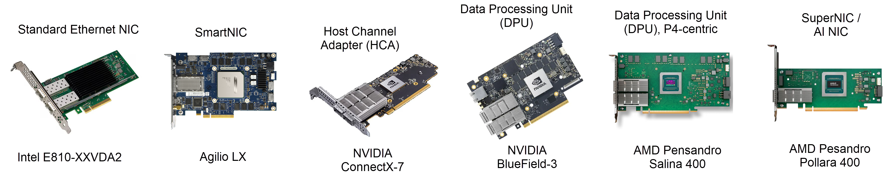

# The Data Center Network Adapter Ecosystem

## The Evolution of Network Offload

To understand the modern landscape of data center network adapters, it is essential to first understand the problem they solve: **CPU overhead in the network data path**.

In a traditional server, the host CPU is responsible for every aspect of network communication—processing protocol headers, managing connections, copying data between buffers, enforcing security policies, and running virtual switches. As network speeds increased from 1G to 10G to 100G and beyond, the CPU could no longer keep up. The time spent on network processing directly reduced the time available for running application workloads.

This bottleneck drove a progression of increasingly capable network adapters, each generation offloading more work from the host CPU onto dedicated hardware:

- **Standard NIC**: Offloads basic protocol processing (checksum, segmentation) in fixed-function hardware.

- **SmartNIC**: Adds a programmable data-plane pipeline (FPGA or P4-based ASIC) for custom packet processing, but has no RDMA capability.

- **HCA (Host Channel Adapter)**: An InfiniBand/RDMA-class NIC that offloads the entire RDMA data path (queue pairs, transport protocols, retransmission) in fixed-function hardware.

- **DPU (Data Processing Unit)**: Integrates a full System-on-Chip (SoC) with general-purpose CPU cores, its own OS, and hardware accelerators, enabling complete infrastructure offload.

- **SuperNIC**: An HCA optimized for AI workloads — adds multipath packet spraying, out-of-order placement, selective retransmission, and operates without PFC dependency.

The sections below cover each category in detail, followed by the switching and cabling infrastructure that completes the hardware ecosystem.

## Standard NIC: Fixed-Function Protocol Offload

A standard Network Interface Card (NIC) is the foundational building block of data center networking. Its primary role is to move Ethernet frames between the server and the network as fast as possible by offloading well-defined protocol operations into fixed-function silicon.

Standard NICs offload:

- **Checksum computation** (TCP/UDP/IP) to validate packet integrity without CPU involvement.
- **TCP Segmentation Offload (TSO)** and **Large Receive Offload (LRO)** to handle packet segmentation and reassembly in hardware, reducing per-packet CPU overhead for large transfers.
- **Receive Side Scaling (RSS)** to distribute incoming traffic across multiple CPU cores using hardware-based hashing.
- **SR-IOV (Single Root I/O Virtualization)** to present multiple virtual NIC instances to the hypervisor, enabling direct VM-to-NIC data paths that bypass the software virtual switch.

The critical distinction is that all of this logic is **fixed-function**: the offload capabilities are defined at manufacturing time and cannot be reprogrammed by the operator. The adapter accelerates known protocols but cannot execute custom logic or run arbitrary software.

A standard NIC has no knowledge of RDMA. It processes Ethernet/IP/TCP and UDP traffic using the traditional kernel networking stack — the host CPU still manages socket buffers, context switches, and memory copies. This is sufficient for general-purpose workloads, but at 100G+ speeds the CPU overhead becomes the bottleneck that RDMA was designed to eliminate.

Examples of standard NICs include the Intel E810 (Ice Lake) and Broadcom NetXtreme-E (BCM57xxx).

## SmartNIC: Programmable Data-Plane Offload

A SmartNIC extends the standard NIC by adding a **programmable packet-processing pipeline** to the adapter. Instead of only offloading fixed, predefined protocols, a SmartNIC can execute custom, operator-defined logic on every packet at line rate.

This programmability is typically implemented through one of two hardware approaches:

- **FPGA-based SmartNICs**: Use a Field-Programmable Gate Array to implement custom packet processing logic in reconfigurable hardware. Examples include early Xilinx (now AMD) Alveo SmartNICs and Intel FPGA-based adapters. FPGAs offer maximum flexibility but require specialized HDL (Hardware Description Language) expertise to program.

- **P4-based ASIC SmartNICs**: Use a purpose-built ASIC with a pipeline designed to execute programs written in the P4 domain-specific language. P4 allows network engineers to define custom packet parsing, matching, and action logic using a high-level programming model. The pipeline follows the Protocol Independent Switch Architecture (PISA): a programmable parser extracts headers, a series of match-action stages apply forwarding decisions, and a deparser reassembles the outgoing packet — all at line rate. The Netronome (now Corigine) Agilio family is an example, using a 60-core Network Flow Processor (NFP) to execute P4 programs at 10–100 GbE line rates.

> Note that the P4-programmable pipeline concept also appears in DPUs (see [AMD Pensando](#amd-pensando-dpu-family) below), where it is combined with general-purpose ARM cores and an independent OS to form a complete infrastructure offload platform.

### What a SmartNIC Can Do That a Standard NIC Cannot

Because the data-plane logic is programmable, operators can implement custom functionality directly on the adapter without consuming host CPU cycles:

- Custom packet classification, filtering, and Access Control Lists (ACLs)
- Hardware-accelerated Open vSwitch (OVS) offload for virtual networking
- Stateful firewalling, connection tracking, and NAT
- Custom telemetry, flow monitoring, and IPFIX export
- Protocol-specific optimizations (e.g., custom load balancing, header rewriting)

### What a SmartNIC Cannot Do

A SmartNIC has **no RDMA capability**. It cannot create queue pairs, execute RDMA verbs, perform kernel-bypass transfers, or run any InfiniBand transport protocol. All of these require the fixed-function RDMA transport engine found in an HCA. A SmartNIC accelerates *custom packet processing*; an HCA accelerates *RDMA transport*. These are fundamentally different offload models, and they are not interchangeable — which is why DPUs combine both (an HCA engine alongside a programmable pipeline) on a single card.

## HCA (Host Channel Adapter): RDMA-Capable Network Adapter

A Host Channel Adapter (HCA) is the InfiniBand term for a network adapter that offloads the **entire RDMA data path** in hardware. While it includes all the basic offloads of a standard NIC (checksum, TSO/LRO, RSS), the HCA goes far beyond them by implementing the RDMA transport layer directly in silicon — no kernel involvement in the data path.

An HCA offloads:

- **RDMA verb processing** — The HCA executes the full RDMA data path (queue pair management, memory registration, send/receive/read/write operations, completion handling) directly in hardware, enabling kernel-bypass and zero-copy transfers as described in the [RDMA deep dive](01_README_RDMA.md).

- **Transport protocol state machines** — For InfiniBand, this includes Reliable Connection (RC), Unreliable Connection (UC), and Unreliable Datagram (UD) transport services, along with segmentation and reassembly (SAR) and Go-Back-N retransmission, as described in the [InfiniBand deep dive](02_README_INFINIBAND.md#transport-services).

- **Congestion control** — Hardware-driven mechanisms such as FECN/BECN (InfiniBand) or DCQCN (RoCEv2) that react to congestion signals without software intervention.

The fundamental difference between a standard NIC and an HCA is **where the transport protocol runs**. On a standard NIC, the host CPU executes TCP/IP in the kernel, managing connection state, retransmission timers, and buffer copies in software. On an HCA, the transport protocol (RC, UC, UD) executes entirely in the adapter's hardware, and applications post work requests directly to hardware queues via the Verbs API — the kernel is not in the data path.

### NVIDIA ConnectX Family (The Industry Standard HCA)

The NVIDIA ConnectX family (formerly Mellanox) is the industry-standard implementation of an HCA. These adapters execute InfiniBand's core capabilities—RDMA, transport protocols, congestion control, and segmentation/reassembly—entirely in hardware.

Over time, ConnectX adapters evolved from InfiniBand-only devices into multi-protocol network interfaces. Early generations supported only native InfiniBand, but later versions added support for Ethernet and RDMA over Ethernet (RoCEv1 and v2). Some ConnectX models can operate in either InfiniBand or Ethernet mode via **Virtual Protocol Interconnect (VPI)**, making them highly versatile across different data center environments.

From a performance perspective, these adapters connect to the host via high-speed PCIe interfaces (Gen4/Gen5) and offload nearly all networking tasks from the CPU. For example, ConnectX-7 delivers up to 400 Gb/s of throughput while maintaining sub-microsecond latency, enabling applications to fully utilize network bandwidth without being bottlenecked by software processing.

> A detailed generation-by-generation breakdown is provided in [The ConnectX Hardware Timeline](#the-connectx-hardware-timeline) below.

## DPU (Data Processing Unit): Full Infrastructure Offload

### The Problem: Datacenter Tax

As cloud computing scaled through the 2010s, operators discovered that a growing share of host CPU cycles was consumed not by tenant workloads but by infrastructure overhead — virtual switching, storage virtualization, encryption, firewalling, telemetry, and bare-metal provisioning. Google's 2015 warehouse-scale computing study quantified this at nearly **30% of all CPU cycles** across their fleet. For every three servers purchased, nearly one server's worth of compute was lost to infrastructure rather than customer workloads.

The [standard NICs](#standard-nic-fixed-function-protocol-offload) and [SmartNICs](#smartnic-programmable-data-plane-offload) described above could not solve this — neither can run a full operating system or execute the stateful, general-purpose computation that infrastructure services require.

### The Pioneer: Amazon Nitro

Amazon Web Services was the first to deploy this architecture at scale. Starting in 2013, AWS introduced dedicated offload cards in their C3 instances that moved networking functions off the host CPU, increasing packet processing from 100,000 to over 1 million packets per second. Over the next four years, AWS progressively offloaded storage virtualization (C4, 2015) and management functions to discrete hardware cards. In 2015, AWS acquired **Annapurna Labs** to develop custom silicon for these cards.

The complete **Nitro System**, launched with C5 instances in November 2017, eliminated the hypervisor's control domain (Dom0) entirely — networking, storage, security, and management all ran on dedicated Nitro Cards with custom Annapurna ASICs, freeing the host CPU exclusively for tenant workloads. This was the first production-scale implementation of what the industry would later call a DPU.

### What Defines a DPU

A Data Processing Unit (DPU) integrates an entire **System-on-Chip (SoC)** directly onto the network adapter. This SoC includes general-purpose CPU cores, its own DRAM, persistent storage, hardware accelerators, and a high-speed network interface — all on a single PCIe card.

The defining characteristic is that the DPU **runs its own operating system** (typically Linux), completely independent of the host server. This transforms the adapter from a peripheral device into an autonomous compute platform that can run full infrastructure software stacks without consuming any host CPU cycles.

In a DPU-enabled server, infrastructure and application workloads are physically separated:

- **The Host CPU** runs only the tenant's application workloads (VMs, containers, AI training jobs).
- **The DPU** runs all infrastructure services: virtual switching (OVS), storage virtualization (NVMe-oF), encryption (IPsec/TLS), security policy enforcement, network telemetry, and bare-metal provisioning — the same services that previously consumed 30% of host CPU cycles.

This separation provides strong isolation. The tenant workload on the host cannot interfere with (or even observe) the infrastructure services running on the DPU. This is particularly valuable in multi-tenant cloud environments where the cloud provider must enforce networking and security policies without trusting the tenant's operating system.

Following Amazon's lead, the rest of the industry moved quickly. NVIDIA acquired Mellanox in 2019 (gaining the BlueField line), Fungible emerged from stealth in 2020, AMD acquired Pensando in 2022, and Microsoft acquired Fungible in 2023. Intel co-designed the IPU E2000 with Google. Today, every major cloud provider deploys DPU-class hardware for infrastructure offload.

### NVIDIA BlueField DPU Family

The NVIDIA BlueField series is the most widely deployed DPU in AI and cloud data centers. Each generation integrates a ConnectX-class network adapter with an increasingly powerful ARM-based SoC:

| Specification             | BlueField-2 (2021)           | BlueField-3 (2022)                | BlueField-4 (2025)                   |
| ------------------------- | ---------------------------- | --------------------------------- | ------------------------------------ |
| **CPU Cores**             | 8× Arm A72                   | 16× Arm A78 (Hercules)            | 64× Arm Neoverse V2                  |
| **CPU Cache**             | 1 MB L2 / 6 MB L3            | 8 MB L2 / 16 MB LLC               | 114 MB shared L3                     |
| **Memory**                | Up to 32 GB DDR4             | 16 GB DDR5                        | 128 GB LPDDR5x                       |
| **Integrated NIC**        | ConnectX-6 Dx                | ConnectX-7 class                  | ConnectX-9                           |
| **Network Bandwidth**     | 200 Gb/s                     | 400 Gb/s                          | 800 Gb/s                             |
| **Network Ports**         | 1×200G or 2×100G             | 1–4 ports, up to 400G             | Up to 800G/port, up to 8 split ports |
| **InfiniBand**            | EDR / HDR                    | NDR                               | XDR (via ConnectX-9)                 |
| **PCIe**                  | Gen 4 (8 or 16 lanes)        | Gen 5 (32 lanes)                  | Gen 6 x16                            |
| **Onboard Storage**       | No                           | M.2/U.2 connectors                | 512 GB on-board SSD                  |
| **Datapath Accelerator**  | —                            | 16 cores, 256 threads (DOCA)      | 16 cores, 256 threads (DOCA)         |
| **Crypto**                | IPsec/TLS, AES-GCM/XTS       | IPsec/TLS/MACsec, AES-GCM/XTS     | IPsec/TLS/PSP, AES-GCM/XTS           |
| **Form Factors**          | HHHL, FHHL                   | HHHL, FHHL                        | PCIe, Vera Rubin NVL72               |

In AI clusters, BlueField DPUs are commonly deployed on the storage and management network interfaces of GPU servers (e.g., in the Dell PowerEdge XE9680, two BlueField-3 DPUs handle storage virtualization and infrastructure management), while ConnectX HCAs serve as the dedicated compute NICs on the backend Scale-Out fabric.

### AMD Pensando DPU Family

The AMD Pensando DPU family (formerly the Distributed Services Card / DSC) takes a fundamentally different architectural approach from BlueField. Where BlueField places general-purpose ARM cores at the center of both the control plane and data plane, Pensando enforces a strict separation: a **P4-programmable ASIC** with hundreds of Match Processing Units (MPUs) handles all fast-path packet processing at wire speed, while **ARM CPU cores** run only the control plane — configuration, policy updates, orchestration, and a Linux-based management OS. The ARM cores never touch data-plane packets, ensuring deterministic throughput and latency regardless of control-plane load.

This architecture makes Pensando particularly well-suited for stateful, high-throughput services (OVS offload, stateful firewalling, NVMe-over-TCP, IPsec encryption) where every packet must be processed at line rate without exception.

The Pensando platform has evolved through three SoC generations:

| Specification         | Capri / Elba (Gen 1–2)      | Giglio (Gen 2+, 2023)       | Salina 400 (Gen 3, 2024)    |
| --------------------- | --------------------------- | --------------------------- | --------------------------- |
| **CPU Cores**         | 16× Arm A72                 | 16× Arm A72                 | 16× Arm Neoverse N1         |
| **Memory**            | DDR4                        | DDR5                        | DDR5 (up to 128 GB)         |
| **P4 MPU Engines**    | 144                         | 144 (enhanced)              | 232                         |
| **Network Bandwidth** | 200 Gb/s                    | 200 Gb/s                    | 400 Gb/s                    |
| **PCIe**              | Gen 4                       | Gen 4                       | Gen 5                       |

AMD provides a Software-in-Silicon Development Kit (SSDK) that allows customers to write custom P4 programs for the data path, enabling advanced stateful services such as TCP/TLS proxying, NVMe-over-TCP acceleration, IPsec, and custom flow aging — all compiled down to the MPU pipeline and executed at line rate.

### Marvell OCTEON DPU Family

The Marvell OCTEON 10 DPU platform is built on 5nm process technology and integrates Arm Neoverse N2 cores with hardware accelerators for networking, security, and inline AI/ML inference. The product line scales across multiple performance tiers:

- **CN102** — Up to 8 Arm N2 cores, 10G SerDes, optimized for edge and entry-level networking (approximately 25W TDP)
- **CN103** — Up to 8 Arm N2 cores, 56G SerDes, for mid-range routing and security appliances
- **CN106** — Up to 24 Arm N2 cores, integrated 1 Tb/s switch, inline AI/ML acceleration cores, targeting cloud data centers and 5G infrastructure

### Intel IPU (Infrastructure Processing Unit)

"IPU" is Intel's branding for the DPU concept. Architecturally, an IPU is a DPU — an SoC with general-purpose ARM cores, its own Linux OS, and hardware accelerators on a PCIe adapter. Intel's naming emphasizes a specific deployment model co-designed with Google: the cloud provider owns and manages the IPU entirely, while the host server is presented as a bare resource to the tenant. The provider can patch, update, and enforce infrastructure policies without any dependency on the tenant's operating system.

**Intel IPU E2000 ASIC** — Co-designed with Google, the E2000 is the underlying SoC featuring a programmable packet-processing engine, NVMe storage interface, cryptographic acceleration, and compression offload. It is designed for integration into custom server platforms by hyperscale operators.

**Intel IPU Adapter E2100** — A PCIe adapter built around the E2000 SoC, packaging it into a standard server form factor:

| Specification         | Intel IPU E2100                                |
| --------------------- | ---------------------------------------------- |
| **CPU Cores**         | 16× Arm Neoverse N1                            |
| **Network Bandwidth** | 200 Gb/s (2× QSFP56)                           |
| **PCIe**              | Gen 4 (x16)                                    |
| **Accelerators**      | NVMe transport, crypto/encryption, compression |
| **TDP**               | 75W–150W (variant dependent)                   |
| **Operating System**  | Linux                                          |

## SuperNIC: The AI-Era HCA

The [HCA section](#hca-host-channel-adapter-rdma-capable-network-adapter) above described how an HCA offloads the RDMA transport in hardware. For over a decade, the protocol it implemented — single-path RC with Go-Back-N retransmission and PFC-enforced losslessness — was sufficient. As AI training clusters scaled beyond tens of thousands of GPUs, these assumptions broke down. The [RoCEv2 Load Balancing deep dive](https://github.com/ManiAm/GNS-DC-Load-Balancing/blob/master/03_README_ROCE_LB.md#ecmp-load-balancing-for-rocev2) traces the progression, and the [MRC protocol](https://github.com/ManiAm/GNS-DC-Load-Balancing/blob/master/03_README_ROCE_LB.md#mrc-multipath-reliable-connection) was designed to solve these problems at the transport layer. A **SuperNIC** is an HCA whose silicon implements MRC (or the equivalent features defined by the [Ultra Ethernet Consortium](https://ultraethernet.org/)) instead of single-path RC. It has no on-card OS, no general-purpose CPU cores, and no SmartNIC-style programmable pipeline. Applications interact with it through the standard Verbs API. What changes is *which* transport protocol the silicon executes.

### The NVIDIA SuperNIC Portfolio

NVIDIA currently markets three products under the SuperNIC brand, each built on a different hardware platform. The **BlueField-3 SuperNIC** is physically the same hardware as the [BlueField-3 DPU](#nvidia-bluefield-dpu-family), but shipped in **NIC Mode**. The ARM cores are inactive by default, and the device functions purely as a ConnectX-class network adapter. This reduces power consumption, improves network performance, and minimizes host memory footprint compared to full DPU mode. It can be reconfigured to DPU mode if infrastructure offload is later needed. The **ConnectX-8** and **ConnectX-9 SuperNICs** are pure HCAs — no ARM SoC, no on-card OS. ConnectX-8 is the first generation with native MRC support. ConnectX-9 is designed for NVIDIA Rubin GPU systems, delivering up to 1.6 Tb/s aggregate throughput and introducing programmable RDMA transport, the NVIDIA Inference Transfer Library (NIXL), and post-quantum cryptography (CNSA 2.0).

The table below shows all three side by side. The "Based on" row highlights the architectural difference: BlueField-3 SuperNIC carries dormant DPU hardware (ARM cores, memory, SSD), while ConnectX-8/9 are clean HCA designs with no DPU overhead. The "AI Networking" row shows the feature progression — BlueField-3 SuperNIC supports programmable congestion control (PCC) but lacks MRC, ConnectX-8 adds MRC and SHARP, and ConnectX-9 adds programmable RDMA transport and NIXL for inference workloads.

| Specification           | BlueField-3 SuperNIC              | ConnectX-8 SuperNIC                | ConnectX-9 SuperNIC                  |
| ----------------------- | --------------------------------- | ---------------------------------- | ------------------------------------ |
| **Based on**            | BlueField-3 DPU (NIC Mode)        | ConnectX-8 HCA                     | ConnectX-9 HCA                       |
| **Max Bandwidth**       | 400 Gb/s                          | 800 Gb/s                           | 800 Gb/s (1.6 Tb/s to Rubin GPUs)   |
| **Ethernet Speeds**     | Up to 400 GbE                     | Up to 2×400 GbE, 8 split ports     | Up to 800 GbE, 8 split ports         |
| **InfiniBand**          | NDR (400 Gb/s)                    | XDR (800 Gb/s)                     | XDR (800 Gb/s)                       |
| **PCIe**                | Gen 5 (32 lanes)                  | Gen 6 (up to 48 lanes)             | Gen 6 (up to 48 lanes)              |
| **On-board Memory**     | 32 GB DDR5                        | —                                  | —                                    |
| **On-board SSD**        | 128 GB                            | —                                  | —                                    |
| **ARM Cores**           | Up to 16 (inactive by default)    | —                                  | —                                    |
| **Crypto**              | IPsec/TLS/MACsec/PSP, AES-GCM/XTS | IPsec/MACsec/PSP                   | IPsec/TLS/PSP, CNSA 2.0 PQC         |
| **AI Networking**       | RoCE, GPUDirect, PCC              | MRC, SHARP, GPUDirect, RoCEv2      | MRC, SHARP, NIXL, GPUDirect, programmable RDMA transport |
| **Form Factors**        | HHHL, FHHL                        | HHHL, OCP 3.0 TSFF, Dual Mezzanine | HHHL, OCP3 TSFF, Quad IO card (Vera Rubin NVL144) |
| **GA Release**          | 2023                              | 2025                               | 2026                                |

### SuperNIC Beyond NVIDIA

SuperNIC originated as an NVIDIA brand, but the underlying concept is being adopted industry-wide under different names:

- **AMD Pensando Pollara 400** — Marketed as an "AI NIC." A 400 Gb/s adapter with a P4-programmable engine that implements MRC-equivalent features (multipath packet spray, out-of-order placement into GPU memory, selective retransmission, path-aware congestion avoidance). It is the first adapter certified as UEC-ready.

- **Broadcom Thor Ultra** — Marketed as an "AI Ethernet NIC." An 800 Gb/s clean-sheet design fully compliant with UEC 1.0. Features hardware-accelerated multipath, out-of-order delivery, SACK-based selective retransmission, and programmable congestion control.

- **Cornelis Networks CN6000** — An 800 Gb/s "SuperNIC" (using the same term as NVIDIA) combining Omni-Path architecture with Ethernet/RoCEv2 and UEC support.

The technical capabilities converge across vendors. The differences lie in the standards each follows (NVIDIA's proprietary MRC vs. the open UEC specification) and the switch ecosystems they integrate with (Spectrum-X for NVIDIA, Tomahawk Ultra for Broadcom, etc.). The MRC specification was released as an open standard through the [Open Compute Project](https://www.opencompute.org/) with contributions from all major vendors, signaling eventual convergence.

## Comparison

| Capability                        | Standard NIC                   | SmartNIC                                    | HCA                              | DPU                                     | SuperNIC                                          |
| --------------------------------- | ------------------------------ | ------------------------------------------- | -------------------------------- | --------------------------------------- | ------------------------------------------------- |
| **Protocol offload**              | Fixed-function (TCP/IP)        | Fixed + programmable pipeline               | Fixed-function (TCP/IP + RDMA)   | Fixed + programmable + full SoC         | Fixed-function (TCP/IP + RDMA + MRC/UEC)          |
| **RDMA support**                  | No                             | No                                          | Yes (kernel-bypass, zero-copy)   | Yes (via integrated HCA)                | Yes (multipath, OOO placement, selective retx)    |
| **Programmable data plane**       | No                             | Yes (FPGA or P4 ASIC)                       | No                               | Yes                                     | No (transport-level programmability in CX-9)      |
| **General-purpose CPU on-card**   | No                             | No (or minimal)                             | No                               | Yes (ARM cores, 8–64+)                  | No                                                |
| **Runs its own OS**               | No                             | No                                          | No                               | Yes (Linux)                             | No                                                |
| **Multipath transport**           | No                             | No                                          | No (single-path per QP)          | No (single-path per QP)                | Yes (packet spray across all paths)               |
| **PFC dependency**                | N/A                            | N/A                                         | Required                         | Required                                | Eliminated                                        |
| **Virtual switch offload**        | Partial (SR-IOV)               | Full (OVS hardware offload)                 | Partial (SR-IOV)                 | Full (OVS + management)                 | Partial (SR-IOV)                                  |
| **Storage virtualization**        | No                             | Limited                                     | No                               | Full (NVMe-oF, compression, encryption) | No                                                |
| **Infrastructure isolation**      | None                           | Data-plane only                             | None                             | Complete (separate OS and management)    | None                                              |
| **Typical use case**              | General-purpose networking     | Custom packet processing, telemetry         | HPC, AI compute fabric           | Multi-tenant cloud, AI storage/mgmt fabric | AI training/inference compute fabric              |
| **Examples**                      | Intel E810, Broadcom NetXtreme | AMD/Xilinx Alveo, Netronome/Corigine Agilio | NVIDIA ConnectX-7, Broadcom P7   | NVIDIA BlueField, AMD Pensando, Intel IPU | NVIDIA ConnectX-8/9, AMD Pollara, Broadcom Thor Ultra |

## The ConnectX Hardware Timeline

The deployment of RoCE is closely tied to the evolution of the NVIDIA (formerly Mellanox) ConnectX family. Over the years, these adapters transitioned from strict InfiniBand hardware to versatile, multi-protocol engines capable of synthesizing lossless fabrics over Ethernet.

### ConnectX Generations Supporting RoCEv1

| Generation     | Year | Max Link Speed            | Protocol Modes              | RDMA Support     | Notes                                                                |
| -------------- | ---- | ------------------------- | --------------------------- | ---------------- | -------------------------------------------------------------------- |
| ConnectX-1     | 2007 | 10 Gb/s                   | InfiniBand                  | IB RDMA          | First-generation HPC adapter                                         |
| ConnectX-2     | 2009 | 10–40 Gb/s                | InfiniBand, Ethernet        | IB RDMA          | First dual-protocol Mellanox adapter                                 |
| ConnectX-3     | 2012 | 40 GbE / FDR IB (56 Gb/s) | VPI (Ethernet + InfiniBand) | IB RDMA, RoCEv1  | Introduced Virtual Protocol Interconnect (VPI)                       |
| ConnectX-3 Pro | 2013 | 40/56 Gb/s                | Ethernet + InfiniBand       | IB RDMA, RoCEv1  | Improved SR-IOV, storage offloads, and virtualization features       |

**ConnectX-1 (2007)** — Mellanox's first-generation ConnectX adapter, designed for HPC environments running InfiniBand fabrics. It supported 10 Gb/s InfiniBand (DDR) links and focused on enabling RDMA-based MPI workloads in supercomputing clusters. This generation did not support Ethernet as a primary operating mode.

**ConnectX-2 (2009)** — Expanded the platform to support both InfiniBand and Ethernet, making it one of the first Mellanox adapters to bridge traditional data center networking and HPC fabrics. Depending on the model, the adapter supported 10 GbE Ethernet or InfiniBand speeds up to 40 Gb/s (QDR). The card was typically purchased as either an Ethernet or InfiniBand variant rather than dynamically switching between protocols.

**ConnectX-3 (2012)** — A major milestone that introduced Virtual Protocol Interconnect (VPI), allowing the same physical adapter to operate as either an Ethernet NIC or an InfiniBand HCA based on firmware configuration. VPI models (e.g., MCX354A) support both protocols; Ethernet-only variants (labeled "EN," e.g., MCX314A-BCCT) do not support InfiniBand. ConnectX-3 also introduced RoCEv1 support, enabling RDMA over Layer-2 Ethernet networks.

**ConnectX-3 Pro (2013)** — An enhanced version of ConnectX-3 with improved SR-IOV virtualization, packet processing acceleration, and storage networking offloads. Like ConnectX-3, it was available in both VPI and Ethernet-only variants and supported RoCEv1.

### ConnectX Generations Supporting RoCEv2

| Generation     | Year | Max Link Speed            | Protocol Modes        | RDMA Support     | Notes                                                    |
| -------------- | ---- | ------------------------- | --------------------- | ---------------- | -------------------------------------------------------- |
| ConnectX-4     | 2015 | 100 GbE / EDR IB          | Ethernet + InfiniBand | IB RDMA, RoCEv2 | First generation with RoCEv2; major jump to 100G        |
| ConnectX-4 Lx  | 2016 | 10/25/40/50 GbE           | Ethernet only         | RoCEv2          | Lower-cost Ethernet-only variant                         |
| ConnectX-5     | 2016 | 100 GbE / EDR IB          | Ethernet + InfiniBand | IB RDMA, RoCEv2 | Added NVMe-oF support and advanced offloads              |
| ConnectX-6     | 2019 | 200 GbE / HDR IB          | Ethernet + InfiniBand | IB RDMA, RoCEv2 | Introduced PCIe Gen4                                     |
| ConnectX-6 Dx  | 2020 | 200 GbE                   | Ethernet              | RoCEv2          | Added inline IPsec and TLS security offloads             |
| ConnectX-6 Lx  | 2020 | 25/50 GbE                 | Ethernet              | RoCEv2          | Lower-cost, power-efficient variant                      |
| ConnectX-7     | 2022 | 400 GbE / NDR IB          | Ethernet + InfiniBand | IB RDMA, RoCEv2 | PCIe Gen5; widely deployed in modern AI clusters         |
| ConnectX-8     | 2025 | 800 GbE / XDR IB          | Ethernet + InfiniBand | IB RDMA, RoCEv2 | PCIe Gen6; MRC support; SuperNIC branding                |
| ConnectX-9     | 2026 | 800 GbE / XDR IB          | Ethernet + InfiniBand | IB RDMA, RoCEv2 | PCIe Gen6; up to 1.6 Tb/s aggregate; designed for Rubin GPU systems |

**ConnectX-4 (2015)** - The first generation to introduce RoCEv2, which encapsulates RDMA traffic inside UDP/IP packets. This enabled RDMA to be routed across Layer-3 leaf-spine networks, removing the Layer-2 broadcast domain limitation of RoCEv1 and making RDMA practical for modern data center fabrics at scale.

**ConnectX-5 (2016)** — Built on the ConnectX-4 architecture with the addition of NVMe over Fabrics (NVMe-oF) hardware offload, enabling remote storage access at near-local latency. ConnectX-5 also introduced Multi-Host mode, allowing a single adapter to be shared across multiple server nodes, and enhanced GPUDirect RDMA for direct GPU-to-NIC transfers without staging through host memory.

**ConnectX-6 (2019)** — Doubled bandwidth to 200 Gb/s (HDR InfiniBand / 200 GbE) and introduced PCIe Gen4 connectivity. ConnectX-6 was the first generation with hardware-accelerated 200G Ethernet, making it the adapter of choice for early large-scale AI training clusters. VPI models continued to support both InfiniBand and Ethernet.

**ConnectX-6 Dx (2020)** — An Ethernet-only variant that added inline hardware offload for IPsec and TLS encryption/decryption at line rate, targeting security-sensitive cloud and enterprise deployments. By handling crypto in the NIC, the host CPU is freed from encryption overhead entirely.

**ConnectX-7 (2022)** — Jumped to 400 Gb/s (NDR InfiniBand / 400 GbE) with PCIe Gen5. Widely deployed as the primary compute NIC in NVIDIA DGX H100 and similar AI training platforms. ConnectX-7 introduced Programmable Congestion Control (PCC) via NVIDIA DOCA, enhanced GPUDirect RDMA, and In-Network Computing (SHARP) for collective offload.

**ConnectX-8 (2025)** — The first generation marketed under the **SuperNIC** brand. Delivers 800 Gb/s (XDR InfiniBand / 800 GbE) over PCIe Gen6. ConnectX-8 introduces native MRC support — multipath packet spraying, out-of-order delivery with immediate memory placement, selective retransmission, and PFC-free operation — making it the first ConnectX adapter that can distribute a single RDMA connection across all available fabric paths.

**ConnectX-9 (2026)** — Designed for the NVIDIA Rubin GPU architecture. Delivers up to 1.6 Tb/s aggregate throughput (800 Gb/s per port, dual-port). Beyond the MRC capabilities of ConnectX-8, ConnectX-9 adds programmable RDMA transport (allowing custom transport behaviors in hardware), the NVIDIA Inference Transfer Library (NIXL) for inference workloads, and post-quantum cryptography support (CNSA 2.0). It serves as the integrated NIC inside the BlueField-4 DPU.
