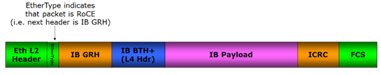
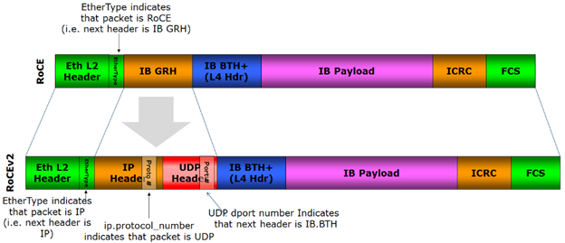
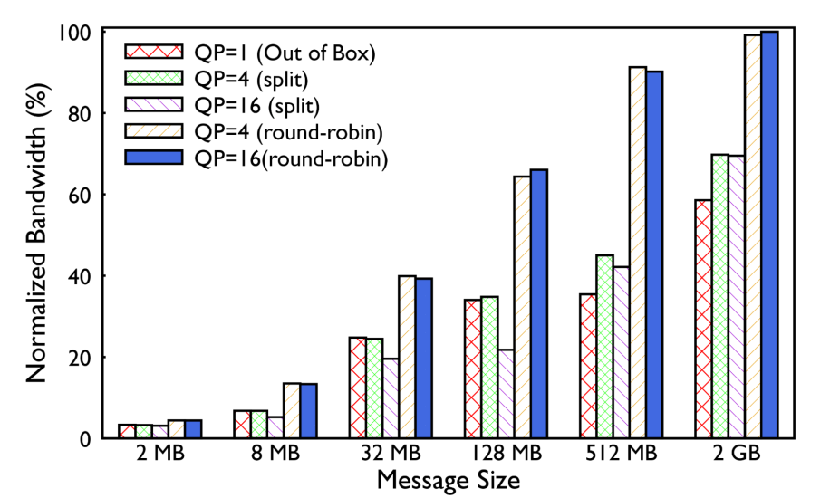

# RDMA over Converged Ethernet (RoCE)

Historically, data centers ran two networks: **InfiniBand** (for high-speed, direct-memory storage/compute) and **Ethernet** (for standard internet/user traffic). Managing two distinct infrastructures is operationally complex and expensive. The concept of "Network Convergence" emerged to unify these traffic types onto a single wire. This desire birthed RDMA over Converged Ethernet (RoCE).


## The Foundation: Preparing Ethernet for RDMA

Before discussing how RoCE works, we must address the fundamental difference between the two physical mediums. InfiniBand is natively lossless; it uses **Credit-Based Flow Control** (CBFC) at the hardware level to physically prevent packet drops. Ethernet is natively lossy; if a switch's buffer fills up, it simply discards the overflow packets.

Because the RDMA transport protocol relies on a strict **Go-Back-N** (GBN) retransmission mechanism, dropping packets in an RDMA environment destroys throughput and skyrockets latency. Therefore, to run RDMA on Ethernet, we have to coerce Ethernet into behaving like a lossless fabric.

At modern link speeds, the Go-Back-N retransmission window is large. At 800 Gb/s with typical round-trip latency, approximately 108 packets are in flight at any moment. A single lost packet therefore triggers retransmission of, on average, N/2 ≈ 54 packets. The bandwidth consumed by those 54 redundant retransmissions is pure waste.

The damage scales rapidly with loss rate. At just 1% packet loss, effective throughput drops to approximately 65% of line rate. At 5% loss, the fabric becomes nearly unusable as retransmission storms consume most of the available bandwidth. This is why zero loss is not a performance optimization. It is a correctness requirement for any RoCE deployment.


## Upgrading Ethernet with Data Center Bridging (DCB)

Coercing Ethernet into lossless behavior is achieved using **Data Center Bridging** (DCB), an umbrella term for a family of IEEE standards that transform a standard Ethernet fabric into a lossless transport suitable for RDMA. The DCB suite provides four building blocks:

- **Enhanced Transmission Selection (ETS)** — IEEE 802.1Qaz: egress scheduling via strict-priority or weighted round-robin policies that guarantee fair bandwidth distribution under congestion.
- **Priority Flow Control (PFC)** — IEEE 802.1Qbb: per-priority PAUSE frames that physically prevent packet loss by halting a single traffic class while others continue flowing.
- **Data Center Bridging Exchange (DCBX)** — IEEE 802.1Qaz: an LLDP-based handshake that auto-negotiates PFC, ETS, and application mappings between a switch and a NIC, preventing silent misconfigurations.
- **Quantized Congestion Notification (QCN)** — IEEE 802.1Qau: a legacy Layer 2 congestion signal, now obsolete. Modern RoCEv2 fabrics replace it with DCQCN, which uses Layer 3 ECN to signal congestion across routed networks.

> For a detailed treatment of DCB see the **[Data Center Bridging (DCB)](https://github.com/ManiAm/GNS-QOS/blob/master/docs/03_CLASSIFICATION.md#data-center-bridging-dcb--why-it-exists)** documentation series.

The remainder of this section covers the RoCEv2-specific configuration defaults and the ConnectX-4 firmware parameters.

### RoCEv2 Classification and Trust Mode

In a RoCEv2 deployment, the switch operates in **trust DSCP** mode (reading the 6-bit DSCP field from the IP header) and maps incoming packets into Traffic Classes. The canonical mapping is:

| DSCP Value | Traffic Class | Traffic Type     |
| ---------- | ------------- | ---------------- |
| 48         | TC6           | CNP              |
| 24         | TC3           | RoCEv2 data      |
| 0          | TC0           | TCP / management |

Any unmapped DSCP value falls to TC0 (best-effort). While this mapping is fully configurable, these defaults are the recognized industry standard for RDMA deployments.

### Egress Scheduling

The egress scheduler, governed by ETS (IEEE 802.1Qaz), combines Strict Priority and Deficit Weighted Round Robin (DWRR):

| Traffic Class | Scheduling Algorithm | Bandwidth Allocation      | Primary Purpose                                 |
| ------------- | -------------------- | ------------------------- | ----------------------------------------------- |
| TC6 (CNP)     | Strict Priority      | — (Always serviced first) | Instant congestion feedback (DCQCN)             |
| TC3 (RoCEv2)  | DWRR                 | 50% of remaining          | High-speed RDMA data transfers                  |
| TC0 (TCP)     | DWRR                 | 50% of remaining          | Standard network management and general traffic |

> A **Congestion Notification Packet (CNP)** is a small control frame generated by the receiver when it detects that an incoming RoCEv2 data packet has been marked with the ECN Congestion Experienced (CE) codepoint by a switch along the path. The CNP is sent back to the original sender, instructing it to reduce its transmission rate according to the DCQCN algorithm. Because a delayed CNP means a delayed reaction to congestion, CNPs are assigned to TC6 with DSCP 48 and scheduled with Strict Priority to ensure they are always dequeued ahead of data traffic. For a detailed treatment of CNP generation and the DCQCN feedback loop, see the **[Notification Point documentation](https://github.com/ManiAm/GNS-QOS/blob/master/docs/05_DCQCN.md#the-notification-point-generating-the-cnp)**.

### Priority Groups (PG)

These Traffic Classes map into three Priority Groups on the ingress side:

- **PG6 (Congestion Notification)**: Mapped from TC6. Configured as lossy, but strictly prioritized so CNPs bypass data queues and reach the sender as fast as possible.
- **PG3 (RDMA/RoCEv2)**: Mapped from TC3. Configured as lossless. PFC is exclusively enabled on this group to guarantee zero packet drops.
- **PG0 (Standard Traffic)**: Mapped from TC0. Configured as lossy.

### PFC vs. Credit-Based Flow Control

PFC is Ethernet's tool to emulate the lossless reliability that Credit-Based Flow Control (CBFC) provides natively to InfiniBand. While both successfully prevent congestion drops, CBFC's proactive nature makes it inherently stable. PFC works, but because it relies on slamming the brakes right before an accident happens, it requires meticulous network tuning and introduces operational risks like PFC storms and deadlocks.

| Feature  | PFC (Priority-Based Flow Control)                                  | CBFC (Credit-Based Flow Control)                                                       |
| -------- | ------------------------------------------------------------------ | -------------------------------------------------------------------------------------- |
| Logic    | Reactive: pauses traffic when congestion occurs ("I'm full, stop") | Proactive: allows transmission only when credits are available ("You have credit, go") |
| Trigger  | Sends PAUSE frames when buffer occupancy reaches a threshold       | Sends credit updates as buffer space becomes available                                 |
| Standard | IEEE 802.1Qbb (part of Data Center Bridging, DCB)                  | InfiniBand; emerging in Ultra Ethernet Consortium (UEC) designs                        |
| Main Use | General data center networks (e.g., RoCEv2, FCoE)                  | AI clusters, HPC systems, and large-scale distributed training fabrics                 |


## DCQCN and Congestion Control

To avoid triggering PFC's emergency brake, the RoCEv2 ecosystem relies on **DCQCN** (Data Center Quantized Congestion Notification) as a proactive congestion control algorithm. DCQCN uses ECN bits in the IP header to signal congestion: when a switch's queue depth crosses a WRED threshold, it marks passing packets with Congestion Experienced (CE). The receiver detects these marks and generates a Congestion Notification Packet (CNP) back to the sender, which then throttles its transmission rate through a multi-phase recovery state machine.

> For the full algorithm see **[DCQCN and ECN](https://github.com/ManiAm/GNS-QOS/blob/master/docs/05_DCQCN.md)**.


## RoCEv1: The Layer 2 Solution (2010)

Introduced by the InfiniBand Trade Association (IBTA) in April 2010, RoCEv1 (often termed "IBoE" or InfiniBand over Ethernet) was the first attempt to run the InfiniBand transport protocol over Ethernet links.

RoCEv1 was designed for simplicity. It completely replaced the InfiniBand Physical and Link layers with a standard Ethernet header. The motivation was to allow organizations to use standard Ethernet switches, DACs, and transceivers while retaining the low-latency, zero-copy benefits of the InfiniBand Verbs API.

A RoCEv1 packet is essentially an InfiniBand Base Transport Header (BTH) and payload encapsulated directly inside an Ethernet frame with a specific Ethertype (0x8915).



In native InfiniBand architecture, packets utilize two distinct checksums: an **Invariant CRC** (ICRC) to guarantee end-to-end payload integrity and a **Variant CRC** (VCRC) to protect link-level routing headers that change as the packet hops across the fabric. However, because RoCEv1 encapsulates the InfiniBand payload inside a standard Ethernet frame, the native InfiniBand VCRC is entirely redundant and is stripped away in favor of the standard Ethernet Frame Check Sequence (FCS).

The Ethernet FCS handles all underlying physical and link-level error detection across the copper wire, while the retained InfiniBand ICRC acts as the ultimate safeguard, ensuring the RDMA payload remains completely uncorrupted as it bypasses the Linux kernel and writes directly into the receiving application's memory.

> RoCEv1 had a fatal flaw for large-scale deployment: it was not routable.

Because RoCEv1 lacked an IP header and relied solely on MAC addresses and an Ethertype, it could not pass through Layer 3 routers. The traffic was strictly confined to a single Layer 2 broadcast domain (a single VLAN or rack). As modern data centers rapidly migrated to Leaf-Spine topologies requiring Layer 3 routing for massive scalability, RoCEv1 became practically obsolete for hyperscale use, relegating it to smaller, localized storage deployments.


## RoCEv2: The Routable Revolution (2014)

To address the severe scalability limitations of RoCEv1, the IBTA released the RoCEv2 specification in late 2014. RoCEv2, widely known as "Routable RoCE," encapsulates the RDMA transport inside standard UDP/IP packets.

By adding an IP header, the packet now looks like standard internet traffic to any network equipment. Standard routers can read the destination IP address and forward the packet across complex, multi-tiered network topologies. This was a transformative architectural shift, enabling RDMA to scale from single racks to massive, multi-pod data centers containing tens of thousands of compute nodes.

### RoCEv2 Packet Structure

The RoCEv2 packet structure is more complex than RoCEv1 to accommodate routability and advanced congestion control.



**Ethernet Header (14 Bytes)**

Ethertype: 0x0800 (IPv4) or 0x86DD (IPv6). The fact that this is an RDMA packet is now hidden deeper inside the IP payload.

**IP Header (20 Bytes for IPv4)**

DSCP: Used to classify the traffic for Quality of Service (QoS), essential for mapping RoCE traffic into the correct Traffic Class and lossless Priority Group as discussed earlier.

ECN (Explicit Congestion Notification): Two bits used for advanced congestion signaling. This is the foundation of the DCQCN congestion control mechanism.

**UDP Header (8 Bytes)**

Destination Port: Fixed at 4791. This well-known port, assigned by IANA, identifies the payload as a RoCEv2 packet to the receiving network interface.

Source Port: Variable. Unlike the fixed destination port, the source port is computed per-flow (typically a hash of the Queue Pair number and other connection identifiers). This is critical for ECMP load balancing: Leaf-Spine fabrics use the UDP source port as entropy in their hash function to distribute RoCEv2 flows across multiple equal-cost paths. Without this variation, all RoCE traffic between two hosts would follow a single path, leaving the remaining fabric links idle.

**InfiniBand Headers (BTH)**

The BTH remains exactly identical to native InfiniBand (containing the OpCode, DestQP, and PSN), allowing existing hardware engines to process the packet natively once the Ethernet/IP/UDP encapsulation is stripped away.


## ECMP Load Balancing for RoCEv2

> This section assumes familiarity with ECMP mechanics, hash algorithms, and the elephant flow problem covered in the [Fabric Load Balancing](https://github.com/maniam/GNS-DC-VXLAN/blob/master/docs/02a_README_LB.md) documentation. Here, we focus specifically on RoCEv2 and the constraints that RDMA's Reliable Connection (RC) transport imposes on ECMP.

In a Leaf-Spine fabric, ECMP distributes aggregate traffic across multiple equal-cost spine links by hashing each packet's 5-tuple to a deterministic output port. For general-purpose TCP workloads - thousands of short-lived, small flows (mice flows) - this statistical distribution works well. The sheer volume of independent flows naturally balances the load across all available paths.

RoCEv2 traffic, however, has characteristics that fundamentally conflict with this model. This section examines why standard load balancing breaks down for RDMA traffic and how the industry has evolved to address it.

### RoCEv2 Entropy: The UDP Source Port

For ECMP to distribute traffic, packets within different flows must produce different hash values. In the RoCEv2 5-tuple, four fields are static:

| Field            | Value                                            | Variability         |
| ---------------- | ------------------------------------------------ | ------------------- |
| Source IP        | Sender's NIC address                             | Fixed per node      |
| Destination IP   | Receiver's NIC address                           | Fixed per node      |
| Protocol         | UDP (17)                                         | Always fixed        |
| Destination Port | 4791 (IANA-assigned RoCEv2 well-known port)      | Always fixed        |
| **Source Port**  | **Hash of QP number and connection identifiers** | **Variable per QP** |

If the UDP source port were also fixed, all RoCEv2 traffic between any two servers would produce the same hash and be pinned to a single spine link — leaving every other path idle. To prevent this, the sender's NIC computes a per-QP hash (typically derived from the Queue Pair number and other internal connection state) and places it in the UDP source port field. To intermediate switches, each QP appears as a distinct UDP conversation with a unique 5-tuple, allowing ECMP to stripe different QPs across different spine links.

This mechanism is sufficient for separating different connections onto different paths. The challenge lies in what happens within a single connection.


### The RC Ordering Constraint

As covered in the [InfiniBand deep dive](02_README_INFINIBAND.md#segmentation-and-reassembly-sar), when an application message exceeds the MTU, the sender's NIC segments it into multiple packets. The first packet carries the RDMA Extended Transport Header (RETH) containing the remote virtual address, `R_Key`, and total DMA length. All subsequent packets carry raw payload fragments with no addressing metadata — they rely entirely on arriving in sequence so the receiver can write each fragment to the correct memory offset.

This creates a hard constraint: **all packets within a single QP must follow the exact same network path**. If packets from the same QP were spread across different spine links, path latency differences would cause out-of-order arrival. The receiving NIC would interpret this as packet loss, discard the out-of-order packets, and trigger Go-Back-N retransmission — exactly the catastrophic throughput collapse described in the [opening of this document](#the-foundation-preparing-ethernet-for-rdma).

The consequence is that RoCEv2 + RC locks every QP to a single physical path. The per-QP UDP source port provides inter-QP entropy for ECMP, but intra-QP traffic is strictly single-path. No standard ECMP mechanism can split a single QP across multiple links.


### Why This Breaks at AI Scale

The combination of single-path pinning and the nature of AI training traffic creates a severe load balancing problem that standard ECMP cannot solve. RoCEv2 traffic is dominated by elephant flows.

AI training collectives (all-reduce, all-to-all, all-gather) generate massive, long-lived, high-bandwidth transfers. A single GPU may open an RDMA connection to another GPU and stream data at full 400 or 800 Gb/s line rate for seconds or minutes. These are textbook [elephant flows](https://github.com/maniam/GNS-DC-VXLAN/blob/master/docs/02a_README_LB.md#the-elephant-flow-problem) — a small number of connections that individually consume an entire link's capacity.

Standard ECMP is a purely static mechanism. It assigns a flow to a path at connection setup and never reconsiders. If a link becomes congested due to hash collisions, ECMP continues forwarding new packets into the bottleneck while neighboring links remain empty. It has no feedback loop, no congestion awareness, and no ability to rebalance.

This is the fundamental mismatch: ECMP was designed for a world of many small, statistically diverse flows. RoCEv2 AI traffic produces a small number of massive, long-lived flows where the statistical assumptions collapse.


### QP Scaling: The Software Workaround

The most common software-level approach to improving RoCEv2 load balancing is **QP scaling**. Instead of sending a transfer over a single QP, the application (or collective communication library such as NCCL) splits the data across multiple QPs to the same destination. Because each QP generates a different UDP source port, ECMP hashes them to different spine links, distributing the load.

For example, if a single 400 Gb/s transfer is split across 4 QPs, each QP carries approximately 100 Gb/s and hashes independently. The probability that all four collide on the same link drops significantly compared to a single QP.

Meta deployed QP scaling across their production AI training clusters and measured its impact on AllReduce bandwidth. The figure below (from [Meta's SIGCOMM 2024 paper](https://engineering.fb.com/2024/08/05/data-center-engineering/roce-network-distributed-ai-training-at-scale/)) compares two strategies — splitting each message across multiple QPs versus posting successive messages to different QPs in round-robin fashion — at QP counts of 1, 4, and 16. Round-robin with 16 QPs achieves near-100% normalized bandwidth for large messages (2 GB), while a single QP (the "out of box" baseline) reaches only ~60%. The improvement is most pronounced for large messages where elephant flows dominate; for small messages (2–8 MB), even 16 QPs provide limited benefit because the transfers are too short to create sustained congestion.



However, QP scaling has practical limits:

- **Diminishing returns**: Experiments show negligible improvement beyond 8–16 QPs. With more QPs, the probability of *some* collision remains high (birthday paradox with more draws), and the overhead of managing additional QPs increases.

- **Application complexity**: The sending and receiving applications must coordinate multiple QPs, manage multiple completion queues, and ensure correct data reassembly. Collective communication libraries absorb this complexity, but it adds software overhead.

- **Does not eliminate collisions**: QP scaling reduces the probability of worst-case collisions but does not prevent them. At large scale (hundreds of thousands of QPs across thousands of nodes), collisions are still statistically inevitable.

QP scaling is a pragmatic improvement within the constraints of single-path RC, but it does not solve the fundamental problem. True resolution requires either the network or the transport protocol to support per-packet multi-path operation.


## Adaptive Routing for RoCEv2

The [Adaptive Routing](https://github.com/maniam/GNS-DC-VXLAN/blob/master/docs/02b_README_ARS.md) documentation describes how modern switch ASICs overcome ECMP's congestion blindness by dynamically steering traffic based on real-time port congestion. The two primary algorithms (flowlet switching and packet spraying) apply to RoCEv2 traffic, but the RC ordering constraint changes the calculus significantly.

### Flowlet Switching

In flowlet mode, the switch monitors each flow for idle gaps (periods where no packets are in transit). When a gap exceeds the configured idle time (which must be greater than the maximum path latency skew), the switch knows all previous packets have been delivered. It can safely reassign the flow to a less-congested spine link without causing reordering.

For RoCEv2, flowlet switching is the safe, protocol-compatible choice because it preserves in-order delivery. However, AI training collectives often generate continuous, high-bandwidth streams with minimal idle gaps. A GPU performing an all-reduce at line rate produces a near-continuous packet stream — the switch may rarely or never observe a gap long enough to trigger a reroute. In this scenario, a massive elephant flow remains pinned to a congested link for its entire duration, and flowlet switching degrades to behaving like static ECMP.

### Packet Spraying

In packet-spray mode, the switch abandons flow affinity entirely. Every packet is independently routed to the least-congested spine link. This shatters elephant flows across all available paths, achieving near-perfect link utilization.

The problem is that packets from the same QP take different paths with different latencies and arrive out of order. Standard RoCEv2 NICs interpret this as packet loss and trigger Go-Back-N retransmission, destroying throughput. Packet spraying therefore cannot be used with standard RC unless the receiving NIC can handle reordering.

Two approaches have emerged, each removing a constraint that limited the previous one:

**Approach 1: Hardware reorder buffer (tolerate limited reordering)**

For packet spraying to work, the receiving NIC must handle out-of-order arrival. Modern HCAs (such as NVIDIA ConnectX-7) include dedicated **hardware reorder buffers** — on-chip SRAM that holds early-arriving packets, waits for the missing earlier packets to arrive, and then writes the reassembled, correctly ordered data to host memory. The application never sees out-of-order data.

However, reorder buffers have a fundamental limitation: they are **finite**. The buffer can only hold a limited number of out-of-order packets at a time. At 400–800 Gb/s line rates, the bandwidth-delay product across a multi-hop fabric can exceed the buffer capacity. When too many packets arrive out of order — or the gap between the earliest and latest packet grows too large — the buffer overflows. Overflowed packets must be dropped, triggering Go-Back-N retransmission and negating the throughput benefit of spraying. This limits the degree of path diversity that reorder-buffer NICs can tolerate.

**Approach 2: True out-of-order placement (eliminate reordering entirely)**

Rather than buffering and reassembling, [MRC](#mrc-multipath-reliable-connection) makes every packet self-describing — each carries the full RDMA virtual address, so the receiving NIC writes it directly to the correct memory position on arrival, regardless of order. No reorder buffer is needed, no packet is dropped for arriving early, and path diversity is no longer constrained by buffer size.


## MRC: Multipath Reliable Connection

The preceding sections traced a progression of increasingly severe problems: [single-path RC pinning](#the-rc-ordering-constraint) causes [elephant flow collisions](#why-this-breaks-at-ai-scale) that ECMP cannot resolve, [QP scaling](#qp-scaling-the-software-workaround) provides diminishing returns, [flowlet switching](#flowlet-switching) cannot reroute continuous streams, and [packet spraying](#packet-spraying) violates RC's ordering guarantees. Each workaround addresses a symptom while leaving the root constraints intact: single-path delivery, Go-Back-N retransmission, and PFC-enforced losslessness.

RoCEv2 transports InfiniBand packets over Ethernet by encapsulating them inside UDP/IP. The InfiniBand specification defines three primary transport services — RC, UC, and UD (see the [InfiniBand deep dive](02_README_INFINIBAND.md#transport-services)) — and RoCEv2 reuses them directly. **Multipath Reliable Connection (MRC)** adds multipath capabilities on top of RC, exclusively in the RoCEv2/Ethernet context. It does not define a new InfiniBand transport service, nor does it operate over native InfiniBand fabrics. MRC was released as an open specification through the Open Compute Project (OCP) in May 2026. It eliminates the root constraints identified above.

MRC was developed collaboratively by OpenAI, Microsoft, NVIDIA, AMD, Broadcom, and Intel. It has been implemented in 400 and 800 Gb/s NICs (NVIDIA ConnectX-8, AMD Pollara/Vulcano, Broadcom Thor Ultra) and is deployed in production across OpenAI's largest training clusters, Microsoft's Fairwater data centers, and Oracle Cloud Infrastructure's (OCI) Abilene facility, where it has been used to train frontier large language models for ChatGPT and Codex.

### How MRC Works

Rather than incremental patches to these problems, MRC rethinks the interaction between the transport protocol, the network topology, and the routing layer.

#### Packet Spraying Across Hundreds of Paths

The most fundamental change in MRC is the elimination of single-path flow pinning. Instead of binding a QP to one ECMP path, MRC **sprays** packets from a single QP across hundreds of network paths simultaneously, spanning all planes in a multi-plane topology.

At QP startup, the sender generates a set of **Entropy Values (EVs)** — typically 128 to 256 entries — each mapping to a unique path through the network. In a standard ECMP deployment, the EV is embedded in the packet's UDP source port and IPv6 flow label, causing each packet to hash to a different ECMP path. In production deployments, MRC replaces ECMP with SRv6 static source routing (described in the [SRv6 section](#static-source-routing-with-srv6) below), where each EV maps directly to a specific SRv6-encoded path — but the spraying principle is the same. The sender rotates through the EV set, sending consecutive packets over different paths. This transforms what was a single "elephant flow" into a fine-grained spray distributed evenly across the fabric.

Because the spray is per-packet rather than per-flow, load balancing operates at the finest possible granularity. Different senders do not coordinate their EV sets — randomized selection is sufficient because the aggregate effect across hundreds of QPs naturally distributes load.

#### Out-of-Order Delivery with Immediate Memory Placement

Packet spraying means packets traverse paths of different lengths and congestion states, so they inevitably arrive out of order. As established in [The RC Ordering Constraint](#the-rc-ordering-constraint), this is fatal for standard RC — the RETH with the destination address is only in the first packet, so subsequent packets depend on in-order arrival.

MRC solves this by including the **full RDMA virtual address and `R_Key` in every data packet**. This allows the receiving NIC to write each packet directly to its correct position in the application's memory buffer the instant it arrives, regardless of arrival order. No reordering buffer is needed, and no packet is discarded simply because it arrived ahead of an earlier one.

> At the transport level, MRC only supports RDMA Write and Write-with-Immediate operations. These are the dominant operations in AI collective communication libraries (such as NCCL), so this restriction has no practical impact on AI training workloads.

#### Selective Retransmission (SACK/NACK)

With out-of-order delivery handled, MRC replaces Go-Back-N with **selective retransmission**. Instead of cumulative ACKs that only confirm the highest in-order sequence number, MRC uses Selective ACK (SACK) packets that report exactly which packets have arrived and which are missing. When a gap is detected, the sender retransmits only the specific lost packets rather than the entire window.

This dramatically reduces the bandwidth wasted on unnecessary retransmissions, especially at 400–800 Gb/s line rates where a Go-Back-N window can contain thousands of packets. The difference is quantifiable:

```text
At 800 Gb/s with 9 KB jumbo frames:
  Packets in flight (BDP) = 800 Gbps × 10 µs RTT = 1 MB ≈ 108 packets

Go-Back-N (standard RC):
  1 lost packet → retransmit from lost PSN onward ≈ N/2 = ~54 packets
  Throughput loss per event = 54/108 ≈ 50%
  At 1% packet loss rate:  throughput ≈ 1/(1 + N×p/2) = 1/1.54 ≈ 65%  → 35% wasted

Selective Retransmission (MRC):
  1 lost packet → retransmit only that 1 packet
  At 1% packet loss rate:  throughput > 99%  → <1% wasted
```

At the same 1% loss rate, Go-Back-N wastes 35% of bandwidth on redundant retransmissions while selective retransmission wastes less than 1% — a difference that determines whether a training job survives a transient loss event or stalls.

#### Disabling PFC: Operating on Lossy Ethernet

Because MRC sprays a single QP's packets across hundreds of paths, a flow reaches the last-hop switch over many different ingress links. PFC, which pauses an entire ingress port, would indiscriminately throttle packets from many unrelated flows that happen to share those links. MRC therefore **disables PFC entirely** and runs Ethernet in best-effort (lossy) mode.

This is a deliberate trade-off: accepting occasional packet loss in exchange for eliminating PFC-induced [head-of-line blocking and congestion spreading](https://github.com/maniam/GNS-QOS/blob/master/docs/04_PFC.md#the-dangers-of-pfc-managing-the-lossless-safety-net). The selective retransmission mechanism handles the resulting losses efficiently, making the system more predictable under stress.

#### Packet Trimming for Incast

To accelerate loss recovery, especially during incast (many-to-one) traffic patterns, MRC uses **packet trimming**. When a switch would otherwise drop a packet due to buffer overflow, it instead strips the payload and priority-forwards only the header to the destination. The receiving NIC recognizes the trimmed packet and immediately generates a NACK, triggering fast retransmission on an alternate path.

Packet trimming serves a dual purpose: it provides faster loss notification than timeout-based detection, and it helps MRC distinguish **congestion-induced loss** (trimmed packets arrive as headers) from **path failure** (packets vanish entirely). This distinction is critical for making correct routing decisions.

#### ECN-Based Adaptive Load Balancing

MRC keeps a small amount of per-EV state to track path health. Switches along each path mark packets with ECN (Explicit Congestion Notification) when queues begin to build. The receiver echoes the ECN signal back to the sender in SACK packets, tagged with the specific EV that experienced congestion. The sender then temporarily avoids that EV, redistributing traffic to less-congested paths.

In a network with full bisection bandwidth, sustained congestion in the core indicates an imbalance rather than true oversubscription. ECN-based load balancing smooths out this unevenness, preventing internal queues from growing enough to cause congestive loss. This is fundamentally different from [DCQCN](#dcqcn-and-congestion-control), which reduces the sender's overall injection rate in response to ECN — MRC instead shifts traffic to a better path while maintaining full throughput.

#### Path Failure Detection and Recovery

When a packet is genuinely lost (not trimmed), MRC assumes the corresponding path has failed and immediately removes that EV from the active set, replacing it with a backup EV from the same network plane. This reaction happens within tens of microseconds — orders of magnitude faster than switch-based dynamic routing convergence, which can take seconds.

To prevent permanently retiring paths that suffered a transient error (such as a bit flip from a cosmic ray), MRC sends background **probe packets** on retired EVs. If enough consecutive probes succeed, the EV is restored to the active set. This creates a self-healing loop: failures are bypassed almost instantly, and recovered paths are automatically brought back into service.


### Multi-Plane Topology Co-Design

MRC was co-designed with a specific network topology that maximizes its strengths. Instead of treating an 800 Gb/s NIC as a single high-speed link, the NIC is broken out into multiple smaller links (for example, 8 × 100 Gb/s). Each link connects to a different top-of-rack (T0) switch, creating **eight independent parallel networks** called planes.

Using 51.2 Tb/s switches (the current fastest Ethernet switching silicon), each switch at 100 Gb/s has 512 ports instead of 64 ports at 800 Gb/s. With 512-port switches, a two-tier Clos topology can connect over **131,000 GPUs** — a scale that would require three or four tiers with conventional 800 Gb/s links.

The multi-plane design delivers several advantages:

- **Lower latency**: The longest path traverses 3 switches instead of 5 or 7.
- **Higher redundancy**: Losing a single T0–T1 link reduces a node's capacity by only ~0.4% (in an 8-plane network) versus ~3% in a single-plane design.
- **Graceful NIC port failure**: If one of eight NIC ports fails, the node loses only 12.5% of bandwidth. MRC detects the failure, remaps EVs to avoid the failed plane, and notifies remote peers — the training job continues without interruption.
- **Reduced cost and power**: A two-tier multi-plane network requires roughly 60% of the switches and 67% of the optics compared to an equivalent three-tier single-plane network.

MRC distributes its EV set equally across all planes, ensuring that traffic is inherently balanced between them. This tight coupling between topology and transport is what enables the protocol to fully utilize the available path diversity.


### Static Source Routing with SRv6

Conventionally, switches run dynamic routing protocols (such as BGP) to compute paths and react to failures. However, MRC already handles failure detection and avoidance at the transport layer, making dynamic routing redundant. Worse, having two adaptive mechanisms (MRC at the endpoints and dynamic routing in the switches) interact creates unpredictable behavior: MRC avoids a failed path, then dynamic routing re-converges and changes ECMP mappings, disturbing MRC's load balancing.

MRC addresses this by **disabling dynamic routing entirely** and using **IPv6 Segment Routing (SRv6)** with static forwarding tables in the switches. SRv6 works as follows:

1. At QP startup, the NIC generates the EV set and maps each EV to a specific SRv6 destination address. This address encodes the complete path through the network as a sequence of 16-bit micro-Segment IDs (uSIDs), each identifying a specific switch.

2. When a packet is sent, its IPv6 destination address contains the full path: the first uSID identifies the first-hop switch, the second identifies the next switch, and so on.

3. At each hop, the switch checks if its own uSID is present, then **left-shifts** the address by 16 bits to expose the next hop's uSID. It looks up this new address in a static forwarding table (configured once at installation and never changed) and forwards the packet out the corresponding port.

4. The MRC NIC encapsulates packets as IPv6-in-IPv6, with the outer address being the SRv6 path and the inner address being the destination NIC's actual address for decapsulation.

Because the forwarding tables are static and the path is fully determined by the sender, there is no routing convergence delay, no ECMP ambiguity, and no switch-level computation. Failures are handled exclusively by MRC removing the corresponding EV from its active set.

This design also provides excellent **observability**: because each EV deterministically maps to a specific physical path, when MRC reports a bad EV, operators can immediately identify the exact failed link or switch — something that is extremely difficult with hash-based ECMP, where the mapping from flow to path is opaque.


### MRC vs. InfiniBand RC: Key Differences

MRC and InfiniBand RC serve fundamentally different deployment contexts. The following table summarizes the core architectural differences:

| Aspect                       | InfiniBand RC                              | MRC (extends RoCEv2 RC)                         |
| ---------------------------- | ------------------------------------------ | ----------------------------------------------- |
| Network Type                 | Native InfiniBand (lossless fabric)        | Ethernet (best-effort / lossy)                  |
| Path Model                   | Single path per QP                         | Hundreds of paths per QP (packet spraying)      |
| Packet Ordering              | Strict in-order delivery required          | Out-of-order delivery with immediate placement  |
| Loss Recovery                | Go-Back-N (retransmit entire window)       | Selective retransmission (SACK/NACK)            |
| Flow Control                 | CBFC (per-VL credit-based, lossless)       | No PFC; lossy Ethernet with packet trimming     |
| Congestion Response          | FECN/BECN reduces sender injection rate    | ECN steers traffic to less-congested paths      |
| Failure Detection            | Subnet Manager re-sweeps (seconds)         | Per-path EV removal (microseconds)              |
| Routing                      | SM-computed LFTs in switches               | SRv6 static source routing from NIC             |
| Supported Operations         | All (Send/Recv, Write, Read, Atomics)      | RDMA Write and Write-with-Immediate only        |
| Target Scale                 | Thousands of nodes (single subnet)         | 100,000+ GPUs (multi-plane Ethernet)            |

MRC is not a replacement for InfiniBand RC in all scenarios. It targets a specific and critical use case: sustaining predictable, high-throughput collective communication across massive Ethernet-based AI training clusters where flow collisions, PFC storms, and slow failure recovery would otherwise cripple training efficiency.


### Production Impact

In production deployments at OpenAI and Microsoft, MRC has demonstrated several concrete operational improvements:

- **Link flap tolerance**: During training of frontier models, multiple link flaps per minute between T0 and T1 switches had no measurable impact on synchronous pretraining. Repair of these links became a low-priority maintenance activity rather than an urgent operational event.

- **Switch failure resilience**: When T1 switches had to be rebooted during active training, MRC progressively detected that the affected EVs were failing (each individual EV is retired within tens of microseconds) and redistributed traffic across remaining paths. The full recovery — retiring all EVs traversing the failed switch and rebalancing — completed within seconds. The training job continued without coordination between network operations and the team running the training job.

- **NIC port failure survival**: Before MRC, a failed link between a GPU's NIC and its T0 switch would crash the training job. With MRC, the job survives with reduced bandwidth (losing one of eight planes reduces capacity by 12.5%), and most such failures recover within a minute.

- **Performance under loss**: In controlled experiments comparing MRC against RoCEv2 on identical hardware, a single MRC QP spraying across 256 paths outperformed 16 RoCEv2 QPs in all-reduce collectives. Under 0.1% induced packet loss, MRC maintained near-line-rate throughput for large messages, while RoCEv2 performance collapsed due to Go-Back-N amplification and PFC-induced blocking.

- **Zero collateral damage**: In 7-to-1 incast experiments, MRC perfectly shared the bottleneck link among incast flows with zero impact on a concurrent "victim" flow on the same fabric. RoCEv2 with DCQCN degraded the victim flow's throughput by 25–75% depending on QP count.


## Cell-Based Switching (Distributed Scheduled Fabric)

The [Packet Spraying](#packet-spraying) section above described two endpoint-side approaches to handling out-of-order arrival: hardware reorder buffers and true OOO placement. Both assume a standard Ethernet fabric where packets can arrive out of order. A fundamentally different architecture solves the problem inside the **network itself**, so the NIC needs no reordering hardware at all.

A **Distributed Scheduled Fabric (DSF)** makes the entire multi-switch fabric behave as a **single Ethernet node**. Leaf switches act as line cards and Spine switches act as the backplane of what appears to be one enormous crossbar switch. The mechanism works in three steps:

1. **Segmentation**: The ingress Leaf chops each Ethernet frame into fixed-size **cells** (typically 64–256 bytes), each tagged with a sequence number. Cells are placed into **Virtual Output Queues (VOQs)** — one queue per destination Leaf — to prevent head-of-line blocking.

2. **Deterministic Spraying**: Cells are distributed across all Spines using a mathematically precise schedule (not a hash), guaranteeing exactly equal load with no hash collisions.

3. **Reassembly**: The egress Leaf collects cells from all Spines, reassembles them into the original frame using the sequence numbers, and delivers a perfectly ordered stream to the NIC.

From the server's perspective, the multi-hop fabric is invisible — it behaves as if every server is plugged into the same single switch. This makes DSF compatible with any NIC and any transport protocol (including standard RoCE) with no endpoint modifications.

DSF was designed as a **high-performance Ethernet alternative to InfiniBand**, achieving comparable lossless guarantees and load balancing while remaining on standard Ethernet at the server-facing interface. This allows operators to connect GPUs and NICs from any vendor that supports standard Ethernet or RoCE, avoiding InfiniBand's single-vendor ecosystem.

The trade-offs are significant. Both ingress and egress Leaf switches must perform segmentation, scheduling, and reassembly at line rate, which demands specialized ASICs and higher switch cost. DSF requires a **homogeneous fabric** — all switches in the path must run the same vendor's cell-based protocol, and mixing DSF switches with standard Ethernet switches is not possible. For this reason, DSF is often considered a **closed vendor solution**, architecturally similar to InfiniBand in that it relies on proprietary hardware and tightly coupled traffic management. The primary deployment today is in AI training backends at hyperscale operators like Meta.
