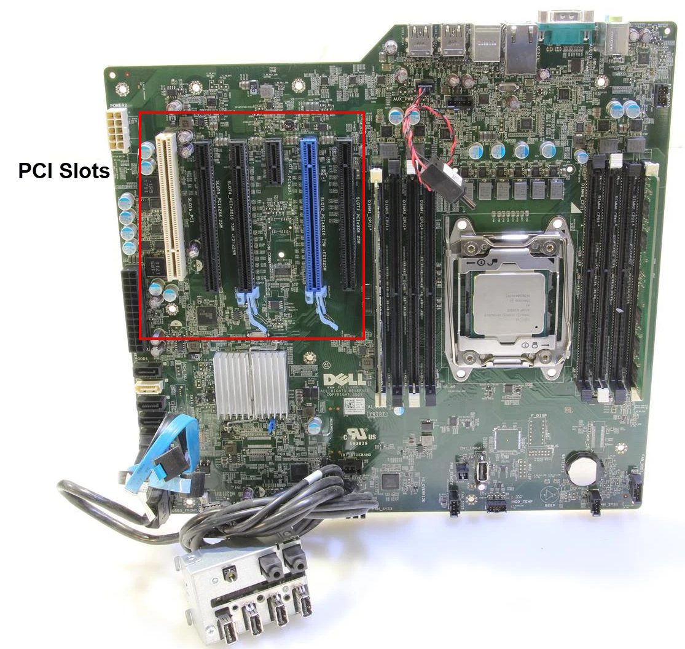

# Lab Setup

This document covers the setup of our RDMA networking lab, including hardware selection and PCIe slot planning, BIOS configuration, OS installation, and the software packages required to operate and benchmark Mellanox ConnectX adapters over InfiniBand and RoCE.


## Hardware Setup

### Network Adapters

This lab uses multiple types of network adapters, each serving a distinct role:

| Adapter                  | Role          | Speed      | RDMA Method |
| ------------------------ | ------------- | ---------- | ----------- |
| Mellanox ConnectX-4 (x2) | Hardware RDMA | 40/100 GbE | RoCEv2 (kernel bypass) |
| Intel I210-AT (x1)       | Software RDMA | 1 GbE      | Soft-RoCE (kernel-based) |

The **ConnectX-4** adapters perform hardware-offloaded RDMA. All data transfer happens directly between application memory and the NIC, bypassing the Linux kernel networking stack entirely. This achieves line-rate throughput with near-zero CPU usage, but the traffic is invisible to standard packet capture tools.

The **Intel I210-AT** is a standard 1 GbE NIC used exclusively for Soft-RoCE. Soft-RoCE is a pure software implementation of the RoCEv2 protocol that runs entirely in the Linux kernel and works on any standard Ethernet NIC (no special RDMA hardware required). We use this inexpensive NIC to generate real RDMA Verbs traffic (RDMA Read, Write, Send/Receive) that travels as ordinary UDP packets through the kernel networking stack, making it fully visible to tools like tcpdump, GNS3, and Wireshark.

### Workstation

These adapters are full-height PCIe cards that require physical clearance, dedicated cooling, and high-wattage PCIe slots. This rules out Small Form Factor (SFF) systems, which only support low-profile cards and provide limited expansion. A mid-tower or full-tower workstation is required.

| Form Factor             | PCIe Support | Suitable? |
| ----------------------- | ------------ | --------- |
| Full Tower              | Multiple full-height x16 slots, high power delivery | Yes |
| Mid Tower               | Full-height x16 slots, standard ATX motherboard | Yes |
| Small Form Factor (SFF) | Low-profile only, limited slots | No |
| Micro / Tiny / Mini     | No internal PCIe expansion | No |

We use two Dell Precision T5810 workstations with the following specs:

- CPU: Intel Xeon E5-1620 v3, 3.5 GHz, 4 cores
- Memory: 16 GB DDR4
- Storage: 480 GB SSD

The T5810 is a mid-tower workstation with full-height PCIe slots, robust power delivery, and optimized airflow. We chose an older workstation because it offers an affordable entry point for a home lab. Since this system won't be deployed in a production environment, we don't require bleeding-edge specifications.

### PCIe Slot Assignment

Understanding the difference between physical slot size and electrical lanes is crucial for optimizing adapter performance. The T5810 provides the following PCIe layout:

| Slot           | Physical Size | Electrical | Power Limit | Assigned Device      |
| -------------- | ------------- | ---------- | ----------- | -------------------- |
| Slot 1         | x8            | Gen3 x8    | 25W         | Reserved             |
| Slot 2 (Blue)  | x16           | Gen3 x16   | 75W         | `Mellanox CX-4`      |
| Slot 3         | x1            | Gen2 x1    | 25W         | `Intel I210-AT`      |
| Slot 4         | x16           | Gen3 x16   | 75W         | `Mellanox CX-4`      |
| Slot 5         | x16           | Gen2 x4    | 25W         | Reserved             |
| Slot 6 (White) | PCI (Legacy)  | N/A        | N/A         | Legacy Only          |



The CX-4 adapters are placed in Slots 2 and 4 because these are the only slots that provide a full 16 lanes of PCIe Gen 3 directly from the CPU with 75W power delivery. This prevents PCIe bus saturation and ensures zero-bottleneck performance for 40/100 GbE traffic.

The Intel I210-AT occupies Slot 3 (PCIe x1). Its 1 GbE Soft-RoCE role requires minimal bandwidth, so a single Gen2 lane is sufficient.

### BIOS Parameters

To access the BIOS on a Dell system, press **F2** during POST.

To ensure compatibility with modern hardware and high-speed NICs, the following BIOS settings must be configured:

- **Boot Mode:** Set to UEFI (Disable Legacy/CSM). UEFI is required for proper PCIe address mapping and modern NVMe support.
- **Secure Boot:** Disabled. This prevents driver signing conflicts, especially when working with third-party kernel modules for Mellanox or specialized networking hardware.


## Operating System Setup

### Headless Server Architecture

A headless server is a system operated without a dedicated monitor, keyboard, or mouse. All management is performed remotely via SSH or serial console. This is the standard operating model in data centers and professional labs.

**Why headless?**

- **Hardware Efficiency:** Removing the GPU frees a PCIe Gen3 x16 slot for an additional ConnectX adapter.
- **Reduced Power & Heat:** No discrete GPU means lower idle power draw and cooler chassis temperatures.
- **Space Optimization:** No monitor or keyboard required; the workstation can be placed in a closet, rack, or basement.
- **Professional Management:** Remote access via SSH or serial console (PuTTY, Screen, Minicom) mirrors enterprise environments.

### Installation Procedure

We have selected Ubuntu Server 24.04.4 LTS. The Server edition has no GUI, which minimizes resource overhead on a dedicated networking lab machine.

Because the T5810 will run headless, we need a temporary display output only during OS installation. A GPU is temporarily installed in Slot 2 for this purpose, then removed afterward.

1. Create a bootable USB drive using [Rufus](https://rufus.ie/) (Windows) or `dd` (Linux).
2. Install a temporary GPU in Slot 2 and connect it to a monitor.
3. Enter the BIOS (F2), set USB as the first boot device, and boot from the installation media.
4. Complete the Ubuntu Server installation and verify that SSH is working over the network.
5. Remove the GPU from Slot 2 to reclaim the PCIe slot for a Mellanox CX-4 adapter.


## Software Setup

### Kernel Module Verification

Before interacting with the InfiniBand fabric, we must verify that the Linux kernel has successfully loaded the RDMA subsystem and the specific Mellanox hardware drivers.

When you first insert a ConnectX-4 card and boot the machine, the motherboard's PCIe bus detects a device with a specific Vendor ID (`0x15b3` for Mellanox). The Ubuntu `udev` system instantly recognizes this ID, realizes it needs the `mlx5_core` driver, and automatically pulls it into the kernel from its "Inbox" driver library. Because `mlx5_core` depends on the RDMA subsystem, the kernel automatically pulls in `ib_core` and `ib_uverbs` as well.

You can verify this initial hardware stack by checking the loaded kernel modules:

    lsmod | grep -E "^(ib_|rdma_|mlx|iw_|hfi1|qedr)"

Expected Output:

    ib_core               507904  2 ib_uverbs,mlx5_ib
    ib_uverbs             184320  1 mlx5_ib
    mlx5_core            2494464  1 mlx5_ib
    mlx5_ib               487424  0
    mlxfw                  36864  1 mlx5_core

> The numbers on the far right of `lsmod` output represent the "Used By" count. For example, `ib_core` has a 2 next to it because it is the base foundation that 2 other modules are actively depending on to stay running.

At this stage, Ubuntu has successfully loaded the "bottom half" of the RDMA architecture:

| Kernel Module | Short Description                                                                                                                                            |
| ------------- | ------------------------------------------------------------------------------------------------------------------------------------------------------------ |
| ib_core       | Core Linux InfiniBand/RDMA subsystem. Provides shared infrastructure, APIs, and transport logic for all RDMA drivers.                                        |
| ib_uverbs     | InfiniBand User Verbs interface. Exposes `/dev/infiniband/uverbsX` devices, enabling user-space applications to directly access RDMA queues (kernel bypass). |
| mlx5_core     | The foundational hardware driver for ConnectX-4 (and newer) adapters. Handles PCI initialization, memory management, and basic Ethernet functionality.       |
| mlx5_ib       | RDMA hardware driver for Mellanox devices. Translates generic RDMA verbs into device-specific mlx5 commands.                                                 |
| mlxfw         | Mellanox firmware interface module. Enables querying and updating NIC firmware via user-space tools (e.g., mlxfwmanager).                                    |

While our hardware is successfully initialized and capable of doing RDMA at this point, you do not yet have the full protocol stack loaded. You are missing the "Control Plane"—the modules that actually set up the connections and manage the network. To resolve this, we install the `rdma-core` package. This provides the essential user-space libraries and daemons required to run RDMA over any fabric.

> While the Linux kernel handles the low-level hardware modules, `rdma-core` provides the APIs that allow software applications to utilize those modules to achieve Kernel Bypass.

    sudo apt install -y rdma-core

Once installed, running the lsmod command again will reveal a much more robust RDMA stack:

    lsmod | grep -E "^(ib_|rdma_|mlx|iw_|hfi1|qedr)"

Expanded Output:

    ib_core               507904  10 rdma_cm,ib_ipoib,rpcrdma,iw_cm,ib_iser,ib_umad,rdma_ucm,ib_uverbs,mlx5_ib,ib_cm
    ib_uverbs             184320  2 rdma_ucm,mlx5_ib
    mlx5_core            2494464  1 mlx5_ib
    mlx5_ib               487424  0
    mlxfw                  36864  1 mlx5_core

    rdma_cm               151552  3 rpcrdma,ib_iser,rdma_ucm
    rdma_ucm               32768  0
    ib_cm                 151552  2 rdma_cm,ib_ipoib
    ib_umad                45056  0
    ib_ipoib              139264  0
    ib_iser                53248  0
    iw_cm                  61440  1 rdma_cm

These newly loaded modules represent the "Upper Half" of the stack, responsible for routing, connection management, and advanced storage protocols:

| Kernel Module | Short Description                                                                                                                                                                                                                                  |
| ------------- | -------------------------------------------------------------------------------------------------------------------------------------------------------------------------------------------------------------------------------------------------- |
| rdma_cm       | RDMA Connection Manager. The generic traffic cop for RDMA. It abstracts the underlying network layer (InfiniBand, RoCE, or iWARP) and handles the TCP-like setup and teardown of RDMA connections.                                                 |
| rdma_ucm      | RDMA User-space Connection Manager. This acts as the bridge that allows user-space testing applications (like ib_send_bw) to talk to the rdma_cm to negotiate their initial connection parameters before kernel bypass begins.                     |
| ib_cm         | InfiniBand Connection Manager. Similar to rdma_cm, but strictly handles connection establishment for native InfiniBand fabrics.                                                                                                                    |
| ib_umad       | User Management Datagrams. A critical module for native InfiniBand. It allows user-space diagnostic tools (ibstat, ibping) and the Subnet Manager (OpenSM) to send hardware-level control packets across the fabric.                               |
| ib_ipoib      | IP over InfiniBand. A protocol driver that encapsulates standard IP packets inside InfiniBand frames. This allows you to assign standard 192.168.x.x addresses to native InfiniBand interfaces so standard tools like SSH can traverse the fabric. |
| ib_iser       | iSCSI Extensions for RDMA. A storage protocol module that accelerates iSCSI SAN traffic by mapping it directly into RDMA memory transfers, reducing latency.                                                                                       |
| iw_cm         | iWARP Connection Manager. Handles connection establishment for iWARP (RDMA over TCP/IP). Included by default, though typically unused in Mellanox RoCEv2/InfiniBand setups.                                                                        |

### Mellanox Firmware Tools (MFT)

In a professional networking lab, the Mellanox Firmware Tools (MFT) are essentially the "BIOS for your network card." While the Ubuntu operating system provides the drivers to use the card, MFT provides the tools to manage the hardware itself.

Installing NVIDIA/Mellanox Firmware Tools (MFT) on Ubuntu allows for firmware updates, diagnostics, and customization of Mellanox network adapters. The process involves installing dependencies (`gcc`, `make`, `dkms`), downloading the Debian-based `.tgz` package, extracting it, running `install.sh`, and starting the MST driver service to allow tool access.

Ensure required build tools are installed:

    sudo apt install -y gcc make dkms

Download the latest [MFT DEB package](https://network.nvidia.com/products/adapter-software/firmware-tools/) from the NVIDIA Networking website.

```bash
wget https://www.mellanox.com/downloads/MFT/mft-4.35.0-159-x86_64-deb.tgz
tar -xvf mft-<version>-x86_64-deb.tgz
cd mft-<version>-x86_64-deb
sudo ./install.sh
```

When you run `sudo ./install.sh`, it compiles a small kernel module using DKMS. This is why you installed `gcc`, `make`, and `dkms` first. This ensures that if you update your Ubuntu kernel in the future, the Mellanox tools won't break—they will automatically re-compile themselves for the new kernel version.

After installation, start MST (Mellanox Software Tools):

    sudo mst start

Check the status and locate devices:

    sudo mst status

When you run `sudo mst start`, the Mellanox Software Tools script attempts to load drivers for every generation of Mellanox hardware simultaneously.

- **Legacy Hardware (ConnectX-3):** Older cards required direct memory-mapped access to the silicon registers, which utilized the `mst_pci` module (creating devices like `/dev/mst/mt4099_pci_cr0`).

- **Modern Hardware (ConnectX-4 and newer):** Nvidia changed the silicon architecture starting with the ConnectX-4. These cards are managed entirely through standard PCI Configuration cycles (`pciconf`).

Because the mst script detects our ConnectX-4 (mt4115) cards, it successfully creates the modern `pciconf` device endpoints. It then realizes the legacy `mst_pci` driver is not needed by any hardware in our system, so it gracefully unloads it to save memory.

**Auto start on boot**

Without MST running in the background, the rest of the MFT package is completely blind to our hardware.

Running `sudo mst start` is a one-time, session-only command. It manually loads the proprietary kernel modules (like `mst_pci`) and maps the hardware registers to the `/dev/mst/` directory. The moment you reboot, the Linux kernel clears all of that out.

You can create your own lightweight systemd service. This gives you total control and guarantees it runs correctly on boot.

    sudo nano /etc/systemd/system/mst.service

And add the following:

```text
[Unit]
Description=Mellanox Software Tools (MST) Startup
After=network.target

[Service]
Type=oneshot
RemainAfterExit=yes
ExecStart=/usr/bin/mst start
ExecStop=/usr/bin/mst stop

[Install]
WantedBy=multi-user.target
```

Now that the file exists, tell systemd to rescan its directories, then enable and start our new service.

```bash
sudo systemctl daemon-reload
sudo systemctl enable mst
sudo systemctl start mst
```

Reboot and check the status one more time:

    sudo systemctl status mst

The following shows the important tools installed as part of the MFT package:

| Tool           | What it does for you                                                                                                                                      |
| -------------- | --------------------------------------------------------------------------------------------------------------------------------------------------------- |
| `mst`          | The device access layer. Initializes Mellanox devices and creates `/dev/mst/*` nodes so other tools can communicate with the NIC.                         |
| `mlxconfig`    | Firmware configuration tool. Used to change persistent settings such as InfiniBand ↔ Ethernet mode (LINK_TYPE), SR-IOV, and other NIC parameters.         |
| `mlxfwmanager` | Firmware inventory and compatibility checker. Displays current firmware version, PSID, and whether updates are available or recommended.                  |
| `mlxlink`      | Link diagnostics tool. Provides detailed information about link state, speed, width, and signal integrity (useful for validating DAC/optics performance). |
| `flint`        | Firmware flashing utility. Used to burn or update firmware images, including re-flashing OEM cards to standard Mellanox firmware.                         |

### `infiniband-diags` Package

While MFT is used to manage the hardware and its firmware, the infiniband-diags package is used to manage and troubleshoot the InfiniBand fabric (the network itself). Think of it this way: MFT is for the card, while infiniband-diags is for the "wire" and the connection between our two T5810 workstations.

You can install it on Ubuntu with:

    sudo apt install -y infiniband-diags

Infiniband-diags is a collection of open-source utilities designed to help you configure, debug, and maintain an InfiniBand network. These tools are the industry standard for verifying that our high-speed RDMA links are healthy, correctly addressed, and passing data without errors.

**Why do we need it?**

Standard networking tools like ping, ifconfig, or nmap are designed for Ethernet and TCP/IP. They don't understand InfiniBand's unique addressing (LIDs and GIDs). You need this package to:

- **Discover the Topology:** See how nodes are connected (Who is Port 1 talking to?).
- **Verify Link Health:** Check if the link is "Active" or stuck in "Initializing" state.
- **Perform RDMA Pings:** Test connectivity at the hardware level, bypassing the Linux kernel entirely.
- **Debug Unconfigured Networks:** Many of these tools use "Directed Routes," meaning they can talk to a card even if it doesn't have an IP address or a Subnet Manager yet.

| Category     | Tool            | Short Description                                                            |
| ------------ | --------------- | ---------------------------------------------------------------------------- |
| Local Status | `ibstat`        | Displays basic local HCA status (LID, state, physical state, and link rate). |
|              | `ibstatus`      | Simplified wrapper to quickly verify if an InfiniBand link is up.            |
| Discovery    | `ibnetdiscover` | Scans the fabric and builds a detailed topology map of nodes and links.      |
|              | `ibnodes`       | Lists all nodes (hosts and switches) in the current subnet.                  |
|              | `ibhosts`       | Lists only Host Channel Adapters (HCAs).                                     |
|              | `ibswitches`    | Lists only InfiniBand switches in the fabric.                                |
|              | `ibrouters`     | Lists InfiniBand routers in the fabric.                                      |
| Connectivity | `ibping`        | Tests hardware-level connectivity using InfiniBand management datagrams.     |
|              | `ibtracert`     | Traces the logical path between two InfiniBand endpoints.                    |
|              | `ibsysstat`     | Retrieves basic system information (CPU, memory, etc.) from a remote node.   |
| Addressing   | `ibaddr`        | Displays the Local Identifier (LID) of a node.                               |
|              | `saquery`       | Queries the Subnet Administration database (e.g., PathRecords).              |
|              | `ibidsverify`   | Verifies uniqueness and consistency of LIDs and GIDs across the fabric.      |
| Performance  | `perfquery`     | Dumps hardware performance and error counters for a port.                    |
|              | `ibqueryerrors` | Scans the fabric and reports ports with elevated error counters.             |
| Subnet Mgmt  | `sminfo`        | Queries the Subnet Manager (SM) for its state and priority.                  |
|              | `smpquery`      | Retrieves Subnet Management Parameters (SMP) directly from hardware.         |
|              | `smpdump`       | Produces a raw hex dump of Subnet Management packets.                        |
| Advanced Ops | `ibportstate`   | Manually controls port state (enable, disable, reset, speed changes).        |
|              | `ibroute`       | Displays unicast forwarding tables for a switch.                             |
|              | `dump_fts`      | Dumps all forwarding tables (unicast, multicast, linear) from a switch.      |
|              | `ibccquery`     | Queries congestion control configuration and state.                          |
|              | `vendstat`      | Retrieves vendor-specific diagnostics and adapter information.               |

### `ibverbs-utils` Package

While the rdma-core package installs the underlying APIs (libibverbs), the ibverbs-utils package provides a collection of essential user-space programs used to test and debug the RDMA stack.

    sudo apt install -y ibverbs-utils

These tools interact directly with the Verbs API to ensure that user-space applications can successfully access the RDMA hardware while bypassing the kernel. The suite includes both device query utilities and simple "pingpong" client/server tests. These pingpong tests are fantastic for verifying that the basic RDMA transport modes (RC, UC, UD) are functioning correctly before moving on to heavy traffic generators like perftest.

| Category        | Tool                | Short Description                                                                     |
| --------------- | ------------------- | ------------------------------------------------------------------------------------- |
| Device Info     | `ibv_devices`       | Lists all RDMA adapters accessible from user space.                                   |
|                 | `ibv_devinfo`       | Displays detailed RDMA device attributes, including port state, MTU, and GID tables.  |
| Diagnostics     | `ibv_asyncwatch`    | Monitors and logs asynchronous hardware events (e.g., port state changes, errors).    |
| Transport       | `ibv_rc_pingpong`   | Tests RDMA connectivity using Reliable Connection (RC) transport.                     |
|                 | `ibv_uc_pingpong`   | Tests RDMA connectivity using Unreliable Connection (UC) transport.                   |
|                 | `ibv_ud_pingpong`   | Tests RDMA connectivity using Unreliable Datagram (UD) transport.                     |
| Advanced Queues | `ibv_srq_pingpong`  | Tests RDMA connectivity using Shared Receive Queues (SRQ) for efficient memory usage. |
|                 | `ibv_xsrq_pingpong` | Tests RDMA connectivity using Extended Shared Receive Queues (XSRQ).                  |

### `perftest` Package

While MFT manages the card and infiniband-diags manages the network, the perftest package is the industry standard for pushing raw data across an InfiniBand link.

Run this on both workstations:

    sudo apt install -y perftest

This package provides a suite of "micro-benchmarks" that talk directly to the Verbs API (the low-level RDMA language). Because these tools bypass the Linux kernel networking stack entirely, they can achieve the full line-rate speed of the ConnectX adapters with near-zero CPU usage.

| Category     | Tool                         | Short Description                                                                 |
| ------------ | ---------------------------- | --------------------------------------------------------------------------------- |
| Send/Receive | `ib_send_bw`                 | Measures maximum throughput (Gbps) using the Send operation.                      |
|              | `ib_send_lat`                | Measures round-trip latency (µs) using the Send operation.                        |
| RDMA Write   | `ib_write_bw`                | Measures bandwidth for RDMA Write (direct memory placement on the remote node).   |
|              | `ib_write_lat`               | Measures latency for RDMA Write operations.                                       |
| RDMA Read    | `ib_read_bw`                 | Measures bandwidth for RDMA Read (reading from remote memory).                    |
|              | `ib_read_lat`                | Measures latency for RDMA Read operations.                                        |
| Atomic Ops   | `ib_atomic_bw`               | Measures throughput for RDMA atomic operations (Fetch-and-Add, Compare-and-Swap). |
|              | `ib_atomic_lat`              | Measures latency for RDMA atomic operations.                                      |
| Raw Ethernet | `raw_ethernet_bw`            | Measures bandwidth for raw Ethernet frames (when NIC is in Ethernet mode).        |
|              | `raw_ethernet_lat`           | Measures latency for raw Ethernet frames.                                         |
|              | `raw_ethernet_fs_rate`       | Measures packet rate (packets/sec) for raw Ethernet flow steering.                |
|              | `raw_ethernet_burst_lat`     | Measures latency for bursts of raw Ethernet packets.                              |
| Automation   | `run_perftest_loopback`      | Runs performance tests in local loopback mode (single NIC).                       |
|              | `run_perftest_multi_devices` | Coordinates performance tests across multiple HCAs.                               |

### `mlnx-tools` Package

The previous packages focus on hardware drivers, fabric diagnostics, and performance benchmarking. The `mlnx-tools` package fills the remaining gap: runtime NIC configuration for QoS, IRQ affinity, and RoCE tuning. This package is not available in the standard Ubuntu repositories. Install it from source:

    git clone https://github.com/Mellanox/mlnx-tools.git
    cd mlnx-tools
    sudo make install

There is nothing to compile. The package is entirely Python scripts and shell utilities. The `make install` target copies them into the standard system paths.

| Category        | Tool                         | Short Description                                                                          |
| --------------- | ---------------------------- | ------------------------------------------------------------------------------------------ |
| QoS             | `mlnx_qos`                   | Configures trust mode, DSCP-to-TC mapping, PFC, ETS, and buffer sizes per interface.       |
| RoCE Mode       | `cma_roce_mode`              | Sets the RDMA-CM RoCE mode (v1 or v2) per device.                                          |
| RoCE ToS        | `cma_roce_tos`               | Sets the RDMA-CM Type of Service (DSCP) value for RoCE traffic.                            |
| Device Info     | `show_gids`                  | Displays the GID table for all RDMA devices.                                               |
|                 | `show_counters`              | Displays NIC hardware counters.                                                            |
| Performance     | `mlnx_perf`                  | Real-time NIC performance counter monitoring.                                              |
|                 | `mlnx_tune`                  | Auto-tunes system and NIC parameters for optimal performance.                              |
| IRQ Affinity    | `set_irq_affinity.sh`        | Pins NIC interrupts to specific CPU cores.                                                 |
|                 | `set_irq_affinity_bynode.sh` | Pins NIC interrupts by NUMA node.                                                          |
|                 | `show_irq_affinity.sh`       | Displays current IRQ-to-CPU affinity for NIC interrupts.                                   |
| Diagnostics     | `mlnx_dump_parser`           | Parses NIC firmware crash dumps.                                                           |
|                 | `mlx_fs_dump`                | Dumps NIC flow steering rules.                                                             |

The most important tool in this package is `mlnx_qos`, which configures trust mode, DSCP-to-TC mapping, PFC per-priority, ETS bandwidth allocation, and buffer sizes on Ethernet-mode ports — all the switch-side QoS concepts, but applied at the NIC level.
