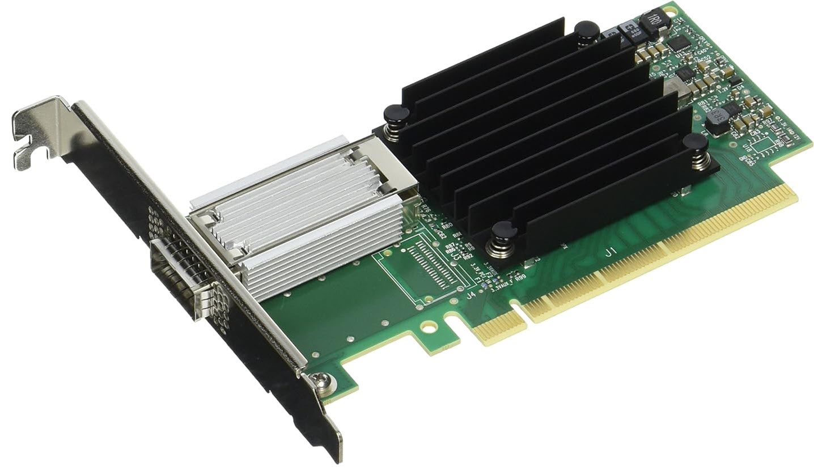

# Mellanox MCX455A-ECAT ConnectX-4 VPI



The Mellanox MCX455A-ECAT is a high-performance network adapter based on the ConnectX-4 VPI (Virtual Protocol Interconnect) architecture. It was designed for modern data-center and high-performance computing (HPC) environments that require extremely high bandwidth and low-latency communication between servers, storage systems, and accelerators. The adapter connects to the host through a PCIe 3.0 ×16 interface and provides a single QSFP28 port capable of operating at speeds up to 100 Gb/s.

A key feature of this card is its VPI capability, meaning the same physical port can operate in either InfiniBand or Ethernet mode depending on configuration. In InfiniBand mode it supports EDR (Enhanced Data Rate) InfiniBand at 100 Gb/s, while in Ethernet mode it supports 100 Gigabit Ethernet and lower speeds such as 40 GbE, 25 GbE, and 10 GbE. This flexibility allows the card to be used in both traditional Ethernet data-center networks and specialized HPC fabrics that rely on InfiniBand for ultra-low latency communication.

Beyond raw bandwidth, the ConnectX-4 architecture integrates extensive hardware offload engines that accelerate networking tasks. The NIC can offload transport operations from the CPU, enabling technologies such as RDMA (Remote Direct Memory Access) for both InfiniBand and RoCE networks. This allows applications to move data directly between memory regions on different hosts without involving the CPU or operating system, dramatically reducing latency and improving throughput. The adapter also supports features like hardware virtualization, congestion control, and encapsulation offloads (for example VXLAN or NVGRE), making it suitable for cloud, storage, and distributed computing workloads.

In practice, the MCX455A-ECAT represents the first widely deployed 100 Gb/s generation of Mellanox adapters. Compared with earlier cards like ConnectX-3, it significantly increased bandwidth and improved RDMA performance while maintaining compatibility with both Ethernet and InfiniBand networks. Because of this combination of flexibility, performance, and availability on the used market, ConnectX-4 adapters are often used in AI clusters, HPC systems, and advanced networking labs that require experimentation with high-speed interconnect technologies.

## ConnectX-4 Cabling and Link Configuration

For this lab, we are using a Point-to-Point (P2P) topology, connecting the two nodes directly without the need for an expensive 100GbE or EDR network switch.

When dealing with 100Gb/s networking, we have the option to use either Active Optical Cables (AOC/Fiber) or Direct Attach Copper (DAC). For a point-to-point home lab setup, we use passive DAC cables due to their cost-effectiveness and simplicity over short distances.

Because we are using single-port Mellanox ConnectX-4 VPI adapters capable of running both InfiniBand and Ethernet, we utilize two distinct cables depending on the specific protocol being tested. The adapter's firmware expects the physical cable's identifier to match the configured port protocol. Therefore, you will physically swap the DAC directly between the two nodes when transitioning between native InfiniBand and Ethernet testing phases.

Unlike previous generations, the ConnectX-4 silicon is capable of pushing a full 100 Gbps in both modes: EDR (InfiniBand) and 100GBASE-CR4 (Ethernet). Both standards achieve their high throughput by utilizing four independent transmission lanes operating at 25 Gbps each over the twinaxial copper.

- Mellanox MCP1600-E001E30 (The IB Cable): This is the dedicated EDR InfiniBand cable. Use this one when you have the port configured to LINK_TYPE=1 (InfiniBand).

- Mellanox MCP1600-C001E30N (The Ethernet Cable): This is the dedicated 100GbE cable. Use this when you switch the port back to LINK_TYPE=2 (Ethernet) to test RoCEv2 or standard TCP/IP traffic.

Both the dedicated InfiniBand (MCP1600-E001E30) and Ethernet (MCP1600-C001E30N) Direct Attach Copper (DAC) cables utilize the QSFP28 physical connector. If you hold both cables in your hands, the metal transceiver heads and the thick twinaxial copper wire will look and feel physically identical. They both plug into the exact same slot on your ConnectX-4 adapter.

The acronym QSFP28 explains exactly how the cable achieves its high throughput:

- Q (Quad): The connector contains 4 independent electrical lanes for transmitting data, and 4 parallel lanes for receiving.
- SFP (Small Form-factor Pluggable): The industry-standard modular, hot-swappable transceiver shape used in data centers.
- 28: Each of the 4 lanes is capable of signaling at speeds up to 28 Gigabits per second.
  - For 100GbE Ethernet, it runs 4 lanes at exactly 25 Gbps.
  - For EDR InfiniBand, it runs 4 lanes at roughly 25.78 Gbps to account for physical encoding overhead.

Because the physical copper layout and the QSFP28 metal housing are identical, the ConnectX-4 network card relies entirely on reading a tiny I2C EEPROM microchip hidden inside the cable head. This chip tells the card whether the cable is certified for the InfiniBand or Ethernet protocol.


Why Use DAC Cables for a Home Setup?

Zero-Configuration Layer 1: Passive DAC cables are true "plug-and-play." They have the transceiver modules permanently attached to the wire, meaning they do not require the external power draw, careful optical alignment, or specialized fiber cleaning kits associated with optical cabling.

Latency Benchmarking: By connecting the workstations directly via copper in a P2P topology, we eliminate "switch hop" latency and optical conversion delays. This allows us to establish a pure, lowest-possible-latency hardware baseline for evaluating both native InfiniBand and RoCEv2 performance.

## Initial ConnectX-4 Provisioning

use lspci to confirm that the system can see the cx-4 cards:

```bash
lspci | grep Mellanox
03:00.0 Ethernet controller: Mellanox Technologies MT27700 Family [ConnectX-4]
04:00.0 Infiniband controller: Mellanox Technologies MT27700 Family [ConnectX-4]
```

mlxfwmanager (Mellanox Firmware Manager) is the primary tool within the MFT suite used to inventory, query, and update the firmware on your Mellanox network adapters.

```bash
sudo mlxfwmanager --query

Querying Mellanox devices firmware ...

Device #1:
----------

  Device Type:      ConnectX4
  Part Number:      MCX455A-ECA_Ax
  Description:      ConnectX-4 VPI adapter card; EDR IB (100Gb/s) and 100GbE; single-port QSFP28; PCIe3.0 x16; ROHS R6
  PSID:             MT_2180110032
  PCI Device Name:  /dev/mst/mt4115_pciconf1
  Base GUID:        ec0d9a030044c158
  Versions:         Current        Available
     FW             12.28.2040     N/A
     PXE            3.6.0102       N/A
     UEFI           14.21.0017     N/A

  Status:           No matching image found

Device #2:
----------

  Device Type:      ConnectX4
  Part Number:      MCX455A-ECA_Ax
  Description:      ConnectX-4 VPI adapter card; EDR IB (100Gb/s) and 100GbE; single-port QSFP28; PCIe3.0 x16; ROHS R6
  PSID:             MT_2180110032
  PCI Device Name:  /dev/mst/mt4115_pciconf0
  Base GUID:        506b4b0300eeae06
  Versions:         Current        Available
     FW             12.17.2046     N/A
     PXE            3.4.0903       N/A

  Status:           No matching image found
```

The output for these two devices provides a goldmine of technical data for your lab setup, revealing exactly how the hardware is currently configured:

1. Capability & Physical Hardware

Part Number (MCX455A-ECA): This is the specific model. The description confirms this is a VPI card, meaning it can handle both EDR InfiniBand (100Gb/s) and 100GbE Ethernet natively out of its single QSFP28 port.

PCIe3.0 x16: To push a massive 100 Gigabits per second, the card must negotiate at Gen 3 speeds using a full 16 electrical lanes. This perfectly validates placing the cards into the x16 slots on the T5810 motherboard.

2. Networking Identifiers (GUIDs)

Base GUID: Both Device #1 and Device #2 list a Base GUID (e.g., ec0d9... and 506b4...). This is the definitive proof that both cards are currently configured in InfiniBand Mode. In an InfiniBand fabric, the GUID acts similarly to a MAC address in Ethernet, providing the unique hardware identifier necessary for the Subnet Manager to route traffic.

3. Firmware Lifecycle & Expansion ROMs

If you look closely at the Versions block, you will notice a few discrepancies between the two cards. Because these adapters were likely sourced from the used enterprise market, they retain the firmware history of their previous environments.

FW (The Core Firmware): Device #1 is running 12.28.2040, while Device #2 is running an older 12.17.2046 revision.

PXE & UEFI (The Boot ROMs): Device #1 lists a UEFI version, but Device #2 does not. PXE (Preboot Execution Environment) and UEFI are Expansion ROM modules embedded within the firmware. They allow the host motherboard to boot an operating system directly off the network (via network-attached storage or an OS deployment server) before the local hard drive even initializes.

Why is UEFI missing on Device #2? When flashing Mellanox cards, administrators can choose to flash a "minimal" image to save NVRAM space, or they can flash the complete package that includes all FlexBoot (PXE/UEFI) ROMs. The previous owner of Device #2 simply flashed an image that omitted the UEFI bootloader module. This does not affect the card's ability to pass 100Gbps traffic once Ubuntu is loaded.

While the Status says "No matching image found" (because the mlxfwmanager tool doesn't have a local update file to compare them against yet), it is highly recommended to flash both cards to the exact same, latest firmware binary. This will synchronize their firmware versions, restore the missing UEFI ROM to Device #2, and ensure maximum stability for your peer-to-peer 100Gbps links.

### Updating Firmware

to update firmware you can ask the tool to search online:

    sudo mlxfwmanager -d /dev/mst/mt4115_pciconf0 --online -u

or download the firmware:

https://network.nvidia.com/support/firmware/firmware-downloads/

and use something like this (update path and file accordingly):

    sudo mlxfwmanager -d /dev/mst/mt4115_pciconf0 -i ./xxx.bin -u

### Deep-Dive Firmware Configuration (`mlxconfig`)

While mlxfwmanager tells you which firmware version is installed, it does not tell you how that firmware is configured. Because the ConnectX-4 is a highly customizable enterprise adapter, it features dozens of persistent NVRAM settings that control everything from hardware virtualization to boot ROMs.

To dump the complete configuration of the card, we use the mlxconfig query command. This is especially critical for VPI cards, as it is the primary method to verify whether a port is instructed to boot into Ethernet or InfiniBand mode.

Run the following command against your specific PCI configuration device:

    sudo mlxconfig -d /dev/mst/mt4115_pciconf1 query

Sample output:

```text
Device #1:
----------

Device type:        ConnectX4           
Name:               MCX455A-ECA_Ax      
Description:        ConnectX-4 VPI adapter card; EDR IB (100Gb/s) and 100GbE; single-port QSFP28; PCIe3.0 x16; ROHS R6
Device:             /dev/mst/mt4115_pciconf1

Configurations:                                          Next Boot
        PORT_OWNER                                  True(1)             
        ALLOW_RD_COUNTERS                           True(1)             
        RENEG_ON_CHANGE                             True(1)             
        TRACER_ENABLE                               True(1)             
        FLEX_PARSER_PROFILE_ENABLE                  0                   
        FLEX_IPV4_OVER_VXLAN_PORT                   0                   
        SWITCH_COMPT_FEATURE_MASK                   0x0(0)              
        NON_PREFETCHABLE_PF_BAR                     False(0)            
        VF_VPD_ENABLE                               False(0)            
        STRICT_VF_MSIX_NUM                          False(0)            
        VF_NODNIC_ENABLE                            False(0)            
        NUM_PF_MSIX_VALID                           True(1)             
        NUM_OF_VFS                                  0                   
        NUM_OF_PF                                   1                   
        FPP_EN                                      True(1)             
        SRIOV_EN                                    False(0)            
        PF_LOG_BAR_SIZE                             5                   
        VF_LOG_BAR_SIZE                             1                   
        NUM_PF_MSIX                                 63                  
        NUM_VF_MSIX                                 11                  
        PCIE_CREDIT_TOKEN_TIMEOUT                   0                   
        PCI_DOWNSTREAM_PORT_OWNER                   Array[0..15]        
        PCI_WR_ORDERING                             per_mkey(0)         
        MULTI_PORT_VHCA_EN                          False(0)            
        LOG_DCR_HASH_TABLE_SIZE                     14                  
        MAX_PACKET_LIFETIME                         0                   
        DCR_LIFO_SIZE                               16384               
        IB_PROTO_WIDTH_EN_MASK_P1                   0                   
        KEEP_ETH_LINK_UP_P1                         True(1)             
        KEEP_IB_LINK_UP_P1                          False(0)            
        KEEP_LINK_UP_ON_BOOT_P1                     False(0)            
        KEEP_LINK_UP_ON_STANDBY_P1                  False(0)            
        DO_NOT_CLEAR_PORT_STATS_P1                  False(0)            
        AUTO_POWER_SAVE_LINK_DOWN_P1                False(0)            
        LLDP_NB_DCBX_P1                             False(0)            
        LLDP_NB_RX_MODE_P1                          OFF(0)              
        LLDP_NB_TX_MODE_P1                          OFF(0)              
        DCBX_IEEE_P1                                True(1)             
        DCBX_CEE_P1                                 True(1)             
        DCBX_WILLING_P1                             True(1)             
        MEMIC_BAR_SIZE                              0                   
        MEMIC_SIZE_LIMIT                            _256KB(1)           
        DUP_MAC_ACTION_P1                           LAST_CFG(0)         
        SRIOV_IB_ROUTING_MODE_P1                    LID(1)              
        IB_ROUTING_MODE_P1                          LID(1)              
        NUM_OF_PLANES_P1                            0                   
        LOAD_BALANCE_MODE_P1                        DEVICE_DEFAULT(0)   
        DYNAMIC_VF_MSIX_TABLE                       False(0)            
        EXP_ROM_UEFI_ARM_ENABLE                     False(0)            
        EXP_ROM_UEFI_x86_ENABLE                     True(1)             
        EXP_ROM_PXE_ENABLE                          True(1)             
        ADVANCED_PCI_SETTINGS                       False(0)            
        TX_SCHEDULER_BURST                          0                   
        PARTIAL_RESET_EN                            False(0)            
        SW_RECOVERY_ON_ERRORS                       False(0)            
        RESET_WITH_HOST_ON_ERRORS                   False(0)            
        NUM_OF_VL_P1                                _4_VLs(3)           
        NUM_OF_TC_P1                                _8_TCs(0)           
        NUM_OF_PFC_P1                               8                   
        VL15_BUFFER_SIZE_P1                         0                   
        ROCE_NEXT_PROTOCOL                          254                 
        ROCE_CC_PRIO_MASK_P1                        255                 
        ROCE_CC_CNP_MODERATION_P1                   DEVICE_DEFAULT(0)   
        CLAMP_TGT_RATE_AFTER_TIME_INC_P1            True(1)             
        CLAMP_TGT_RATE_P1                           False(0)            
        RPG_TIME_RESET_P1                           300                 
        RPG_BYTE_RESET_P1                           32767               
        RPG_THRESHOLD_P1                            1                   
        RPG_MAX_RATE_P1                             0                   
        RPG_AI_RATE_P1                              5                   
        RPG_HAI_RATE_P1                             50                  
        RPG_GD_P1                                   11                  
        RPG_MIN_DEC_FAC_P1                          50                  
        RPG_MIN_RATE_P1                             1                   
        RATE_TO_SET_ON_FIRST_CNP_P1                 0                   
        DCE_TCP_G_P1                                1019                
        DCE_TCP_RTT_P1                              1                   
        RATE_REDUCE_MONITOR_PERIOD_P1               4                   
        INITIAL_ALPHA_VALUE_P1                      1023                
        MIN_TIME_BETWEEN_CNPS_P1                    0                   
        CNP_802P_PRIO_P1                            6                   
        CNP_DSCP_MODE_P1                            DEVICE_DEFAULT(0)   
        CNP_DSCP_P1                                 48                  
        ROCE_RTT_RESP_DSCP_P1                       0                   
        ROCE_RTT_RESP_DSCP_MODE_P1                  DEVICE_DEFAULT(0)   
        BOOT_VLAN                                   1                   
        LEGACY_BOOT_PROTOCOL                        PXE(1)              
        BOOT_INTERRUPT_DIS                          False(0)            
        BOOT_LACP_DIS                               True(1)             
        BOOT_VLAN_EN                                False(0)            
        IP_VER                                      IPv4(0)             
        BOOT_UNDI_NETWORK_WAIT                      0                   
        BOOT_DBG_LOG                                False(0)            
        BOOT_PKEY                                   0                   
        UEFI_HII_EN                                 False(0)            
        UEFI_LOGS                                   DISABLED(0)         
        CQE_COMPRESSION                             BALANCED(0)         
        IP_OVER_VXLAN_EN                            False(0)            
        MKEY_BY_NAME                                False(0)            
        UCTX_EN                                     True(1)             
        PCI_ATOMIC_MODE                             PCI_ATOMIC_DISABLED_EXT_ATOMIC_ENABLED(0)
        TUNNEL_ECN_COPY_DISABLE                     False(0)            
        LRO_LOG_TIMEOUT0                            6                   
        LRO_LOG_TIMEOUT1                            7                   
        LRO_LOG_TIMEOUT2                            8                   
        LRO_LOG_TIMEOUT3                            13                  
        INT_LOG_MAX_PAYLOAD_SIZE                    AUTOMATIC(0)        
        TPH_STEERING_TAG_TABLE                      DEVICE_DEFAULT(0)   
        LINK_TYPE_P1                                IB(1)               
        SAFE_MODE_THRESHOLD                         10                  
        SAFE_MODE_ENABLE                            True(1)    
```

The output generates a massive list of parameters displaying the settings that will be applied on the Next Boot. For our high-speed testing lab, these are the most important fields to understand:

1. The Physical Layer Protocol

LINK_TYPE_P1: This is the single most critical field for a VPI card. It dictates the physical Layer 2 protocol for Port 1.

IB(1) means the port is in native InfiniBand mode.
ETH(2) means the port is in Ethernet mode.

As seen in the output above, the port is configured for InfiniBand.

2. Virtualization & PCIe

SRIOV_EN & NUM_OF_VFS: Single Root I/O Virtualization. If you plan to pass this physical NIC through to multiple virtual machines (like Proxmox or ESXi guests) so they can share the 100Gbps pipe natively, you would toggle this to True(1). By default, it is disabled (0).

CQE_COMPRESSION: Completion Queue Element compression. Set to BALANCED(0), this allows the card to compress the messages it sends across the PCIe bus to the CPU, saving PCIe bandwidth during extremely high-packet-rate tests.

PCI_ATOMIC_MODE: Governs how the card handles RDMA Atomic operations (like Fetch-and-Add).

3. Advanced Ethernet & RoCE Tuning

Even though the card is currently in InfiniBand mode, it retains its tuning parameters for when it is changed to Ethernet:

DCBX_* Parameters: Data Center Bridging eXchange. When in Ethernet mode, these settings allow the ConnectX-4 to negotiate Priority Flow Control (PFC) with network switches to create a "lossless" Ethernet fabric—an absolute requirement for RoCEv2.

ROCE_* and CNP_* Parameters: These govern Congestion Notification Packets. If the hardware detects network congestion during a RoCEv2 transfer, it uses these exact tuning thresholds to dynamically throttle the transmission rate before packets are dropped.

4. Pre-Boot Environments

LEGACY_BOOT_PROTOCOL & IP_VER: Controls how the card attempts to boot from the network during the host motherboard's POST sequence. It is currently set to use standard PXE(1) over IPv4(0).
