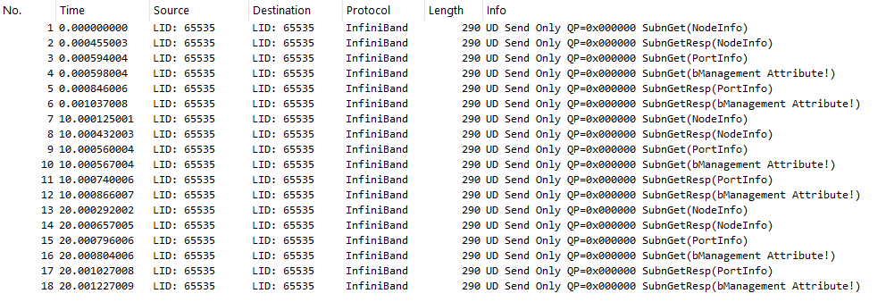

We assume that two workstations are up and running and two cx-4 card are installed on each and provisioned. refer to setup md file.


## Hardware Diagnostics: Verifying HCA State with `ibstat`

We use the infiniband-diags utility suite to interact directly with the adapter. The primary command for checking the local hardware state is ibstat. This tool queries the Host Channel Adapter (HCA) bypassing the OS kernel, and displays the physical and logical status of the ports.

Run the following command:

    ibstat

Sample output:

```text
CA 'ibp4s0'
        CA type: MT4115
        Number of ports: 1
        Firmware version: 12.28.2040
        Hardware version: 0
        Node GUID: 0xec0d9a030044c158
        System image GUID: 0xec0d9a030044c158
        Port 1:
                State: Down  <----------------
                Physical state: Disabled  <----------------
                Rate: 10
                Base lid: 65535
                LMC: 0
                SM lid: 0
                Capability mask: 0x2651e848
                Port GUID: 0xec0d9a030044c158
                Link layer: InfiniBand
```

The output of ibstat is divided into global adapter details and port-specific telemetry. Here is a breakdown of what each field means for the ConnectX-4:

### Global Adapter Information (The HCA)

CA 'ibp4s0': The Channel Adapter (CA) name. Older Linux kernels simply numbered cards (e.g., mlx4_0). Modern Ubuntu systems use "Predictable Network Interface Names," which tie the name directly to the physical motherboard slot. ibp4s0 means this is the InfiniBand device located on PCI bus 4, Slot 0. This is the official device name you will pass to RDMA tools.

CA type (MT4115): The Mellanox silicon identifier. MT4115 specifically designates the ConnectX-4 architecture.

Number of ports: The physical port count on the adapter. Unlike dual-port legacy cards, this specific VPI card has a single 100GbE/EDR port.

Firmware version: Confirms the currently running firmware.

Hardware version: The silicon revision number of the card.

Node GUID & System image GUID: Globally Unique Identifiers burned into the hardware. The Node GUID identifies the entire card on the InfiniBand fabric, serving the same structural purpose as a base MAC address in an Ethernet network.

### Port-Specific Information (Port 1)

This section tells you the real-time health and configuration of your physical connection.

State: This is the logical state of the port. Common states include:

- Down: No connection or administratively disabled.
- Initializing: The cable is connected, but the port is waiting for a Subnet Manager (SM) to configure it.
- Armed: The port is configured but not yet passing active traffic.
- Active: The port is fully operational and ready to transmit data.

Physical state: This is the hardware/electrical state.

- Disabled means the port is currently shut down.
- Polling means the port is actively looking for a signal on the other end of the cable.
- LinkUp means the cable is seated correctly and both sides see an electrical connection.

Rate (10): The currently negotiated link speed in Gbps. When disconnected or disabled, it defaults to the lowest base rate (10). Once connected via your EDR DAC cable, this will jump to 100.

Base lid (65535): The Local Identifier (LID). This is the InfiniBand equivalent of an IP address. 65535 (or 0xFFFF) is the permissive, default unconfigured LID for modern ConnectX-4 cards. It means the port has not yet been assigned a valid address by a Subnet Manager.

LMC (0): LID Mask Control. Used in advanced enterprise setups to assign multiple LIDs to a single physical port for multi-path routing. 0 is standard for home labs.

SM lid (0): The LID of the Subnet Manager that controls this fabric. A value of 0 indicates that no Subnet Manager is currently detected on the network.

Port GUID: The unique hardware address for this specific physical port.

Link layer (InfiniBand): Confirms the port is actively running the native InfiniBand protocol stack, not Ethernet.

Hardware Validation Complete

In the sample output above, the adapters are demonstrating the exact expected state for cards that are seated in the motherboard and powered on, but completely isolated from a network fabric and not yet brought "up" by the operating system. Because the interface has not been triggered by the OS and no cable is attached, the hardware defaults to Physical state: Disabled and State: Down. Furthermore, because there is no link to a Subnet Manager, the Base lid remains at its unconfigured default (65535). This proves that the PCIe bus negotiation, the Ubuntu OS drivers, and the Mellanox firmware are all perfectly healthy and simply awaiting physical cabling and interface activation.

## Physical Peer-to-Peer Connectivity

Once the ConnectX-4 cards are configured on both workstations, the next step is to establish a physical link. For this lab, we are using a Point-to-Point (P2P) topology, connecting the two nodes directly without an InfiniBand switch.

The primary objective of this wiring phase is to verify Layer 1 (Physical) connectivity. We must confirm that the pair can successfully negotiate and maintain a stable "LinkUp" state before we attempt to configure the upper-level protocol routing.

### Step 1: Connecting the First Node (The Polling State)

When the ConnectX-4 interface is administratively enabled by the OS but has no cable attached, it remains in a Disabled state to save power. When you physically insert one end of the InfiniBand DAC cable into the QSFP28 port on Workstation 1, the hardware detects the transceiver's presence and immediately wakes up the port.

If you run ibstat on this machine before connecting the other end of the cable to Workstation 2, you will see the following transition:

```text
CA 'ibp4s0'
        CA type: MT4115
        Number of ports: 1
        Firmware version: 12.28.2040
        Hardware version: 0
        Node GUID: 0xec0d9a030044c34c
        System image GUID: 0xec0d9a030044c34c
        Port 1:
                State: Down
                Physical state: Polling <----------------
                Rate: 10
                Base lid: 65535
                LMC: 0
                SM lid: 0
                Capability mask: 0x2651e848
                Port GUID: 0xec0d9a030044c34c
                Link layer: InfiniBand
```

The physical state Polling indicates that the ConnectX-4 card acknowledges the cable is inserted and is actively sending electrical pulses down the copper wire, searching for a reciprocal signal from a remote peer. Because the other end of the cable is currently dangling in the air, the logical State remains Down.

### Step 2: Completing the Circuit (The LinkUp State)

When you plug the remaining end of the DAC cable into Workstation 2, the two Mellanox cards finally detect each other's electrical pulses. They perform a low-level hardware handshake to negotiate lane width and line speed. Running ibstat again reveals a successful connection:

```text
CA 'ibp4s0'
        CA type: MT4115
        Number of ports: 1
        Firmware version: 12.28.2040
        Hardware version: 0
        Node GUID: 0xec0d9a030044c34c
        System image GUID: 0xec0d9a030044c34c
        Port 1:
                State: Initializing  <----------------
                Physical state: LinkUp  <----------------
                Rate: 56
                Base lid: 65535
                LMC: 0
                SM lid: 0
                Capability mask: 0x2651e848
                Port GUID: 0xec0d9a030044c34c
                Link layer: InfiniBand
```

Key Changes in the Output:

Physical state: LinkUp: This is the most critical field. It confirms that the QSFP28 connectors are properly seated on both ends and the electrical handshake between the two ConnectX-4 cards was successful.

Rate: 56: Even though the ConnectX-4 is an EDR (100Gbps) capable card, it negotiated down to FDR (56 Gbps). This usually indicates that the DAC cable connecting the machines is an older FDR-rated cable, or the remote peer port is limited to 56 Gbps. The hardware automatically downshifted to ensure a stable link.

State: Initializing: This is the "waiting room" of InfiniBand. Even though the wire is physically connected and pulsing at 56 Gbps, the link is not yet "Active." In an InfiniBand fabric, a port cannot pass data payloads until a Subnet Manager (SM) discovers the link and assigns it a routing path.

## Deep-Dive Link Diagnostics (mlxlink)

While tools like ibstat report how the Linux kernel perceives the network interface, they do not provide the full picture of the physical hardware. To inspect the actual Layer 1 electrical connection, the active protocol, and the transceiver health, we use the mlxlink utility. Run the following command against your specific PCI configuration device:

    sudo mlxlink -d /dev/mst/mt4115_pciconf1

Sample output:

```text
Operational Info
----------------
State                              : Active 
Physical state                     : LinkUp 
Speed                              : IB-FDR 
Width                              : 4x 
FEC                                : No FEC 
Loopback Mode                      : No Loopback 
Auto Negotiation                   : ON 

Supported Info
--------------
Enabled Link Speed                 : 0x0000001f (FDR,FDR10,QDR,DDR,SDR) 
Supported Cable Speed              : 0x0000001f (FDR,FDR10,QDR,DDR,SDR) 

Troubleshooting Info
--------------------
Status Opcode                      : 0 
Group Opcode                       : N/A 
Recommendation                     : No issue was observed 

Tool Information
----------------
Firmware Version                   : 12.28.2040 
MFT Version                        : 4.35.0-159
```

This output provides the ultimate confirmation that your physical Layer 1 connection is perfectly healthy:

State & Physical State: Active and LinkUp confirm that the QSFP28 transceiver is seated correctly, the DAC cable is electrically sound, and the two ConnectX-4 cards have successfully completed their hardware handshake.

Speed (The Active Protocol): This field confirms both the negotiated bandwidth and the active operational mode. In this case, it explicitly confirms the link is running at IB-FDR (InfiniBand at 56 Gb/s).

Supported Cable Speed: This diagnostic field solves the mystery of the 56 Gbps speed limit observed in ibstat. mlxlink read the I2C chip inside the DAC cable and confirmed the cable itself is only rated for up to FDR. Therefore, the ConnectX-4 properly limited the link to match the physical medium.

Width: Confirms that the connection is successfully utilizing all four electrical lanes (4x) within the DAC cable to achieve maximum throughput.

FEC (Forward Error Correction): Because the link is operating at 56 Gbps (FDR) over a short DAC cable, the hardware determined that signal integrity is high enough that it does not require FEC. No FEC means slightly lower latency for your RDMA transactions.

If you ever experience unexpected bandwidth drops or suspect a DAC cable is failing, mlxlink is the first command you should run. If the physical cable is failing, the Troubleshooting Info block will explicitly highlight the signal integrity errors.

## Setting up Subnet Manager

Unlike Ethernet, where two computers can often start talking immediately after plugging in a cable (via Auto-MDIX and ARP), InfiniBand is a managed fabric.

Imagine the InfiniBand network as a train system:

- LinkUp means the tracks are laid down (Physical).
- Initializing means the train is sitting at the station, but there is no conductor to tell it where to go or what its ID number is.
- Base lid: 0 confirms this; the "conductor" (Subnet Manager) hasn't given this port a Local Identifier (LID) yet.

To move from Initializing to Active, you must run a Subnet Manager on the network. Since you are in a peer-to-peer setup, one of your two workstations must act as the "conductor" for the entire link.

On Workstation 1, install the Subnet Manager package:

    sudo apt install -y opensm

Start the service. It will automatically detect your ConnectX-4 card and begin managing the fabric:

    sudo systemctl start opensm

Invoke ibstat on both workstations:

workstation 1

```text
CA 'ibp4s0'
        CA type: MT4115
        Number of ports: 1
        Firmware version: 12.28.2040
        Hardware version: 0
        Node GUID: 0xec0d9a030044c34c
        System image GUID: 0xec0d9a030044c34c
        Port 1:
                State: Active  <----------------
                Physical state: LinkUp  <----------------
                Rate: 56
                Base lid: 1  <----------------
                LMC: 0
                SM lid: 1  <----------------
                Capability mask: 0x2651e84a
                Port GUID: 0xec0d9a030044c34c
                Link layer: InfiniBand
```

workstation 2

```text
CA 'ibp4s0'
        CA type: MT4115
        Number of ports: 1
        Firmware version: 12.28.2040
        Hardware version: 0
        Node GUID: 0xec0d9a030044c158
        System image GUID: 0xec0d9a030044c158
        Port 1:
                State: Active
                Physical state: LinkUp
                Rate: 56
                Base lid: 2  <----------------
                LMC: 0
                SM lid: 1
                Capability mask: 0x2651e848
                Port GUID: 0xec0d9a030044c158
                Link layer: InfiniBand
```

You should see a dramatic change:

- State: Should now be Active.
- Base lid: Should now be a non-zero number (usually 1 on one side and 2 on the other).
- SM lid: Should point to the LID of the machine running OpenSM.

## Hardware-Level Connectivity

Once the Subnet Manager (OpenSM) is running and both workstations show `State: Active` in ibstat, you can verify the physical and logical path between the cards.

Unlike a standard Ethernet ping, which uses the ICMP protocol and requires an IP address, ibping operates at Layer 2 of the InfiniBand stack. It bypasses the TCP/IP stack entirely and communicates directly using Management Datagrams (MADs) sent to a specific LID (Local Identifier).

Testing with ibping is the "gold standard" for hardware validation because it proves the InfiniBand fabric is healthy.

On Workstation 2, put the InfiniBand card into "Server" mode so it can listen for and respond to incoming pings:

    sudo ibping -S

On Workstation 1, send the ping. You must target the Base LID of Workstation 2 (which you found in the ibstat output on that machine).

    sudo ibping -L <LID>

A successful ibping will look like this:

```text
Pong from rdma2.(none) (Lid 2): time 0.025 ms
Pong from rdma2.(none) (Lid 2): time 0.038 ms
Pong from rdma2.(none) (Lid 2): time 0.037 ms
```

If you see a response, it confirms:

The DAC cable is physically sound.
The Subnet Manager has correctly mapped the path between the nodes.
The ConnectX-4 hardware is capable of processing RDMA-style management packets.

## ibnodes

ibnodes scans the fabric and lists all detected Host Channel Adapters (HCAs) and Switches. Use this to confirm that all physical nodes in your lab are being correctly discovered by the Subnet Manager.

```bash
sudo ibnodes

Ca      : 0xec0d9a030044c158 ports 1 "rdma2 ibp4s0"
Ca      : 0xec0d9a030044c34c ports 1 "rdma1 ibp4s0"
```

Because you see two lines starting with Ca (Channel Adapter), it proves that Workstation 1 can successfully see Workstation 2 across the DAC cable.

For ibnodes to return a list of remote devices, the Subnet Manager (OpenSM) must be running and must have already "walked" the fabric. If OpenSM were off, this command would likely return an error or only show the local card.

While ibstat tells you about your card, ibnodes tells you about the network.

In your current 2-node lab, it’s simple.

If you eventually add an InfiniBand switch and 5 more T5810 workstations, ibnodes will show all 6 workstations and the switch in one list, giving you a "birds-eye view" of your home lab.

## Bandwidth Benchmarking (`perftest`)

To measure the true hardware capability of our InfiniBand fabric, we use the ib_send_bw utility from the perftest package. This tool pushes raw data directly through the ConnectX-4 hardware, bypassing the OS kernel entirely to measure maximum throughput using RDMA "Send" operations. Since we are in a peer-to-peer setup, the test runs in a traditional Client-Server model.

On Workstation 2, open the listening port and tell the ConnectX-4 card to prepare for an incoming data stream:

    ib_send_bw -d ibp4s0

On Workstation 1, initiate the traffic blast. We use the --report_gbits flag to output the results in Gigabits per second, making it easy to compare against our 56Gbps hardware rating.

    ib_send_bw rdma2.home -d ibp4s0 --report_gbits

You might be wondering: If we are testing the InfiniBand cable, why do we need the standard Ethernet hostname (rdma2.home) or IP address of the other machine? This is due to the difference between the Control Plane and the Data Plane.

The Setup (Control Plane): Before RDMA traffic can flow, both network cards need to know each other's internal hardware identifiers (like the LID, Queue Pair Number (QPN), and Packet Sequence Number (PSN)). perftest uses your standard 1Gbps home network (Ethernet/TCP) to exchange these parameters.

The Execution (Data Plane): As soon as that 1-second TCP handshake finishes, the tool drops the Ethernet connection and blasts the actual test data exclusively across the 56Gbps InfiniBand DAC cable.

When the test finishes, you will receive a detailed output table. Look specifically at the BW average[Gb/sec] column.

```text
---------------------------------------------------------------------------------------
                    Send BW Test
 Dual-port       : OFF          Device         : ibp4s0
 Number of qps   : 1            Transport type : IB
 Connection type : RC           Using SRQ      : OFF
 PCIe relax order: ON
 ibv_wr* API     : ON
 TX depth        : 128
 CQ Moderation   : 1
 Mtu             : 4096[B]
 Link type       : IB
 Max inline data : 0[B]
 rdma_cm QPs     : OFF
 Data ex. method : Ethernet
---------------------------------------------------------------------------------------
 local address: LID 0x01 QPN 0x0107 PSN 0xb264f8
 remote address: LID 0x02 QPN 0x0107 PSN 0x7bdb93
---------------------------------------------------------------------------------------
 #bytes     #iterations    BW peak[Gb/sec]    BW average[Gb/sec]   MsgRate[Mpps]
Conflicting CPU frequency values detected: 1200.000000 != 2400.000000. CPU Frequency is not max.
 65536      1000             52.17              52.16              0.099497
---------------------------------------------------------------------------------------
```

`this needs to be updted after changign the cable`

The card is rated for FDR (56 Gbps), but the test yielded 50.41 Gbps. This is not a hardware failure; in fact, 50.41 Gbps is a spectacular result. Here is exactly where those missing ~5.5 Gigabits went:

Physical Encoding Overhead (The 64b/66b penalty): To maintain electrical signal integrity over the copper wire, FDR InfiniBand uses 64b/66b encoding. For every 64 bits of actual data, 2 bits of alignment headers are added.

Calculation: 56.25 Gbps × (64/66) = ~54.5 Gbps Theoretical Max.

Protocol Overhead: Your data must be chopped into packets. Each packet requires an InfiniBand Local Routing Header (LRH), a Base Transport Header (BTH), and cyclic redundancy checks (CRC) to ensure data isn't corrupted. This protocol wrapper consumes another ~3-4 Gbps of the total pipe.

The CPU Frequency Governor: You'll notice the warning: CPU Frequency is not max. Ubuntu defaults to the "ondemand" power-saving profile. During the test, your CPU was running at 1.2 GHz instead of its 3.4 GHz boost clock. While RDMA bypasses the CPU for data transfer, the CPU still handles the test setup and memory mapping.

Once you strip away the electrical encoding and network headers, the maximum possible "Goodput" (pure application data) on an FDR link is roughly 50 to 52 Gbps. You are maxing out the hardware!

## Hardware Health Auditing (`perfquery`)

perfquery is a diagnostic tool from the infiniband-diags package. While tools like ifconfig or ip -s link read software-level packet counts from the Linux kernel, perfquery talks directly to the silicon on your ConnectX-4 card. It dumps the raw transmit, receive, and error registers directly from the hardware.

ib_send_bw tells you how fast you went (50.41 Gbps).
perfquery tells you the cost of going that fast.

At 56Gbps (FDR), the electrical frequencies traveling over your copper DAC cable are incredibly high. Even a slight bend in the cable, a spec of dust in the QSFP port, or a slightly unseated PCIe card can cause electromagnetic interference. perftest might still show 50Gbps because InfiniBand will rapidly re-transmit dropped frames, but perfquery will expose that the hardware is secretly struggling and correcting errors behind the scenes.

The best practice for validating a new link is the "Sandwich Method." You use perfquery immediately before and immediately after your perftest.

Before running a bandwidth test, clear the odometer on both workstations:

    sudo perfquery -C ibp4s0 -R

Blast the link with data for a few seconds using ib_send_bw (as you just did).

Immediately after the test finishes, check the counters:

    sudo perfquery -C ibp4s0

After a heavy RDMA test, you will see the PortXmitData (on sender side) and PortRcvData (on receving side) numbers skyrocket into the millions. That just means data moved successfully. The most critical fields are the Error Counters. In a perfectly healthy lab, these should all remain exactly at 0 even after pushing terrabytes of data:

```text
# Port counters: Lid 1 port 1 (CapMask: 0x1600)
PortSelect:......................1
CounterSelect:...................0x0000
SymbolErrorCounter:..............0
LinkErrorRecoveryCounter:........0
LinkDownedCounter:...............0
PortRcvErrors:...................0
PortRcvRemotePhysicalErrors:.....0
PortRcvSwitchRelayErrors:........0
PortXmitDiscards:................0
PortXmitConstraintErrors:........0
PortRcvConstraintErrors:.........0
CounterSelect2:..................0x00
LocalLinkIntegrityErrors:........0
ExcessiveBufferOverrunErrors:....0
QP1Dropped:......................0
VL15Dropped:.....................0
PortXmitData:....................16576648
PortRcvData:.....................7669
PortXmitPkts:....................32009
PortRcvPkts:.....................1012
PortXmitWait:....................441
```

## Capturing Infiniband Traffic

Standard packet sniffers (like Wireshark or tcpdump) hook into the Linux Kernel Networking Stack (TCP/IP). However, RDMA is explicitly designed to bypass the CPU and the OS kernel. When you run a bandwidth test like ib_send_bw, the ConnectX-4 hardware pulls data directly out of your system RAM and throws it onto the DAC cable. Because the Linux kernel is completely bypassed during this transfer, standard sniffers are completely blind to the traffic.

To see these packets, you must command the ConnectX-4 firmware to clone the traffic at the silicon level before it hits the wire. Mellanox originally provided a specific tool for this called ibdump.

However, locating and installing ibdump today is a notoriously frustrating experience due to Nvidia's restructuring of their legacy toolchains:

Removed from Modern MFT: Nvidia has completely stripped ibdump out of the modern Mellanox Firmware Tools package. MFT is now strictly a firmware burning and hardware configuration suite.

Deprecated Standalone Repository: The original open-source ibdump repository (github.com/Mellanox/ibdump) is officially deprecated and slated for deletion by the end of 2026. Nvidia now directs users to find ibdump inside the open-source mstflint project.

Missing from Ubuntu Packages: You might think that you can simply run sudo apt install mstflint to get the tool. Unfortunately, Ubuntu package maintainers intentionally remove ibdump when they compile the apt package because it requires complex kernel headers that conflict with their strict open-source packaging policies.

Because of these limitations, the only way to get a working ibdump binary is to clone the mstflint repository and build it yourself.

Since we have already installed the official MFT package, your system has the necessary Mellanox headers (located in /usr/include/mft and /usr/lib64/mft). We just need to install the standard Linux build tools and compile the ibdump directory.

Install Build Dependencies:

    sudo apt install -y build-essential libibverbs-dev rdma-core ibverbs-utils

Clone and Compile:

    git clone https://github.com/Mellanox/mstflint.git
    cd mstflint
    git checkout v4.35.0-1
    cd ibdump
    make clean
    make

Before capturing, ensure the Mellanox firmware management driver is running and locate your hardware device:

    sudo mst status

Now, start the capture directly from your compiled folder:

    sudo ./ibdump --ib-dev=ibp4s0 --mst-dev=/dev/mst/mt4115_pciconf1 -i 1 -w /tmp/ibdump.pcap

What do these flags mean?

--ib-dev=ibp4s0: This tells the Linux Kernel and OFED drivers which logical interface to bind the memory buffers to.

--mst-dev=/dev/mst/mt4115_pciconf1: This tells the Mellanox Firmware Tools (mst) exactly which literal PCIe silicon chip to send the low-level A0/ICMD commands to.

-i 1: Selects physical InfiniBand Port 1 on the Host Channel Adapter (HCA). (Your ibstat output earlier confirmed Port 1 is the active link).

For older card like cx-3 you need to add `--a0-mode`:

    sudo ./ibdump --ib-dev=mlx4_0 --mst-dev=/dev/mst/mt4099_pci_cr0 -i 1 -w /tmp/ibdump.pcap --a0-mode

--a0-mode: This is the magic flag for your ConnectX-3 card. It tells ibdump to use the older/legacy hardware sniffer programming path (the "A0" path) instead of the newer ICMD path. Without this flag on a mlx4 device, the command will fail with an "icmd not supported" error. For your card/firmware combo, this flag is the reason the capture actually starts.


You should get an output confirming the sniffer is active and writing to your .pcap file

```text
Initiating resources ...
searching for IB devices in host
Port active_mtu=4096
MR was registered with addr=0x5dbe34ae3010, lkey=0x17fcec, rkey=0x17fcec, flags=0x1
 ------------------------------------------------
 Device                         : "ibp4s0"
 Physical port                  : 1
 Link layer                     : Infiniband
 Dump file                      : /tmp/ibdump.pcap
 Sniffer WQEs (max burst size)  : 4096
 ------------------------------------------------

Ready to capture (Press ^c to stop):
Captured:         2 packets,      580 bytes
```

When a packet capture is initiated on the InfiniBand interface without an active data workload (such as an ib_send_bw benchmark) running, the resulting .pcap file will isolate the baseline "idle" heartbeat of the fabric. As shown in the Wireshark capture, 100% of this baseline traffic is generated by the Subnet Manager (OpenSM).



A forensic breakdown of the capture reveals the standard behavior of the Subnet Management Interface (SMI):

Permissive LID (LID: 65535): In InfiniBand architecture, 0xFFFF is the Permissive Local Identifier (LID). It acts as a specialized, broadcast-like routing address used exclusively for Subnet Management Packets (SMPs). It allows the Subnet Manager to communicate with ports on the fabric even before standard LIDs have been fully assigned or resolved.

Control Channel (QP=0x000000): Queue Pair 0 (QP0) is strictly reserved in hardware for the Subnet Management Interface. All fabric discovery and configuration packets travel over this dedicated queue. Standard application data and RDMA payloads are forbidden from utilizing QP0.

Management Payloads (SubnGet / SubnGetResp): The packet information shows a standard polling sequence. The OpenSM service issues a SubnGet request to query the Host Channel Adapter (HCA) for its NodeInfo and PortInfo. The hardware immediately replies with a SubnGetResp containing the requested attributes.

Fabric Sweep Interval (Timing Analysis): The timestamps in the capture (0.000, 10.000, 20.000) perfectly illustrate OpenSM's default polling behavior. The Subnet Manager performs a routine "sweep" of the fabric every 10 seconds to discover topology changes, detect physical link state transitions, or register new nodes joining the network.
