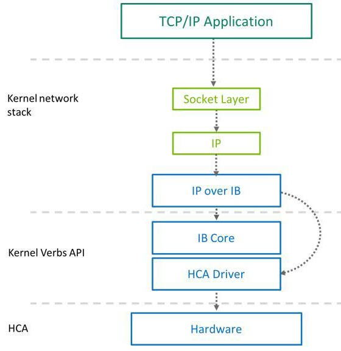
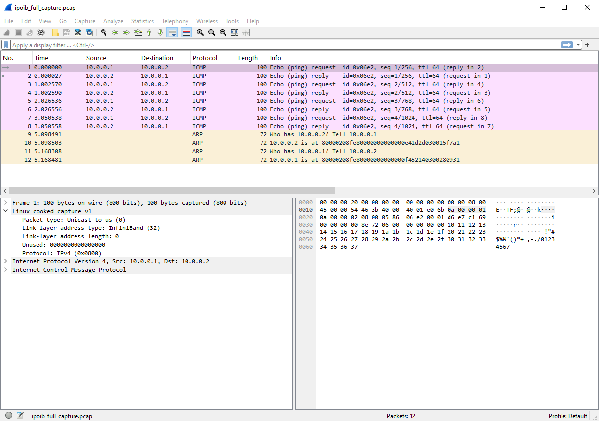
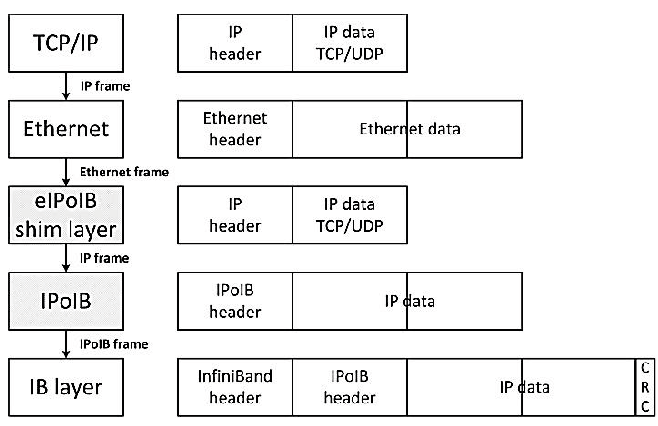

## Inspecting OS Network Interfaces

While tools like ibstat show you how the hardware perceives the physical link, the `ip link show` command reveals how the Linux Kernel Networking Stack views the world.

Run the following command on your workstation:

    ip link show

Sample output:

```text
1: lo: <LOOPBACK,UP,LOWER_UP> mtu 65536 qdisc noqueue state UNKNOWN mode DEFAULT group default qlen 1000
    link/loopback 00:00:00:00:00:00 brd 00:00:00:00:00:00
2: enp0s25: <BROADCAST,MULTICAST,UP,LOWER_UP> mtu 1500 qdisc fq_codel state UP mode DEFAULT group default qlen 1000
    link/ether 50:9a:4c:44:a0:61 brd ff:ff:ff:ff:ff:ff
3: ibs2: <BROADCAST,MULTICAST> mtu 4092 qdisc noop state DOWN mode DEFAULT group default qlen 256
    link/infiniband 00:00:00:67:fe:80:00:00:00:00:00:00:50:6b:4b:03:00:ee:ae:06 brd 00:ff:ff:ff:ff:12:40:1b:ff:ff:00:00:00:00:00:00:ff:ff:ff:ff
    altname ibp3s0
4: ibs4: <BROADCAST,MULTICAST> mtu 4092 qdisc noop state DOWN mode DEFAULT group default qlen 256
    link/infiniband 00:00:11:07:fe:80:00:00:00:00:00:00:ec:0d:9a:03:00:44:c1:58 brd 00:ff:ff:ff:ff:12:40:1b:ff:ff:00:00:00:00:00:00:ff:ff:ff:ff
    altname ibp4s0
```

In the output above, Linux has automatically created two new network interfaces: ibs2 and ibs4 (sometimes named ib0 and ib1 on other distributions).

If you look closely at the link/infiniband hardware address lines, you will see the exact same Base GUIDs (50:6b:4b... and ec:0d:9a...) that we saw in the mlxfwmanager and ibstat outputs earlier. This proves these software interfaces are directly tied to your two physical ConnectX-4 PCIe cards.

### The Source of Confusion: Kernel Bypass vs. OS Interfaces

Seeing these interfaces often confuses engineers who are new to high-speed networking. The primary selling point of InfiniBand and RDMA is Kernel Bypass—the ability for the hardware to pull data directly from application memory and throw it onto the wire, completely bypassing the Linux kernel and the CPU.

So, if InfiniBand is designed to bypass the operating system entirely, why did the Linux kernel automatically create these ibs interfaces?

The answer comes down to how software is written:

Native RDMA Applications (like the perftest suite or high-performance AI frameworks) use a specialized API called "Verbs." These applications know how to talk directly to the ConnectX-4 hardware, ignoring the ibs interfaces entirely. Standard Applications (like SSH, rsync, web browsers, or NFS file shares) do not speak "Verbs." They only know how to send standard TCP/IP packets to the Linux kernel. If the kernel did not create these virtual interfaces, you would not be able to use standard, everyday tools over your 100 Gbps DAC cable.

## IP over InfiniBand (IPoIB)

To bridge the gap between legacy software and modern hardware, the Linux kernel utilizes IP over InfiniBand (IPoIB).

IPoIB is a protocol driver that wraps standard TCP/IP network packets inside InfiniBand hardware frames. It provides a standard IP interface for legacy applications, allowing them to communicate over the ultra-fast InfiniBand fabric without requiring a single line of their source code to be rewritten.

When the mlx5_core hardware driver detects your ConnectX-4 cards, it automatically triggers the ib_ipoib kernel module. This module spins up the ibs2 and ibs4 interfaces. To the operating system, these interfaces look and act exactly like standard Ethernet ports. You can assign them IPv4 addresses, apply iptables firewall rules, and bind standard web servers to them.

> Because IPoIB routes traffic through the Linux kernel's TCP/IP stack to perform this translation, traffic sent over these interfaces does not achieve Kernel Bypass and will consume normal CPU cycles.

### How IPoIB Works: The Translation Layer

IPoIB acts as a real-time software translator operating entirely inside the Linux kernel.

The Application: You initiate a standard command, such as ping 10.0.0.2. The ping program generates a standard ICMP packet and hands it to the Linux kernel's TCP/IP stack.

The Translation: The kernel looks at its routing table and forwards the packet to the virtual ibs4 interface. The ib_ipoib driver intercepts the packet, handles any necessary MTU fragmentation, and encapsulates the raw IP payload inside an InfiniBand transport frame.

Address Resolution: Just like Ethernet uses ARP to map IP addresses to MAC addresses, IPoIB uses ARP over the InfiniBand fabric. However, instead of resolving to a 6-byte MAC address, it resolves the destination IP to a massive 20-byte InfiniBand hardware address (incorporating the port's GUID) and queries the Subnet Manager for the correct routing parameters.

The Wire: The driver passes the fully encapsulated frame to the Host Channel Adapter (HCA), which blasts the InfiniBand frame across the physical cable.

### Architectural Data Flow: The IPoIB "Fast Path"

The following diagram illustrates the layered architecture of IPoIB and how data moves from the high-level application space down to the physical silicon.



When analyzing the data path (represented by the dotted arrows), there is a critical software optimization built into modern Mellanox drivers designed to reduce latency. This is represented by the curved dotted arrow bypassing the middle layers.

The Control Path (Straight Arrows): When the IPoIB interface first initializes, it must use the generic Linux IB Core layer to handle fabric management tasks. This includes joining InfiniBand multicast groups, broadcasting ARP requests, querying the Subnet Manager, and establishing connection parameters.

The Fast Path (Curved Arrow): When the actual heavy lifting of sending application data begins, routing every single packet through the generic IB Core adds unnecessary CPU latency. To optimize throughput, the IPoIB driver utilizes a "Fast Path" that bypasses the generic core entirely, pushing the data payloads directly into the specific hardware driver (in the case of the ConnectX-4, the mlx5_core driver).

### The Kernel Penalty: The Performance Cost of IPoIB

While the Fast Path optimization helps reduce latency, IPoIB is still fundamentally constrained by its position in the operating system. Even though it is incredibly convenient for legacy applications, IPoIB completely breaks the core magic of InfiniBand: Kernel Bypass.

Because IPoIB forces the traffic back up through the standard Linux TCP/IP stack (the green boxes in the diagram), your host CPU is forced to actively manage the transfer. For every packet sent or received, the CPU must handle hardware interrupts, allocate memory buffers (sk_buffs), and perform memory copies between the kernel space and the user application.

This creates a massive bottleneck:

- If you run a native RDMA hardware test like ib_send_bw, the ConnectX-4 uses zero CPU cycles and easily achieves 56 Gbps (FDR) or 100 Gbps (EDR) line rates.

- If you assign an IP address to the ibs4 interface and run a standard iperf3 bandwidth test, the Linux kernel simply cannot process TCP packets fast enough to saturate the high-speed link.

In a standard, untuned configuration, you will likely see the IPoIB bandwidth hit a strict ceiling around 15 to 25 Gbps. If you monitor your system resources during this test, you will see a single CPU core permanently pegged at 100% utilization, desperately trying to process network interrupts while the rest of the 100Gbps InfiniBand pipe sits empty.

### Configuring IPoIB

By default, Ubuntu does not always load the IPoIB translator into the kernel to save memory. We need to explicitly turn it on for both workstations.

Run the following command on both rdma1 and rdma2:

    sudo modprobe ib_ipoib

Check if the Linux kernel created the virtual interfaces.

    ip link show

Example output:

```text
1: lo: <LOOPBACK,UP,LOWER_UP> mtu 65536 qdisc noqueue state UNKNOWN mode DEFAULT group default qlen 1000
    link/loopback 00:00:00:00:00:00 brd 00:00:00:00:00:00
2: enp0s25: <BROADCAST,MULTICAST,UP,LOWER_UP> mtu 1500 qdisc fq_codel state UP mode DEFAULT group default qlen 1000
    link/ether 50:9a:4c:44:a0:61 brd ff:ff:ff:ff:ff:ff
3: ibs2: <BROADCAST,MULTICAST> mtu 4092 qdisc noop state DOWN mode DEFAULT group default qlen 256
    link/infiniband 00:00:00:67:fe:80:00:00:00:00:00:00:50:6b:4b:03:00:ee:ae:06 brd 00:ff:ff:ff:ff:12:40:1b:ff:ff:00:00:00:00:00:00:ff:ff:ff:ff
    altname ibp3s0
4: ibs4: <BROADCAST,MULTICAST> mtu 4092 qdisc noop state DOWN mode DEFAULT group default qlen 256
    link/infiniband 00:00:11:07:fe:80:00:00:00:00:00:00:ec:0d:9a:03:00:44:c1:58 brd 00:ff:ff:ff:ff:12:40:1b:ff:ff:00:00:00:00:00:00:ff:ff:ff:ff
    altname ibp4s0
```

You should see new interfaces representing your Host Channel Adapters (HCAs)—in this case, ibs2 and ibs4 (which correspond to your two separate ConnectX-4 PCIe cards). These are your IP over InfiniBand (IPoIB) interfaces, allowing the Linux kernel to send standard TCP/IP traffic over the InfiniBand fabric.

A few key things to notice about these interfaces:

Protocol: They are explicitly listed as link/infiniband, distinguishing them from your standard link/ether (Ethernet) management interface.

Hardware Address: Instead of a standard 6-byte Ethernet MAC address, you will see a massive 20-byte address. This is the InfiniBand hardware address, which incorporates the port's unique Global Identifier (GUID).

MTU: It defaults to 4092 bytes. This perfectly accommodates the standard 4096-byte InfiniBand payload minus a 4-byte IPoIB encapsulation header.

State: They are currently showing as state DOWN. Even if the physical DAC cable is plugged in and the hardware shows a LinkUp state, the software layer managed by the Linux kernel defaults to an administratively DOWN state. You must manually assign it an IP address and bring it up, exactly as you would with a new Ethernet connection.

**Assigning IP Addresses to the Active IPoIB Link**

Let's create a private /24 subnet strictly for this 56 Gbps link so it does not conflict with your standard home network.

On Workstation 1:

    sudo ip addr add 10.0.0.1/24 dev ibs4
    sudo ip link set ibs4 up

On Workstation 2:

    sudo ip addr add 10.0.0.2/24 dev ibs4
    sudo ip link set ibs4 up

Your InfiniBand fabric now has standard IPv4 routing capabilities. Let's test standard network connectivity across the DAC cable to ensure the IPoIB translator is working.

On Workstation 1:

    ping 10.0.0.2

If your Subnet Manager (OpenSM) is running and the cables are successfully passing electrical signals, the ib_ipoib driver will encapsulate the ICMP packets, and you should immediately see successful ping replies over your high-speed fabric!

### Capturing IPoIB Packets

To perform network analysis or troubleshoot connectivity issues on the IP-over-InfiniBand (IPoIB) layer, a packet capture is required.

To capture all raw traffic, execute the following command on the target host (e.g., Workstation 2).

    sudo tcpdump -i ibs4 -w ipoib_full_capture.pcap

While the capture is running, proceed with your standard network validation tests (e.g., initiating ping, iperf3 from Workstation 1).

Once the necessary traffic has been generated, return to the capturing host and terminate the process using Ctrl + C. The system will output a summary of the capture:



When you run tcpdump on an interface that isn't a standard Ethernet NIC (like your ibs4 interface), the packet capture library (libpcap) sometimes cannot supply a standard link-layer header. To handle this, libpcap strips whatever partial link-layer data it receives and replaces it with a synthetic, "fake" header called a Cooked Header (often referred to as SLL).

Notice that inside that cooked header, Wireshark explicitly identifies the underlying hardware:

    Link-layer address type: InfiniBand (32)

You are not seeing the native InfiniBand headers (LRH, BTH, etc.) because of where tcpdump intercepts the traffic.

tcpdump hooks into the Linux kernel's networking stack. Here is the lifecycle of your ping packet:

The Wire: The packet travels across the physical cable with full InfiniBand routing and transport headers.

The Hardware (HCA): The ConnectX card receives the packet, processes the hardware-level InfiniBand headers, verifies the checksums, and strips those headers off.

The Driver (IPoIB): The card passes the remaining IP payload up to the ib_ipoib driver in the Linux kernel.

The Capture: tcpdump is listening at this software level. By the time tcpdump sees the packet, the physical HCA has already removed the InfiniBand encapsulation.

This illustrates the divide between the software network stack and the hardware fabric.

Even though the encapsulation headers are stripped, there is concrete proof in your screenshot that this is an InfiniBand network. Look closely at Packets 9 through 12 in your Wireshark window. These are ARP (Address Resolution Protocol) requests.

In a standard Ethernet network, ARP asks "Who has IP 10.0.0.1?" and the reply is a 6-byte MAC address (e.g., d8:9e:f3:12:78:91).

Look at the Info column for Packet 12 in your capture:

    10.0.0.1 is at 80000208fe80000000000000f452140300280931

That is a massive 20-byte InfiniBand hardware address. Because IPoIB does not use standard MAC addresses, the ARP protocol must resolve IP addresses to these specific InfiniBand GIDs so the IPoIB driver knows exactly which hardware endpoints to target before passing the data down to the card for encapsulation.

### Architectural Limitation: Native RDMA Visibility

It is critical to understand that tcpdump hooks directly into the Linux kernel's networking stack. Because the IPoIB driver routes traffic through the kernel, tcpdump can see it perfectly.

However, tcpdump is completely blind to native RDMA traffic.

When applications utilize the InfiniBand Verbs API for true RDMA operations (e.g., RDMA Read/Write), the Host Channel Adapter (HCA) performs a hardware-level kernel bypass, moving data directly from user-space memory to the physical wire. Because this traffic never traverses the OS networking stack, it will not appear in a standard tcpdump or Wireshark capture. Capturing native RDMA traffic requires specialized hardware-level tools, such as ibdump, which mirror traffic directly at the adapter's firmware level.

### Ethernet over IPoIB (The Virtualization Shim)

Historically, eIPoIB stood for Ethernet Services over IPoIB. It was created to solve a massive headache for cloud providers and homelabbers trying to use InfiniBand in virtualized environments.

As you saw in the Wireshark capture, standard IPoIB does not use Ethernet headers and relies on a massive 20-byte hardware address. Because it isn't a true Layer 2 Ethernet device, you cannot easily attach an ib0 interface to a standard Linux Bridge (like Open vSwitch). This meant virtual machines (KVM/ESXi) and containers (Docker/Kubernetes), which expect standard virtual Ethernet NICs with 6-byte MAC addresses, could not natively communicate over the InfiniBand fabric.

The eIPoIB Solution:

The eIPoIB driver acts as a "shim" or translator. When enabled, it creates a virtual Ethernet interface (e.g., ethX) directly on top of your InfiniBand interface (ib0).

- It fakes a standard 48-bit MAC address for the OS to see.

- When a VM sends an Ethernet packet, the eIPoIB driver intercepts it, strips off the Ethernet header, and passes the raw IP payload down to the native IPoIB driver to be sent across the InfiniBand fabric.

- On the receiving side, it catches the IP payload, slaps a fake Ethernet header back on it, and hands it up to the VM.

This allowed InfiniBand to be used seamlessly in standard Bridged VM/Container networking, functioning exactly like an Ethernet network to the hypervisor.

This image is a fantastic visual representation of exactly how the driver acts as a translator between standard virtualized environments and the native InfiniBand fabric.



1. The Virtual Machine / OS Layer (Top Two Rows)

TCP/IP: The application generates standard network traffic (an IP header + TCP/UDP payload).

Ethernet: Because the Virtual Machine (or Linux Bridge) expects a normal network interface, it wraps that IP packet inside a standard Ethernet header (which contains standard 6-byte source and destination MAC addresses).

2. The Translator: eIPoIB Shim Layer (Middle Row)

This is where the magic happens. The Ethernet frame hits the eIPoIB virtual interface.

Notice what happens to the packet structure on the right: The Ethernet header completely disappears. The shim intercepts the packet, strips off the fake MAC addresses it used to satisfy the VM, and extracts just the raw IP frame.

3. The Native Stack: IPoIB and IB Layers (Bottom Two Rows)

IPoIB: The shim hands the bare IP packet down to the standard IPoIB driver, which attaches its standard 4-byte IPoIB header.

IB Layer: Finally, the packet is handed to the Host Channel Adapter (HCA) hardware. The hardware encapsulates the entire thing inside native InfiniBand headers (which contain the massive 20-byte hardware addresses, LIDs, and routing information) and tacks on the CRC checksum at the end to be sent across the wire.

### Enhanced IPoIB (The Modern Performance Offload)

Standard IPoIB processes traffic largely in software within the Linux kernel. It relied heavily on single-queue interrupt handling, meaning a single CPU core would get bottlenecked trying to process incoming packets, severely limiting IPoIB throughput (often capping out well below the hardware's 100Gbps+ limits).

Enhanced IPoIB offloads the Upper Layer Protocol (ULP) capabilities directly into the vendor-specific hardware driver (mlx5). It brings modern Ethernet-style hardware accelerations to IPoIB, including:

- RSS (Receive Side Scaling): Distributes incoming IPoIB traffic across multiple CPU cores.
- TSS (Transmit Side Scaling): Distributes outgoing traffic across multiple queues.
- Interrupt Moderation: Batches hardware interrupts to prevent CPU exhaustion.

If you are using ConnectX-4 or newer, Enhanced IPoIB is enabled by default. However, it comes with a strict architectural trade-off: It only supports Datagram mode.

Legacy Connected Mode: Allowed IPoIB to simulate TCP-like connections and use massive MTUs up to 65,520 bytes, which was great for raw throughput on older hardware.

Enhanced Datagram Mode: Limits your MTU to the physical InfiniBand link MTU (usually 4092 or 2044 bytes). Because the hardware is now handling multi-queue scaling (RSS/TSS), it easily makes up for the smaller MTU, delivering vastly superior bandwidth and lower latency.
