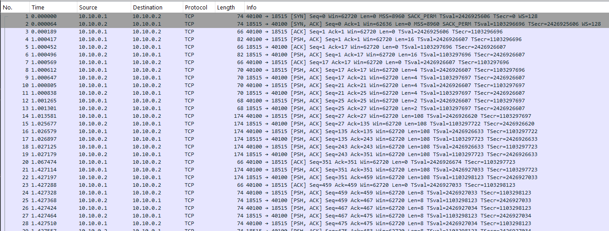
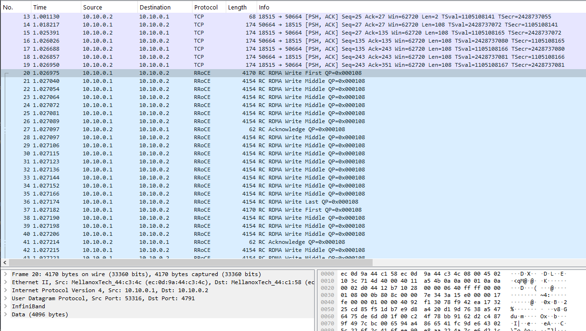

# Configuring ConnectX-4 for RoCEv2 (100GbE)

Before making configuration changes, it is important to understand how modern Mellanox hardware behaves when switched to Ethernet, and how the ConnectX-4 architecture differs fundamentally from older generations.

Firmware vs. OS Drivers: In older generations (like ConnectX-3), the hardware was a blank slate, and the Linux kernel driver (mlx4_core) dictated the port protocol via .conf files every time the machine booted. The ConnectX-4 architecture abandons this. The port configuration is burned directly into the card's non-volatile memory (NVRAM). The operating system's driver (mlx5_core) simply reads whatever the hardware is permanently set to. Therefore, you must use a firmware utility (mlxconfig) to permanently rewrite the card's internal settings.

The Protocol (RoCEv2): When you switch a ConnectX-4 port to Ethernet, it utilizes RoCEv2. Unlike older iterations that operated purely at Layer 2, RoCEv2 encapsulates the RDMA Verbs traffic inside standard UDP/IP packets. This means the traffic is fully routable across standard network switches and routers, making it highly flexible for modern data center designs.

The Speed: ConnectX-4 VPI card supports EDR InfiniBand (100 Gbps). When flipped to Ethernet mode, it supports the equivalent 100GbE standard, allowing you to push massive bandwidth over the exact same physical QSFP28 ports.

## Changing the Port Protocol (InfiniBand to Ethernet)

Check the current link type in the hardware's NVRAM using the Mellanox Firmware Tools (mlxconfig):

    sudo mlxconfig -d /dev/mst/mt4115_pciconf1 query | grep LINK_TYPE

Sample output:

        LINK_TYPE_P1                                IB(1)

This tells us that Port 1 is currently configured for InfiniBand. To switch the port to Ethernet, use the `set` command and change the value to 2:

    sudo mlxconfig -y -d /dev/mst/mt4115_pciconf1 set LINK_TYPE_P1=2

Because you just modified the hardware's core firmware parameters, a standard driver restart is not enough. You must reboot the machine so the motherboard's PCIe bus re-initializes the silicon.

    sudo reboot

## Verifying the Hardware Layer

Once the machine comes back online, check the hardware state using ibstat:

    ibstat

You should see output confirming the port is now operating natively as Ethernet:

```text
CA 'rocep4s0'  <-------------------- (Notice the new name)
        CA type: MT4115
        Number of ports: 1
        Firmware version: 12.28.2040
        Hardware version: 0
        Node GUID: 0xec0d9a030044c34c
        System image GUID: 0xec0d9a030044c34c
        Port 1:
                State: Down
                Physical state: Disabled
                Rate: 40
                Base lid: 0
                LMC: 0
                SM lid: 0
                Capability mask: 0x00010000
                Port GUID: 0xee0d9afffe44c34c
                Link layer: Ethernet  <--------------------
```

If you look at the very top of the output, you will notice the Channel Adapter (CA) name changed from ibp4s0 (or mlx5_X) to rocep4s0.

This is a feature of modern Linux Predictable Network Interface Naming reacting to your firmware changes:

When the port was in InfiniBand mode, the kernel prefixed the hardware Verbs device with ib (InfiniBand, PCI Bus 4, Slot 0).

Now that you have permanently flashed the hardware to Ethernet mode, the mlx5_core driver recognizes it as a ROCE device. The OS dynamically updates the prefix to roce (RoCE, PCI Bus 4, Slot 0).

This name change is a visual confirmation that your operating system is fully aware of the card's RoCEv2 capabilities, rather than just treating it as a generic Ethernet NIC.

Unlike InfiniBand, Ethernet does not require a Subnet Manager (SM) to initialize the port. The moment a valid 100GbE cable is connected and the OS brings the interface up, the link is active.

## Check Interfaces

Verify that Ubuntu recognizes the standard Ethernet interface using the `ip link show` command:

    ip link show

Sample output:

```text
2: enp0s25: <BROADCAST,MULTICAST,UP,LOWER_UP> mtu 1500 qdisc fq_codel state UP mode DEFAULT group default qlen 1000
    link/ether d8:9e:f3:12:78:91 brd ff:ff:ff:ff:ff:ff
3: ens4np0: <BROADCAST,MULTICAST> mtu 1500 qdisc noop state DOWN mode DEFAULT group default qlen 1000
    link/ether ec:0d:9a:44:c3:4c brd ff:ff:ff:ff:ff:ff
    altname enp4s0np0
4: ibs2: <BROADCAST,MULTICAST> mtu 4092 qdisc noop state DOWN mode DEFAULT group default qlen 256
    link/infiniband 00:00:00:67:fe:80:00:00:00:00:00:00:98:03:9b:03:00:1b:79:a8 brd 00:ff:ff:ff:ff:12:40:1b:ff:ff:00:00:00:00:00:00:ff:ff:ff:ff
    altname ibp3s0
```

1. The Management Interface (`enp0s25`)

    What it is: This is your workstation's primary, built-in motherboard Ethernet port.

    How to tell: It has a standard 6-byte MAC address (link/ether d8:9e...), standard 1500 MTU, and the state is actively UP and LOWER_UP, meaning a standard Cat6 cable is plugged in and providing your standard LAN/Internet connection.

2. The Ethernet-Converted ConnectX-4 (`ens4np0`)

    What it is: This is the ConnectX-4 port that we successfully flashed and switched to 100GbE mode using mlxconfig.

    How to tell: Notice that the protocol explicitly says link/ether and it has generated a standard 6-byte Ethernet MAC address (ec:0d:9a:44:c3:4c).

    Current State: It is currently DOWN with the default mtu 1500. Before we can pass RoCEv2 traffic, we will need to bring this interface up, assign it an IP address, and increase that MTU to 9000 (Jumbo Frames).

3. The Native InfiniBand ConnectX-4 (`ibs2`)

    What it is: This is your second ConnectX-4 card, which was left untouched and is operating in native InfiniBand mode. Because standard TCP/IP cannot run natively over InfiniBand, the Linux kernel spun up this IP-over-InfiniBand (IPoIB) virtual interface to act as a translator.

    How to tell: It is explicitly listed as link/infiniband. Instead of a MAC address, it uses a massive 20-byte hardware address that incorporates the port's unique Global Identifier (GUID: 98:03:9b...). The MTU is also set to the InfiniBand default of 4092.

## The "Split-Brain" NIC: OS vs. Hardware Interfaces

When you configure a ConnectX-4 card for RoCEv2, the Linux kernel initializes the hardware with a split-brain architecture. The card presents two distinct faces to the operating system: a standard software network interface, and a low-level hardware Verbs device. Understanding the distinction between these two interfaces is critical, as using the wrong name with the wrong tool will result in errors.

### The OS Network Interface (`ens4np0`)

This is the Linux Kernel Networking Stack's view of the port.

When you run `ip link show`, you are interacting with the standard netdev (Network Device) subsystem.

What it does: It treats your ConnectX-4 card exactly like a standard, cheap motherboard Ethernet port. Any traffic sent to ens4np0 goes through the host CPU, traverses the standard Linux TCP/IP stack, and is completely oblivious to the card's advanced hardware acceleration.

When to use it: You must use the ens4np0 name anytime you are interacting with standard Linux networking tools or configuring the structural baseline of the network.

- Assigning IP addresses (ip addr add...)
- Changing MTU to Jumbo Frames (ip link set mtu 9000)
- Configuring firewall rules (iptables / ufw)
- Running standard TCP/IP troubleshooting (ping, ssh, standard iperf3)
- Capturing non-RDMA traffic (tcpdump -i ens4np0)

### The Hardware Verbs Device (`rocep4s0`)

This is the RDMA Subsystem's view of the port.

When you run ibv_devices, you are interacting with the OFED (OpenFabrics Enterprise Distribution) Verbs API.

    ibv_devices

    device                 node GUID
    ------              ----------------
    ibp3s0              506b4b0300eeae06
    rocep4s0            ec0d9a030044c158

What it does: This interface is the magic of RDMA. It represents a direct pipeline to the hardware silicon. When an application sends data to `rocep4s0`, the ConnectX-4 hardware pulls the data directly out of the application's user-space memory and puts it onto the wire. It completely bypasses the OS network interface (ens4np0), bypasses the Linux kernel, and utilizes zero CPU cycles.

When to use it: You must use the `rocep4s0` name anytime you are running specialized RDMA software or hardware-level diagnostic tools.

- Running RDMA bandwidth and latency benchmarks (ib_write_bw -d rocep4s0)
- Querying hardware error counters (perfquery -C rocep4s0)
- Running hardware-level packet sniffers (e.g., passing -i rocep4s0 to the Mellanox Docker tcpdump)
- Configuring AI frameworks (like NVIDIA NCCL) or MPI clusters to use GPU-Direct RDMA.

## OS Network Configuration and Jumbo Frames

Before establishing the physical connection, we must configure the OS routing and increase the payload size. For 100GbE and RoCEv2/RDMA traffic to perform well, you must increase the Maximum Transmission Unit (MTU) from the default 1500 to 9000 (Jumbo Frames).

On Workstation 1:

    sudo ip link set ens4np0 mtu 9000
    sudo ip addr add 10.10.0.1/24 dev ens4np0
    sudo ip link set ens4np0 up

On Workstation 2:

    sudo ip link set ens4np0 mtu 9000
    sudo ip addr add 10.10.0.2/24 dev ens4np0
    sudo ip link set ens4np0 up

Even though we just told the operating system to bring the interface online and assigned it an IP address, the physical circuit is still open because the DAC cable is not yet attached.

If you check the interface right now, you will see a very specific, expected state:

```bash
ip link show ens4np0

3: ens4np0: <NO-CARRIER,BROADCAST,MULTICAST,UP> mtu 9000 qdisc mq state DOWN mode DEFAULT group default qlen 1000
    link/ether ec:0d:9a:44:c3:4c brd ff:ff:ff:ff:ff:ff
    altname enp4s0np0
```

This output illustrates the split-brain nature of network interfaces:

The Administrative State (UP): Look inside the angle brackets <... ,UP>. This confirms that your ip link set ens4np0 up command worked. The Linux kernel has administratively powered on the software interface and is ready to process packets.

The Physical State (NO-CARRIER): Also inside the angle brackets, NO-CARRIER means the physical QSFP28 transceiver is not detecting an electrical signal. The port is empty, or the remote machine is powered off.

The Operational State (state DOWN): Because there is no physical carrier signal, the overarching operational state of the link remains DOWN. It cannot route traffic.

The Payload Size (mtu 9000): This confirms that our Jumbo Frames configuration was successfully applied and saved.

Seeing `<NO-CARRIER>` alongside UP is the exact confirmation you want before plugging in your 100GbE cable. It proves the software is fully prepped and simply waiting for the hardware to close the circuit.

## Physical Peer-to-Peer Connectivity

Insert a 100G QSFP28 Ethernet DAC between the ConnectX-4 ports. The Linux kernel will detect the carrier signal.

Verify the physical link and MTU:

    ip addr show ens4np0

Sample Output:

```text
3: ens4np0: <BROADCAST,MULTICAST,UP,LOWER_UP> mtu 9000 qdisc mq state UP mode DEFAULT group default qlen 1000
    link/ether ec:0d:9a:44:c3:4c brd ff:ff:ff:ff:ff:ff
    altname enp4s0np0
```

LOWER_UP: Confirms the physical layer (Layer 1) has successfully negotiated and the QSFP28 connection is electrically sound.

mtu 9000: Confirms Jumbo frames are active.

## Test Basic Connectivity

With the physical link up and IP addresses assigned, we can now test the connection.

We will perform a standard ICMP ping to verify the basic OS network stack.

ensure the two machines can ping each other over the new link. From Workstation 1, ping Workstation 2:

    ping 10.10.0.2

This confirms your IP routing and MAC address resolution (ARP) are working perfectly.

## Generating RoCEv2 Traffic

To test true hardware-bypassed RDMA traffic, we use the perftest suite. Because we are using RoCEv2, the hardware uses the InfiniBand Verbs API under the hood, but encapsulates the payloads into standard Ethernet frames.

On Workstation 2 (The Server), start the listener:

    ib_write_bw -d rocep4s0

On Workstation 1 (The Client), initiate the traffic:

    ib_write_bw -d rocep4s0 10.10.0.2 --report_gbits

By appending the `--report_gbits` flag to the testing command, the perftest suite natively reports bandwidth in Gigabits per second (Gb/sec). This matches standard networking measurements and removes the need to manually convert from Megabytes per second.

When the test completes, it outputs a detailed report of the connection parameters.

Sample output:

```text
---------------------------------------------------------------------------------------
                    RDMA_Write BW Test
 Dual-port       : OFF          Device         : rocep4s0
 Number of qps   : 1            Transport type : IB
 Connection type : RC           Using SRQ      : OFF
 PCIe relax order: ON
 ibv_wr* API     : ON
 TX depth        : 128
 CQ Moderation   : 1
 Mtu             : 4096[B]
 Link type       : Ethernet
 GID index       : 3
 Max inline data : 0[B]
 rdma_cm QPs     : OFF
 Data ex. method : Ethernet
---------------------------------------------------------------------------------------
 local address: LID 0000 QPN 0x0106 PSN 0xd29890 RKey 0x17feed VAddr 0x0071b10617a000
 GID: 00:00:00:00:00:00:00:00:00:00:255:255:10:10:00:01
 remote address: LID 0000 QPN 0x0106 PSN 0xfeb199 RKey 0x17feed VAddr 0x00718e149ef000
 GID: 00:00:00:00:00:00:00:00:00:00:255:255:10:10:00:02
---------------------------------------------------------------------------------------
 #bytes     #iterations    BW peak[Gb/sec]    BW average[Gb/sec]   MsgRate[Mpps]
Conflicting CPU frequency values detected: 3491.920000 != 1200.000000. CPU Frequency is not max.
 65536      5000             39.20              39.20              0.074769
---------------------------------------------------------------------------------------
```

Transport type: IB / Link type: Ethernet: This confirms the application is utilizing the native InfiniBand Verbs API, generating true RDMA traffic, but transporting it over a physical Ethernet layer.

GID Mapping: You can see how the hardware automatically mapped your IPv4 addresses (10:10:00:01) into the IPv6 GID format (::ffff:10:10:00:01).

MTU: 4096: Because you enabled Jumbo Frames on the OS interface, the hardware can utilize large 4KB RDMA payloads, maximizing the 100GbE throughput and reducing header overhead.

## Capturing Hardware RoCEv2 Traffic

Because RoCEv2 encapsulates its traffic inside standard UDP/IP packets, the most intuitive first step is to simply run standard Linux packet capture tools. If it is just UDP traffic on an Ethernet network, standard tcpdump should be able to see it, right? Unfortunately, capturing hardware-accelerated RDMA traffic is not that simple. If you attempt to use standard methods, you will run into two distinct roadblocks.

### Attempt 1: Sniffing the RDMA Device

Because we know the RDMA traffic is tied to the Verbs device, your first instinct might be to tell tcpdump to listen directly to the hardware:

    sudo tcpdump -i rocep4s0

However, you will get an error:

```text
libibverbs: Warning: couldn't open config directory '/etc/libibverbs.d'.
tcpdump: rocep4s0: No such device exists
(No such device exists)
```

This is because the standard tcpdump relies on the Linux kernel's libpcap library, which is strictly designed to hook into OS-level network interfaces (netdevs). Because rocep4s0 is a low-level hardware Verbs device, it is completely invisible to the standard OS networking stack. tcpdump simply doesn't know what it is.

### Attempt 2: Sniffing the OS Interface

Since the hardware device didn't work, the next logical step is to run the capture against the standard OS Ethernet interface we configured earlier:

    sudo tcpdump -i ens4np0 -w rocev2-bl.pcap

This time the capture starts successfully. You open another terminal, run your ib_write_bw bandwidth test, and then stop the capture. However, when you open rocev2-bl.pcap in Wireshark, you will notice something strange: There is no high-speed RDMA payload. Instead, you will only see a brief burst of standard TCP/IP traffic, and then total silence.



The TCP packets we captured are the initial Connection Management (CM) Handshake. Before blasting the high-speed RDMA traffic, the perftest tools use a standard TCP socket (usually over port 18515) to connect the two machines. During this brief handshake, the nodes exchange their InfiniBand parameters (GIDs, Queue Pair Numbers, and Packet Sequence Numbers). Because this handshake uses standard TCP sockets, it flows through the Linux kernel, and tcpdump successfully copies it.

Once the control data is exchanged, the test shifts to the hardware layer, and the OS-level capture goes completely dark. This is the ultimate proof of Kernel Bypass. During the actual RoCEv2 data transfer, the ConnectX-4 card uses Direct Memory Access (DMA) to pull the payload straight from the user-space application memory and put it directly onto the physical wire. Because the data entirely bypasses the host CPU and the Linux networking stack, standard tcpdump physically cannot see the packets.

### The Solution: Offloaded Traffic Sniffer

To capture hardware RoCEv2 traffic, we must utilize the "Offloaded Traffic Sniffer" feature built into modern RDMA NICs. This feature tells the NIC's physical silicon to duplicate the kernel-bypassed packets and mirror them back up to the operating system so a sniffer can see them. To trigger this hardware mirror, we need a specially compiled version of libpcap with RDMA support enabled (`--enable-rdma`).

Rather than risking environment conflicts by compiling custom core networking libraries on your host machine, the industry-standard workaround is to use an official Docker container provided by Mellanox. This container includes the correct OFED drivers and a modified tcpdump binary out of the box, allowing you to hook directly into the hardware silicon.

Make sure you have docker installed, if not install it

    curl -fsSL https://get.docker.com | sudo sh

and then:

    sudo usermod -aG docker $USER

make the changes:

    newgrp docker

Pull the Docker Image:

    docker pull mellanox/tcpdump-rdma

Run the Container:

You must run the container with --privileged and mount the InfiniBand character devices so the containerized tcpdump can talk directly to the NIC hardware. We also mount a local /tmp/traces directory to save the output file to the host machine.

    docker run -it --net=host --privileged \
    -v /dev/infiniband:/dev/infiniband \
    -v /tmp/traces:/tmp/traces \
    mellanox/tcpdump-rdma bash

2. To find the exact name of the RDMA device you need to sniff, run the standard Verbs device query command inside the container:

    ibv_devices

    device                 node GUID
    ------              ----------------
    ibp3s0              506b4b0300eeae06
    rocep4s0            ec0d9a030044c158

3. Capture the Traffic:

Inside the container, run tcpdump rocep4s0.

    tcpdump -i rocep4s0 -s 0 -w rocev2_capture.pcap

While the capture is running, you can generate RDMA write traffic like before to verify the capture works.


