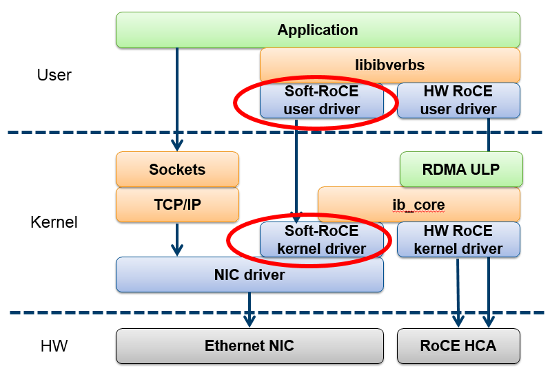

# Software RoCE (Soft-RoCE)

Software RoCE (often referred to in Linux as RXE or rdma_rxe) is a software implementation of the RoCEv2 protocol.

Normally, RDMA requires a specialized hardware RNIC (like a ConnectX-4) to physically handle complex transport logic and memory mapping without CPU involvement. Soft-RoCE allows you to emulate this capability on any standard, non-RDMA Ethernet adapter. It provides the exact same API (verbs) to applications, making it highly valuable for testing, development, or running RDMA-dependent distributed storage in environments without physical RNICs.



Hardware RoCE Path (Right): Traffic moves from the application through the hardware RoCE drivers directly to the specialized RoCE HCA (Host Channel Adapter). This path completely bypasses the main host NIC driver and generic Ethernet controller, achieving true kernel bypass.

Soft-RoCE Path (Center, red ovals): The application's RDMA call is intercepted by the Soft-RoCE user driver. This driver, along with the Soft-RoCE kernel driver (rdma_rxe), implements all the complex RoCE transport logic (Verbs, UDP, IP) entirely in software. Crucially, this emulated logic is packaged and sent down to the standard NIC driver—the exact same OS-level driver used by standard TCP/IP sockets. The final destination is a standard Ethernet NIC.

| Feature           | Hardware RoCEv2 (ConnectX-4)                               | Software RoCE (rdma_rxe)                               |
| ----------------- | ---------------------------------------------------------- | ------------------------------------------------------ |
| Data Path         | NIC hardware directly accesses application memory (RDMA).  | Application → `rdma_rxe` → kernel network stack → NIC. |
| Kernel Bypass     | Yes                                                        | No (CPU and kernel process all traffic)                |
| Capture Interface | RDMA device                                                | Standard Ethernet interface                            |
| Required Tooling  | OFED-aware tools (e.g., tcpdump via Mellanox/NVIDIA stack) | Native tools (e.g., tcpdump, Wireshark)                |

## Configuring Soft-RoCE

To configure Soft-RoCE any standard Ethernet NIC will work (onboard, Intel, Realtek, USB adapter, etc.). The only requirement is a Linux kernel with the `rdma_rxe` module (included in mainline since kernel 4.9) and basic IP connectivity between the two machines. We will use our `Intel I210-AT` ethernet NIC card installed on each workstation.

We will configure one Soft-RoCE device per workstation, binding the software `rxe0` device to the physical Ethernet interface.

| Machine | Interface | Soft-RoCE Device | IP Address |
| ------- | --------- | ---------------- | ---------- |
| rdma1   | enp7s0    | rxe0             | 10.20.0.1  |
| rdma2   | enp7s0    | rxe0             | 10.20.0.3  |

Before configuring the kernel, we need the user-space tools to manage RDMA devices.

Run this on both rdma1 and rdma2:

    sudo apt update
    sudo apt install -y rdma-core ibverbs-utils perftest libibverbs-dev rdmacm-utils

We will load `rdma_rxe` kernel module into the current session and then add it to the `modules-load.d` directory so it automatically loads on all future reboots.

Run this on both rdma1 and rdma2:

    sudo modprobe rdma_rxe
    echo "rdma_rxe" | sudo tee /etc/modules-load.d/rdma_rxe.conf

Using `ip addr add` is temporary and will vanish upon reboot. Because we are using Ubuntu, we will use Netplan to make the IP addresses persistent.

On rdma1:

Create the following Netplan configuration file:

    sudo nano /etc/netplan/99-rdma.yaml

We use the 99-rdma.yaml naming convention because Netplan processes configuration files in numerical order, applying the highest-numbered files last. If there are overlapping configurations, the settings in the last loaded file will overwrite the others. By prefixing our custom configuration with `99-`, we guarantee that our settings take absolute priority and will not be accidentally overridden by the operating system's default network files (such as 50-cloud-init.yaml).

Paste the following, ensuring the indentation is exactly as shown (YAML is strictly space-sensitive):

```yaml
network:
  version: 2
  ethernets:
    enp7s0:
      addresses:
        - 10.20.0.1/24
```

Set the correct permission:

    sudo chmod 600 /etc/netplan/99-rdma.yaml

Apply the changes:

    sudo netplan apply

On rdma2:

Create the same file, but use the .3 address:

    sudo nano /etc/netplan/99-rdma.yaml

Paste the following, ensuring the indentation is exactly as shown (YAML is strictly space-sensitive):

```yaml
network:
  version: 2
  ethernets:
    enp7s0:
      addresses:
        - 10.20.0.3/24
```

Set the correct permission:

    sudo chmod 600 /etc/netplan/99-rdma.yaml

Apply the changes:

    sudo netplan apply

Verify the Ethernet cable (Cat6 or better) is connected between the two NICs. You should now be able to ping 10.20.0.3 from rdma1.

Now that the physical Ethernet interfaces are persistently online with IP addresses, we can bind the Soft-RoCE driver to them.

On rdma1:

    sudo rdma link add rxe0 type rxe netdev enp7s0

On rdma2:

    sudo rdma link add rxe0 type rxe netdev enp7s0

The `rdma link add` command does not survive reboots natively. To make it persistent, we can create a systemd service file:

    sudo nano /etc/systemd/system/soft-roce.service

Paste the following configuration:

```text
[Unit]
Description=Initialize Soft-RoCE Device
After=network-online.target
Wants=network-online.target

[Service]
Type=oneshot
# Note: Check if your rdma path is /sbin/rdma or /usr/sbin/rdma using 'which rdma'
ExecStart=/usr/bin/rdma link add rxe0 type rxe netdev enp7s0
RemainAfterExit=yes

[Install]
WantedBy=multi-user.target
```

Tell systemd to read your new file and enable it to run on boot:

    sudo systemctl daemon-reload
    sudo systemctl enable soft-roce.service

Start it right now (or reboot):

    sudo systemctl start soft-roce.service

Let's verify that the operating system has successfully mapped the new virtual device.

Run on rdma1:

    rdma link show

Sample output:

```text
link ibp3s0/1 subnet_prefix fe80:0000:0000:0000 lid 1 sm_lid 1 lmc 0 state ACTIVE physical_state LINK_UP 
link rxe0/1 state ACTIVE physical_state LINK_UP netdev enp7s0
```

Two RDMA devices are now visible. Each serves a fundamentally different role:

- **ibp3s0** — This is the ConnectX-4's native InfiniBand Verbs interface. It is configured in InfiniBand mode (`LINK_TYPE_P1=IB`) with an EDR InfiniBand DAC cable connected between the two workstations. The state shows `ACTIVE` / `LINK_UP` with a valid LID assigned by the Subnet Manager, confirming the InfiniBand fabric is operational. This device is managed by the Mellanox `mlx5` driver and offloads RDMA operations directly to the NIC hardware, achieving true kernel bypass.

- **rxe0** — This is the Soft-RoCE device we just created. It is a software emulation layer (`rdma_rxe`) bound to the Intel NIC's `enp7s0` interface. The state shows `ACTIVE` / `LINK_UP` because the underlying Ethernet interface is online with a valid IP address, and the `rdma_rxe` kernel module is successfully emulating the Verbs transport on top of it. Unlike `ibp3s0`, this device has no hardware RDMA offload — all transport logic runs on the CPU.

Verify the RDMA subsystem sees it:

    ibv_devices

Sample output:

```text
device                 node GUID
------              ----------------
ibp3s0              ec0d9a030044c34c
rxe0                c66237fffe09dc78
```

## Capturing Soft-RoCE Traffic

Now that our Soft-RoCE infrastructure is set up, capturing the traffic is straightforward. Because of how Soft-RoCE is architected, you do not need specialized Docker containers, custom OFED libraries, or hardware sniffer flags. Because the data traverses the standard Linux networking stack, you must point your packet sniffer at the physical OS interface (enp7s0), not the virtual RDMA device (rxe0).

`rxe0` is your virtual RDMA Verbs device. Standard tcpdump operates at the OS networking level and cannot listen directly to the RDMA subsystem.

`enp7s0` is the standard OS network interface that rxe0 is logically bound to (which you can verify by matching the interface MAC address to the rxe0 GUID). Because the Linux kernel ultimately pushes the Soft-RoCE UDP packets out of this physical port, this is where tcpdump must listen.

To capture the RDMA traffic passing through your Soft-RoCE emulator, simply run standard tcpdump on your host machine against your physical Ethernet interface.

We will apply a filter for UDP port 4791 (the globally recognized standard port for RoCEv2 traffic) to ensure we capture the RDMA payloads while ignoring background OS network chatter.

    sudo tcpdump -i enp7s0 udp port 4791 -w soft_roce_capture.pcap

Leave your tcpdump capture running in its current terminal. Open a second terminal window on rdma2 and start the ib_write_bw tool in "Listen" mode.

    ib_write_bw -d rxe0

Now, switch over to your other workstation (rdma1). Fire the client command, pointing it at rdma2's IP address:

    ib_write_bw -d rxe0 10.20.0.3

Sample output:

```text
---------------------------------------------------------------------------------------
                    RDMA_Write BW Test
 Dual-port       : OFF          Device         : rxe0
 Number of qps   : 1            Transport type : IB
 Connection type : RC           Using SRQ      : OFF
 PCIe relax order: ON
 ibv_wr* API     : OFF
 TX depth        : 128
 CQ Moderation   : 1
 Mtu             : 1024[B]
 Link type       : Ethernet
 GID index       : 1
 Max inline data : 0[B]
 rdma_cm QPs     : OFF
 Data ex. method : Ethernet
---------------------------------------------------------------------------------------
 local address: LID 0000 QPN 0x0013 PSN 0x3d508a RKey 0x0004a6 VAddr 0x007dc6b256a000
 GID: 00:00:00:00:00:00:00:00:00:00:255:255:10:20:00:01
 remote address: LID 0000 QPN 0x0013 PSN 0xc25646 RKey 0x0004b2 VAddr 0x007ad3a2c4e000
 GID: 00:00:00:00:00:00:00:00:00:00:255:255:10:20:00:03
---------------------------------------------------------------------------------------
 #bytes     #iterations    BW peak[MB/sec]    BW average[MB/sec]   MsgRate[Mpps]
Conflicting CPU frequency values detected: 1200.000000 != 3591.635000. CPU Frequency is not max.
 65536      5000             110.31             110.28             0.001764
---------------------------------------------------------------------------------------
```

Once the benchmark completes, stop your tcpdump capture (Ctrl+C). Because the traffic was processed by the CPU and pushed through the standard OS network interface, you will have successfully captured every single RDMA payload in a standard .pcap format, ready to be opened and analyzed in Wireshark!

When an application sends data to your virtual RDMA device, the rdma_rxe software driver intercepts it, packages the RDMA payloads into standard UDP/IP packets, and hands them directly back to the standard Linux kernel's TCP/IP stack to be transmitted over the wire. Because the traffic flows through normal operating system pathways, it crosses the exact software hooks that standard packet sniffers monitor.
